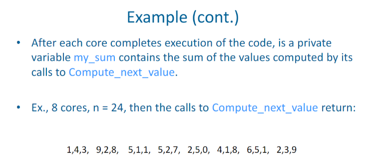

# Example of Serial vs Parallel solutions: compute n values and add them together

Created: 2024-02-07 18:46:56 -0500

Modified: 2024-02-07 18:48:02 -0500

---

Example of Serial vs Parallel solutions: compute n values and add them together

-   Serial:

> {width="4.302083333333333in" height="1.5in"}

-   Parallel:

> {width="5.78125in" height="2.0729166666666665in"}
>
>  
>
> {width="3.3541666666666665in" height="1.53125in"}
>
>  
>
> {width="3.34375in" height="0.5416666666666666in"}
>
>  
>
> {width="3.3645833333333335in" height="1.75in"}
>
>  
>
> {width="3.375in" height="1.6666666666666667in"}
>
>  
>
> {width="3.3854166666666665in" height="1.40625in"}
>
> {width="3.3854166666666665in" height="1.40625in"}
>
>  
>
> {width="3.4166666666666665in" height="1.65625in"}

Notes:

-   This will simply add to the sum after computing the value in steps starting from i all the way to n

    -   STEPS

 

 

Notes:

-   We have p cores

    -   P is much smaller than n

        -   Because of this, each core performs a partial sum of approximately n/p values

            -   Partial sum meaning:

 

 

 

-   Each summation represents a core

<!-- -->

-   Explaining the example:

    -   Each core starts with a sum of 0 and it handles a certain range from my_first_i to my_last_i and it computes the sum of that range

        -   All the cores together will handle up to n

>  

{width="0.17708333333333334in" height="0.23958333333333334in"}{width="0.19791666666666666in" height="0.22916666666666666in"}{width="0.2708333333333333in" height="0.22916666666666666in"}{width="0.13541666666666666in" height="0.21875in"}{width="0.125in" height="0.19791666666666666in"}{width="0.15625in" height="0.1875in"}{width="0.15625in" height="0.1875in"}{width="0.16666666666666666in" height="0.16666666666666666in"}{width="0.17708333333333334in" height="0.20833333333333334in"}{width="0.1875in" height="0.16666666666666666in"}{width="0.22916666666666666in" height="0.20833333333333334in"}{width="0.19791666666666666in" height="0.19791666666666666in"}{width="0.10416666666666667in" height="0.17708333333333334in"}{width="0.16666666666666666in" height="0.17708333333333334in"}{width="0.14583333333333334in" height="0.16666666666666666in"}{width="5.447916666666667in" height="1.8020833333333333in"}{width="0.20833333333333334in" height="0.10416666666666667in"}{width="0.3020833333333333in" height="0.13541666666666666in"}{width="0.11458333333333333in" height="0.13541666666666666in"}{width="0.17708333333333334in" height="0.20833333333333334in"}{width="0.10416666666666667in" height="0.11458333333333333in"}{width="0.1875in" height="0.23958333333333334in"}{width="0.11458333333333333in" height="0.19791666666666666in"}{width="0.125in" height="0.17708333333333334in"}{width="0.21875in" height="0.10416666666666667in"}{width="0.10416666666666667in" height="0.14583333333333334in"}

 

{width="0.17708333333333334in" height="0.19791666666666666in"}{width="0.11458333333333333in" height="0.20833333333333334in"}{width="0.19791666666666666in" height="0.1875in"}{width="0.11458333333333333in" height="0.20833333333333334in"}{width="0.16666666666666666in" height="0.10416666666666667in"}{width="0.11458333333333333in" height="0.16666666666666666in"}{width="0.16666666666666666in" height="0.13541666666666666in"}{width="0.11458333333333333in" height="0.14583333333333334in"}{width="0.1875in" height="0.11458333333333333in"}{width="0.13541666666666666in" height="0.14583333333333334in"}{width="0.4270833333333333in" height="0.3125in"}{width="0.2708333333333333in" height="0.34375in"}{width="0.3854166666666667in" height="0.46875in"}{width="0.10416666666666667in" height="0.21875in"}{width="0.11458333333333333in" height="0.15625in"}{width="0.125in" height="0.25in"}{width="0.13541666666666666in" height="0.23958333333333334in"}{width="0.25in" height="0.10416666666666667in"}{width="0.25in" height="0.125in"}{width="0.22916666666666666in" height="0.11458333333333333in"}{width="0.10416666666666667in" height="0.11458333333333333in"}{width="0.11458333333333333in" height="0.11458333333333333in"}{width="0.15625in" height="0.19791666666666666in"}{width="0.17708333333333334in" height="0.20833333333333334in"}{width="0.125in" height="0.125in"}{width="0.125in" height="0.11458333333333333in"}{width="0.10416666666666667in" height="0.10416666666666667in"}{width="0.13541666666666666in" height="0.125in"}{width="0.10416666666666667in" height="0.13541666666666666in"}{width="0.10416666666666667in" height="0.10416666666666667in"}{width="0.125in" height="0.10416666666666667in"}{width="0.14583333333333334in" height="0.10416666666666667in"}{width="0.13541666666666666in" height="0.11458333333333333in"}{width="0.10416666666666667in" height="0.14583333333333334in"}{width="0.14583333333333334in" height="0.10416666666666667in"}{width="0.10416666666666667in" height="0.10416666666666667in"}{width="0.125in" height="0.17708333333333334in"}{width="0.11458333333333333in" height="0.19791666666666666in"}{width="0.13541666666666666in" height="0.11458333333333333in"}{width="0.10416666666666667in" height="0.125in"}{width="0.16666666666666666in" height="0.10416666666666667in"}

 

Notes:

-   The master core will handle adding up all of the sums found from the cores

-   {width="3.7395833333333335in" height="2.3645833333333335in"}

{width="0.6458333333333334in" height="0.5208333333333334in"}{width="0.13541666666666666in" height="0.4270833333333333in"}{width="0.23958333333333334in" height="0.4479166666666667in"}{width="0.11458333333333333in" height="0.46875in"}{width="0.10416666666666667in" height="0.11458333333333333in"}{width="0.19791666666666666in" height="0.3333333333333333in"}{width="0.4375in" height="0.3229166666666667in"}{width="0.10416666666666667in" height="0.10416666666666667in"}{width="0.13541666666666666in" height="0.28125in"}{width="0.3125in" height="0.28125in"}{width="0.2604166666666667in" height="0.23958333333333334in"}{width="0.22916666666666666in" height="0.2604166666666667in"}{width="0.11458333333333333in" height="0.19791666666666666in"}{width="0.3020833333333333in" height="0.125in"}{width="0.23958333333333334in" height="0.11458333333333333in"}

 

{width="0.3125in" height="0.4166666666666667in"}{width="0.3125in" height="0.4479166666666667in"}{width="0.13541666666666666in" height="0.40625in"}{width="0.3229166666666667in" height="0.4270833333333333in"}{width="0.3541666666666667in" height="0.3541666666666667in"}{width="0.625in" height="0.3020833333333333in"}{width="0.21875in" height="0.3229166666666667in"}{width="0.5104166666666666in" height="0.2916666666666667in"}{width="0.23958333333333334in" height="0.28125in"}{width="0.2604166666666667in" height="0.3125in"}{width="0.3333333333333333in" height="0.28125in"}{width="0.53125in" height="0.3125in"}{width="0.28125in" height="0.21875in"}

Notes:

{width="3.7395833333333335in" height="2.25in"}

 

{width="0.90625in" height="0.3541666666666667in"}{width="0.78125in" height="0.23958333333333334in"}{width="0.9583333333333334in" height="0.9375in"}{width="0.6770833333333334in" height="1.1354166666666667in"}{width="0.9479166666666666in" height="0.5104166666666666in"}{width="0.20833333333333334in" height="0.34375in"}

Notes:

{width="3.28125in" height="1.4791666666666667in"}

 

{width="0.10416666666666667in" height="0.10416666666666667in"}

