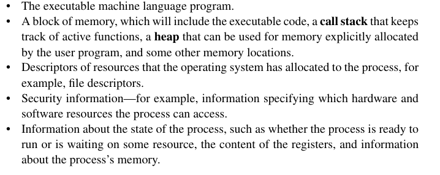

# Background

Created: 2024-02-24 18:35:15 -0500

Modified: 2024-02-24 20:13:40 -0500

---

[The von Neumann architecture]{.underline}

The classic Neumann architecture consists of main memory, a CPU (core/processor), and an interconnection (most notably bus)

 

[Main Memory]{.underline}: Main memory consists of a collection of locations, each of which is capable of storing both instructions and data.

-   Every location has an address and the location's contents.

-   The address is used to access the location

-   the contents of the location is the instruction or data stored in the location

 

[CPU]{.underline}: divided into a control unit and a data path

-   Control unit is responsible for deciding which instructions to run

-   Datapath is responsible for actually executing the instructions

-   Data in CPU is stored in a super fast storage place called registers

    -   Has a special register called program counter that tells the cpu which instruction is next

 

Interconnection: How Instructions and data are transferred b/w main memory and CPU

-   Most notable hardware is called a bus, which is a set of parallel wires.

 

[The Von Nuemann bottleneck]{.underline}: The separation of memory and CPU

-   Since the interconnect determines the rate at which data and instructions are transmitted/can be accessed

-   The vast quantity of data is isolated from the CPU

-   A CPU is capable of executing instructions more than a hundred times faster than fetching items from main memory

>  

[Processes, Multitasking, and threads]{.underline}

-   [A operating system (OS)]{.underline} is a piece of software whose purpose is to manage hardware and software resources on a computer

    -   It determines which programs can run and when they can run

    -   It controls allocation of memory to those programs

    -   Controls access to outside devices such as network card or hard disks

-   [Process]{.underline}: an instance of a computer program that is being executed

    -   When a user runs a program the OS creates a process

    -   A process consists of...

> {width="5.3125in" height="2.1145833333333335in"}

 

-   Most operating systems are [multitasking]{.underline}: OS provides support for simultaneous execution of multiple programs.

    -   Even systems with one core can do this due to [time slice]{.underline}: each process runs for a small interval of time (typically a few milliseconds).

    -   If a process is waiting for a resource or needs to wait for a resource it will [block]{.underline}: meaning that the process will stop executing and another process can run.

    -   Threading: provides a mechanism for programmers to divide their program into independent tasks, so that when one thread is blocked the other can run.

        -   Much faster to switch b/w threads than processes since they are lightweight

 

 

 

 

 

 

 

 

 

 

 

 

 

 

 

 

 

 

 

 

 

 

 

 

 

 

 

 

