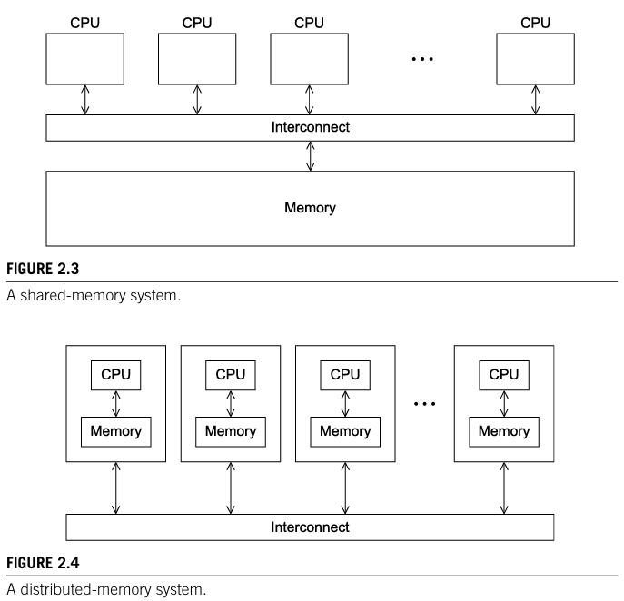
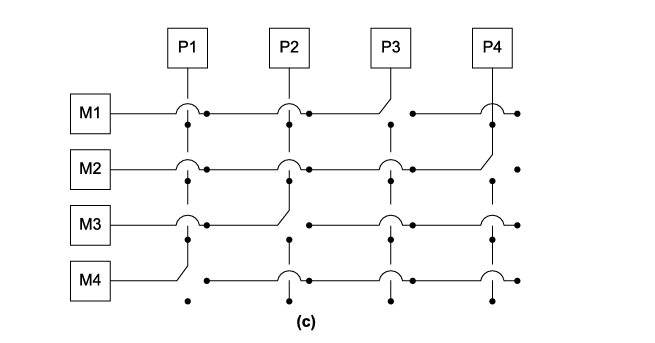
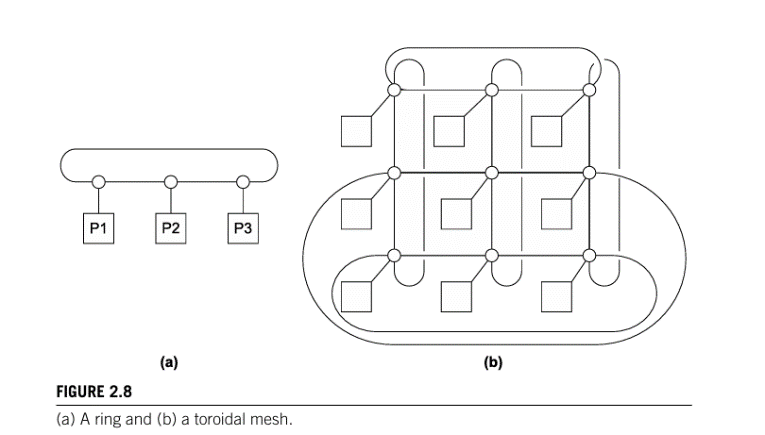
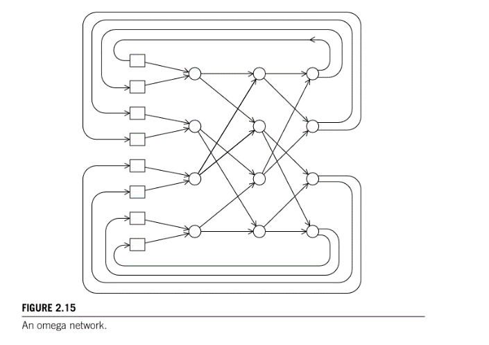
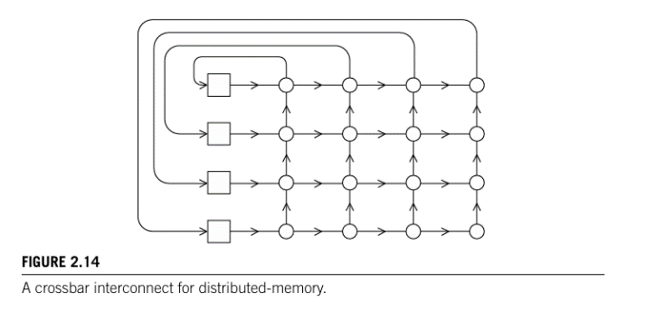

# Parallel Hardware

Created: 2024-02-26 01:26:20 -0500

Modified: 2024-02-26 20:58:25 -0500

---

[Classification of parallel computers:]{.underline} Two different types, flynns tax and how cores access memory

> [Flynn's Taxonomy]{.underline}:

-   [Single instruction stream, single data stream]{.underline}:

    -   Executes a single instruction at a time, computes only a single data value at a time

    -   Example is a classical von neumann system

-   [Multiple instruction stream, multiple data stream]{.underline}:

    -   Executes multiple instructions at a time, computes multiple data values at a time

> [How cores access memory]{.underline}:

-   [Shared memory]{.underline}:

    -   Cores can share access to memory locations and cores coordinate their work by modifying shared memory locations

-   [Distributed memory]{.underline}:

    -   Each core has its own private memory and the cores coordinate their work through a network

 

[SIMD Systems]{.underline}: Single instruction, multiple data are parallel systems who operate on multiple data streams by applying the same instruction to multiple data items.

-   It can be thought of as having one single control unit and multiple data paths

-   An example of this would be vector addition where we have two vectors x and y with n items and a for loop to add the items of y and x into x[i].

    -   In an SIMD system, we can grab lets say 4 i's of y and x (multiple data stream) and do the addition for them at a time (single instruction)

    -   If we have 13 i's in the last stream we will only compute one data stream and the others will be idle

-   The requirement that all the datapaths/streams execute the same instruction or are idle can seriously degrade the overall performance of a SIMD system.

-   Parallelism that's obtained by dividing data among the processors and having the processors all apply (more or less) the same instructions to their subsets of the data is called data-parallelism.

-   They are widely used in vector processors, GPU's, and desktop CPU's

>  

-   [Vector Processors]{.underline}: can operate on arrays or vectors of data.

    -   Registers are capable of storing a vector of operands and operating simultaneously on their content

        -   Big registers

    -   Vector operations are SIMD; same operation is applied to each element

    -   Vector instructions are instructions that operate on vectors as opposed to single data often meaning only one load is needed contrary to multiple loads for conventional systems

    -   Interleaved memory

    -   Strided memory access and hardware scatter/gather

        -   Can do opertions on fixed intervals like lets say the 1st element 3rd elemenbt, 5th element, +2...

        -   Hardware scatter focuses on irriglular intervals like 1, 3, 7, 10, etc

    -   Are fast and easy to use

    -   Good at identifying code that can be vectorized

    -   Provide info as to why a code was not vectorized often times leading the dev to make changes to make their code vectorizable

    -   Cons: bad scalability, expensive

-   [GPU's]{.underline}: real time graphic application programming interfaces or API's, use points, lines, and triangles to represent the surface of an object.

    -   They use [graphics processing pipelines]{.underline} to convert the internal representations into an array of pixels that can be sent to a computer screen.

        -   These are often programmable using [shader functions]{.underline}: short lines of C code is an example

    -   GPU systems can be both SIMD and MIMD as well as shared memory and distributed memory

    -   They handle large images and thus they need to optimize stall times which can be critical to the efficiency of the image being processed

 

[MIMD systems]{.underline}: multiple instructions multiple data, whose system supports multiple simultaneous instruction streams operating on multiple data streams

-   MIMD systems are asynchronous, this is, processors can operate at their own pace. (MIMD systems often have no global clock meaning two cores can be running at different paces even if they are doing the same instruction)

-   There are two types of MIMD systems:

    -   [Shared memory]{.underline}: processors are connected to the same memory block and can access each memory location.

    -   [Distributed memory]{.underline}: each processor has its own private memory and it communicates with other cores through a network.

> {width="3.7708333333333335in" height="3.6354166666666665in"}

 

-   [Shared memory systems]{.underline}:

    -   These systems usually use one or more multicore processors: has multiple CPUs or cores on a single chip

    -   Connects all processors directly to the main memory or a direct connection to a specific block of main memory, and if need be a core can access another cores block of memory through special hardware

    -   Two types of shared memory systems:

        -   [UMA]{.underline}: Connects all processors directly to the main memory; easier to program

        -   [NUMA]{.underline}: a direct connection to a specific block of main memory; faster access to memory

-   [Distributed memory systems]{.underline}:

    -   [Clusters]{.underline}: They are composed of a collection of commodity systems---for example, PCs---connected by a commodity interconnection network---for example, Ethernet.

    -   [Hybrid systems]{.underline}: some aspects of shared memory systems and distributed memory systems such as the example above

    -   [Grid]{.underline}: provides the infrastructure necessary to turn large networks of geographically distributed computers into a unified distributed-memory system.

 

Interconnection Networks

-   The interconnection plays a huge role in the performance of both distributed and shared memory systems.

    -   Even if a processor and memory had unlimited performance, it would be bottlenecked by a slow interconnect

-   [Shared memory interconnect]{.underline}:

    -   It was common for past shared mem sys to have a bus interconnect (it is now slow and outdated)

        -   One big problem is that the more connection to a bus the slower it becomes and processor has to wait longer

    -   Switched interconnects are better

        -   They use switches to control the routing of data among the connected devices.

            -   One example is a [crossbar]{.underline}

> {width="3.3958333333333335in" height="1.7708333333333333in"}

-   [Distributed memory interconnect]{.underline}:

> There are two groups of distributed memory interconnects: direct and indirect interconnects.

-   [Direct interconnects]{.underline}: each switch is directly connected to a processor memory pair and each switch is connected to each other

> {width="3.4791666666666665in" height="1.9791666666666667in"}

-   One of the ways to measure power is the number of links, we typically only count the number of switch-to-switch links

-   [Ring]{.underline} is superior to a simple bus because it allows for simultaneous communication

    -   One way to measure simultaneous communication or connectivity is [bisection width]{.underline}

        -   We simply cut the parallel system in half so that there are equal nodes on each side and count the number of links that needed to be cut to make the half

-   Bandwidth of a link: is the rate at which it can transmit data, usually in megabits or megabytes per second.

    -   It is called [bisection bandwidt]{.underline}h and it is similar to bisection width where you do all the same stuff but you multiply the amount of links (needed to cut) by the rate of data

-   [Fully connected network]{.underline}: this is the ideal direct interconnect which has ALL of the switches connected to each other.

    -   This is not really possible but it is used as a metric for comparing other networks to it to see how close it is to it.

    -   [The hypercube]{.underline} is an example of a highly connected direct network.

        -   They are built inductively

        -   1D, 2D, 3D

        -   Bisection width of p/2

        -   Has 2^d nodes (d meaning dimensions 1D, 2D, etc)

<!-- -->

-   [Indirect interconnects]{.underline}: Provide an alternative to direct interconnects in that the switches may not directly connect to a processor.

    -   The crossbar and omega network are examples of these

> {width="3.2083333333333335in" height="2.2604166666666665in"}
>
>  
>
> {width="3.2395833333333335in" height="1.5729166666666667in"}

-   We still do all the same computations as with direct interconnects like bisection width and bisection bandwidth

>  

Latency and Bandwidth:

-   [Latency]{.underline}: The latency is the time that elapses between the source's beginning to transmit the data and the destination's starting to receive the first byte.

-   [Bandwidth]{.underline}: the rate at which the destination receives data after it has started to receive the first byte.

-   Often times we want to know the [message transmission time]{.underline} = l + n/b

    -   So if the latency of an interconnect is l seconds and the bandwidth is b bytes per second, then the time it takes to transmit a message of n bytes

    -   Sometimes latency and message transmission time are used as the same thing

shows a ring and a two-dimensional toroidal mesh.

As before, the circles are switches, the squares are processors, and the lines are bidirectional links.

