# Collective communication

Created: 2024-03-16 16:55:02 -0400

Modified: 2024-03-16 23:12:03 -0400

---

**One of the main ways we can improve upon the program is by confronting the way we are handling the global sum of computing all the trapezoids.**

-   One metaphor for this problem is:

> If we hire eight workers to, say, build a house, we might feel that we weren't getting our money's worth if seven of the workers told the first what to do, and then the seven collected their pay and went home.

-   But this is very similar to what we're doing in our global sum. Each process with rank greater than 0 is "telling process 0 what to do" and then quitting. That is, each process with rank greater than 0 is, in effect, saying "add this number into the total." Process 0 is doing nearly all the work in computing the global sum, while the other processes are doing almost nothing.

-   Sometimes this is the best case scenario but in this case we can do more to increase efficiency

<!-- -->

-   Tree-structured communication

    -   We can have something like a binary tree structure where lets say processes 1,3,5, and 7 will send their values to 0,2,4,6 respectively and then those processes will do the sum. This process will repeat until we have our final area sum in process 0.

> 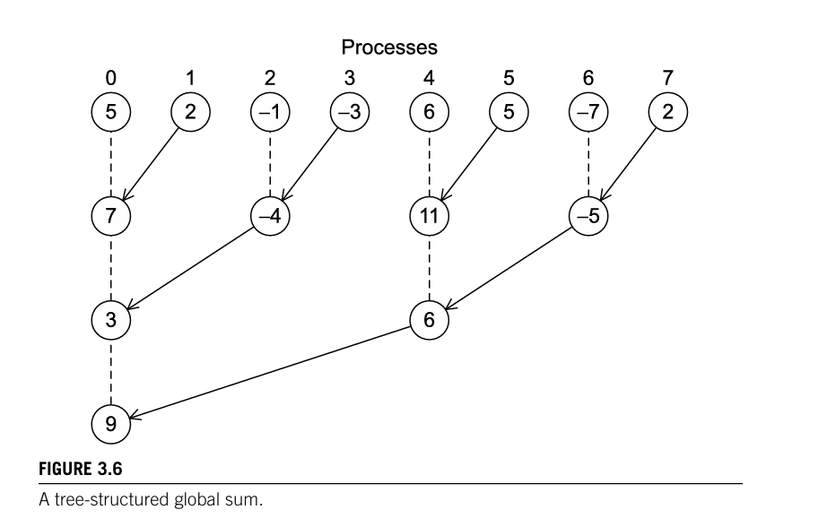{width="5.666666666666667in" height="3.6458333333333335in"}

-   This new scheme has the property that a lot of the work is done concurrently by different processes.

    -   Not only do we compute the area as we go but we are also saving on calling MPI send and receive.

-   So we've reduced the overall time by more than 50%.

 

**MPI_Reduce**

-   MPI provides a function who can do many of the "global sum" operations that we might need. The list of operations for a global sum are:

> 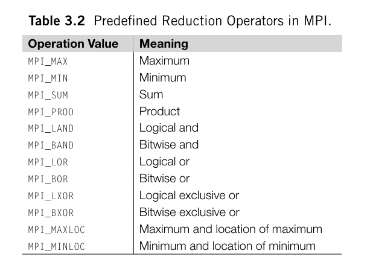{width="4.020833333333333in" height="2.8229166666666665in"}

-   We can use these in the function MPI_Reduce:

> 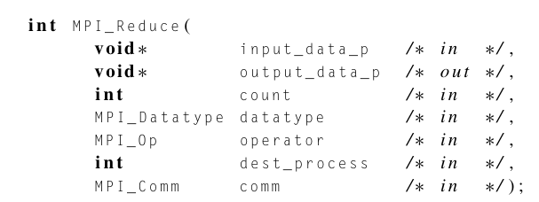{width="6.3125in" height="2.375in"}

-   The 5th param (operator of type MPI_Op) is the one where we enter the operation that we want to use

<!-- -->

-   Some facts that we should know that distinguish functions like MPI_Send and MPI_Recv from a function like MPI_Reduce are:

    -   Point to point vs collective communication

        -   MPI_Send and MPI_Recv are what are known as point to point communications which say that they are processes who are talking directly to each other

        -   MPI_Recv would be known as a collective communication which involves all the processes in the same communicator who are talking to each other

-   Example:

> 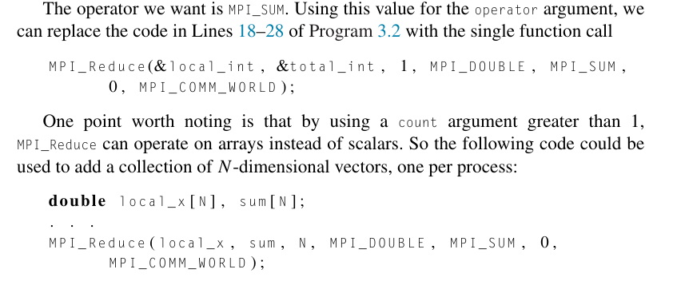{width="6.59375in" height="2.8645833333333335in"}

 

**Collective vs. point-to-point communications**

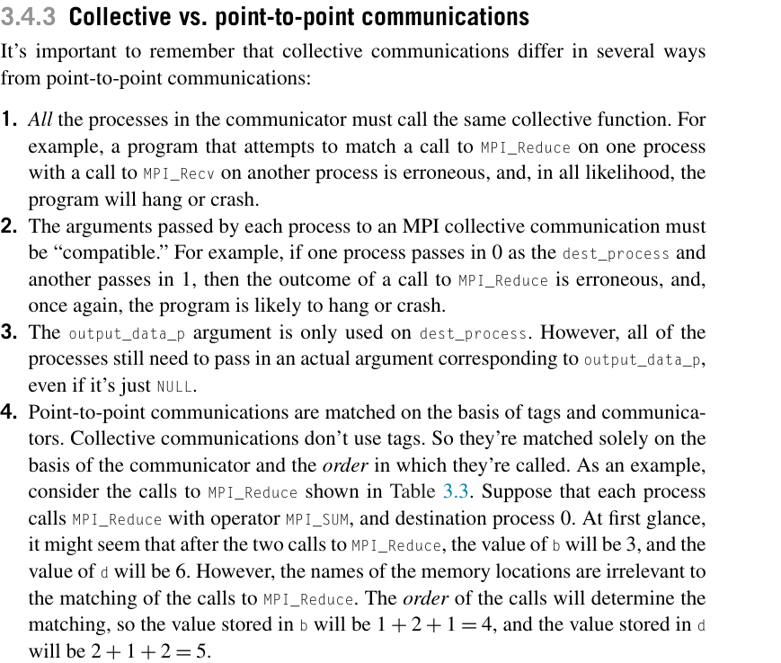{width="6.947916666666667in" height="5.90625in"}

-   Note that for point 4: we use table 3.3 to show that when we are making calls to MPI_Reduce it does not care about the addresses of the memory location instead it only cares about processes 0 output location for each MPI_Reduce call

    -   What I mean by this is that for example the first MPI_Reduce call that process 0 makes is that the value in a be stored in b thus b = 0 + 1. At the same times process 1 calls for c's value to be added, we would assume that it would be added to d but no it is actually added to b since process 0 is adding it to b, so b = 1 + 2. Now b is 3, and process 2 will add b = 3 + 1 making it 4, b = 4.

        -   The same thing would happen in the second call that process 0 does for MPI_Reduce. We will be adding to d instead of any other location it might seem like we are adding to.

> Aliasing

-   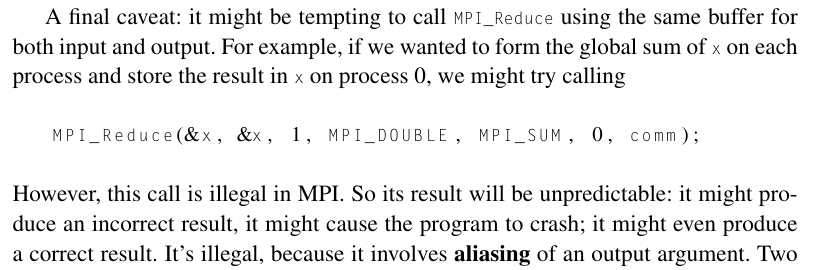{width="8.125in" height="2.6145833333333335in"}

 

**MPI_Allreduce**

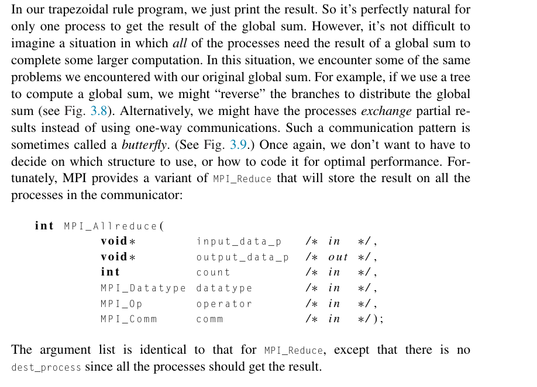{width="8.552083333333334in" height="6.166666666666667in"}

 

**Broadcast**

Similar to how we create a tree like structure for ouputs where we compute for some output, we can do the same for taking in some input and distributing it to all the processes.

-   This is in fact what part of our helper function get_input(..) does

-   How can we make it more efficient to distribute the input to all the processes?

-   MPI provides a functions MPI_Bcast to do just this:

> 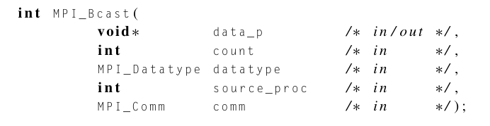{width="6.239583333333333in" height="1.6145833333333333in"}

-   Some program, like our trapizoidal rule prg will look like this:

> 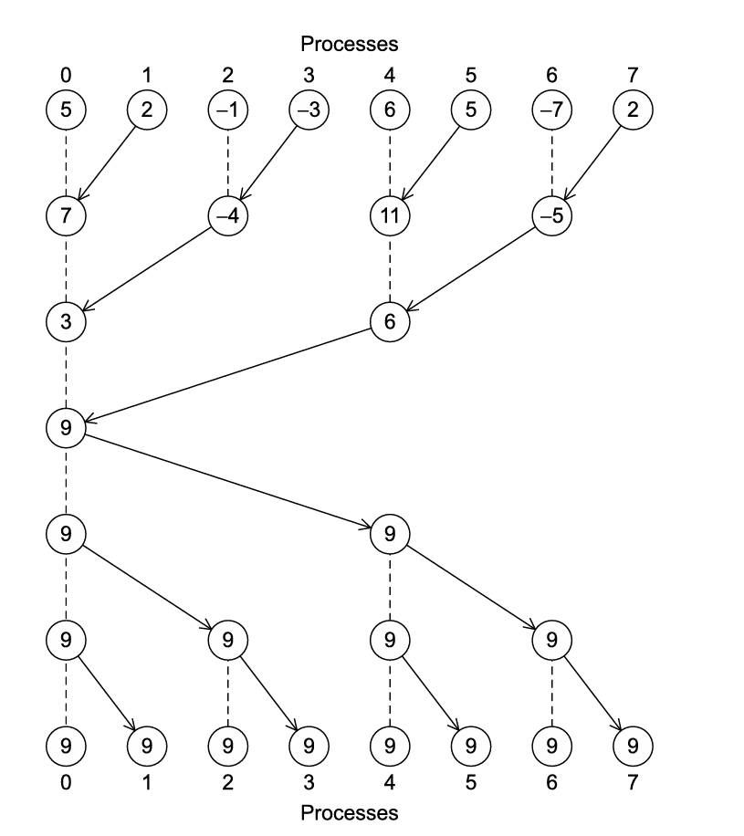{width="6.135416666666667in" height="6.895833333333333in"}

-   We can modify our get_input(..) function to broadcast all the info we need to broadcast out to all the processes

> 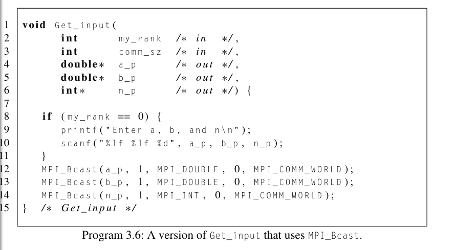{width="6.677083333333333in" height="3.6666666666666665in"}
>
>  

Note:
- If we want to find things like sum, maximum, minimum, product, true/false, etc

 

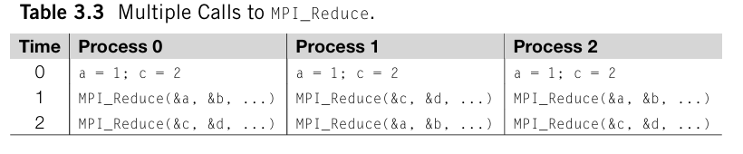{width="5.458333333333333in" height="1.125in"}

 

The process with rank source_proc sends the contents of the memory referenced by data_p to all the processes in the communicator comm.

 

Global sum followed by a distribution of all of the sums

