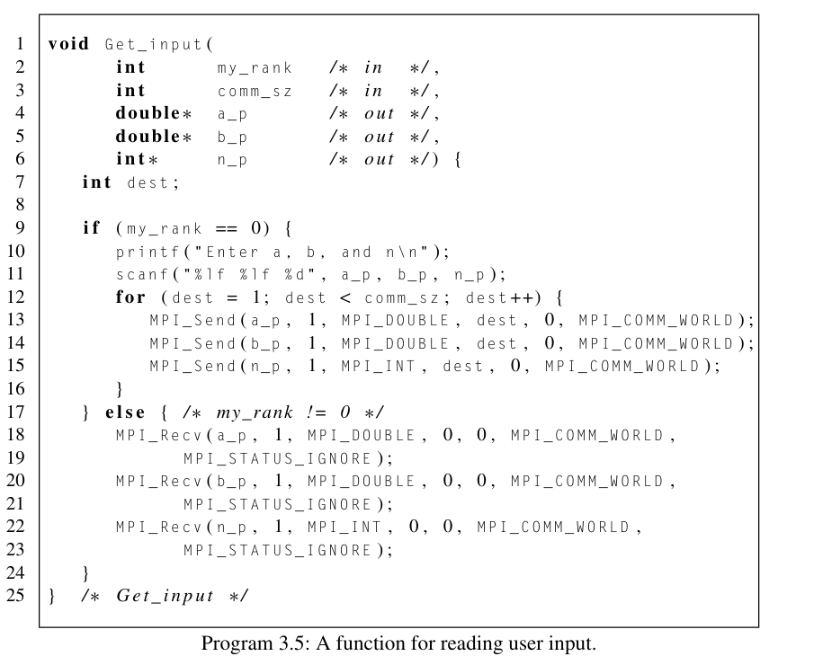
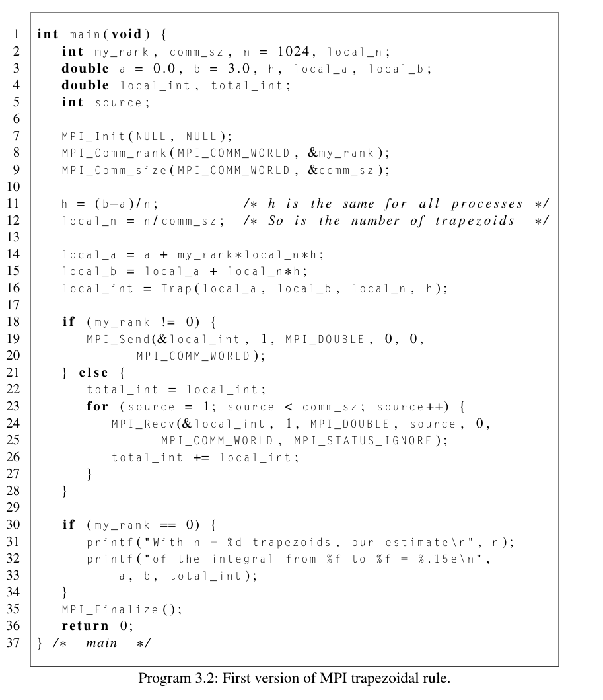

# Dealing with I/O

Created: 2024-03-16 15:47:09 -0400

Modified: 2024-03-16 16:54:59 -0400

---

Instead of having to edit the code and recompile every time we wanted to find the area of a new length we can implement some input and output

-   OUTPUT:

-   So far we have assumed that process 0 can write to stdout (by using printf.

-   Now is a good time to say that all MPI implementations allow all the processes in MPI_COMM_WORLD access to sdout and stderr.

    -   All processes can execute printf and fprintf

    -   However, most MPI implementations don't provide any automatic scheduling of access to these devices. That is, if multiple processes are attempting to write to, say, stdout, the order in which the processes' output appears will be unpredictable.

        -   Because of nondeterminism if we have some prg that has every process execute some message "Does anyone have a toothpick?" the order in which they print can vary run to run.

> {width="6.614583333333333in" height="1.8645833333333333in"}
>
> This happens because each process is competing for access to stdout

-   if we do not want this to happen and we want there to be some sort of order we can modify the program to do so.

    -   For example we could have each process that isnt 0 send its message to process 0 and it will handle the output in rank order.

<!-- -->

-   INPUT:

-   Unlike output most MPI implementations only allow process 0 in MPI_COMM_WORLD access to stdin which handles input.

    -   This makes sense because if it didn't then what process would get what line of input?

        -   Would process 0 get the first line and process 1 get the second line? It wouldn't make much sense

-   So, to write MPI programs that can use scanf, we need to branch on process rank, with process 0 reading in the data, and then sending it to the other processes.

    -   We can create a function that can handle this called get_input(...)

> {width="5.78125in" height="4.71875in"}
>
>  

-   The new trapizoid rule prg would look like:

-   {width="6.197916666666667in" height="7.1875in"}

>  
>
>  

Note:

-   What this function will do is that it will handle asking the user for data, storing it, and then handling having process 0 send all the data to all the other processes who will recv the data

{width="0.10416666666666667in" height="0.10416666666666667in"}

 

{width="0.7708333333333334in" height="0.4479166666666667in"}{width="0.15625in" height="0.4895833333333333in"}{width="0.34375in" height="0.3958333333333333in"}{width="0.15625in" height="0.4166666666666667in"}{width="0.3333333333333333in" height="0.2604166666666667in"}{width="0.4270833333333333in" height="0.2916666666666667in"}{width="0.22916666666666666in" height="0.19791666666666666in"}{width="0.23958333333333334in" height="0.3229166666666667in"}{width="0.14583333333333334in" height="0.34375in"}{width="0.11458333333333333in" height="0.17708333333333334in"}{width="0.375in" height="0.2916666666666667in"}{width="0.17708333333333334in" height="0.25in"}{width="0.34375in" height="0.2916666666666667in"}{width="0.16666666666666666in" height="0.13541666666666666in"}{width="0.10416666666666667in" height="0.10416666666666667in"}{width="0.15625in" height="0.20833333333333334in"}{width="0.14583333333333334in" height="0.3229166666666667in"}{width="0.2604166666666667in" height="0.23958333333333334in"}{width="0.19791666666666666in" height="0.3229166666666667in"}{width="0.17708333333333334in" height="0.21875in"}{width="0.20833333333333334in" height="0.3333333333333333in"}{width="0.10416666666666667in" height="0.125in"}{width="0.15625in" height="0.3541666666666667in"}{width="0.34375in" height="0.15625in"}{width="0.21875in" height="0.21875in"}{width="0.11458333333333333in" height="0.22916666666666666in"}{width="0.11458333333333333in" height="0.23958333333333334in"}{width="0.22916666666666666in" height="0.20833333333333334in"}{width="0.2708333333333333in" height="0.46875in"}{width="0.19791666666666666in" height="0.4166666666666667in"}{width="0.19791666666666666in" height="0.5208333333333334in"}{width="0.13541666666666666in" height="0.15625in"}{width="0.13541666666666666in" height="0.4270833333333333in"}{width="0.11458333333333333in" height="0.3229166666666667in"}{width="0.28125in" height="0.5520833333333334in"}{width="0.40625in" height="0.3854166666666667in"}{width="0.20833333333333334in" height="0.28125in"}{width="0.11458333333333333in" height="0.375in"}{width="0.22916666666666666in" height="0.11458333333333333in"}{width="0.22916666666666666in" height="0.3125in"}{width="0.3854166666666667in" height="0.3333333333333333in"}{width="0.22916666666666666in" height="0.3020833333333333in"}{width="0.17708333333333334in" height="0.3229166666666667in"}{width="0.20833333333333334in" height="0.16666666666666666in"}{width="0.1875in" height="0.20833333333333334in"}{width="0.4375in" height="0.13541666666666666in"}{width="0.2708333333333333in" height="0.10416666666666667in"}{width="0.11458333333333333in" height="0.1875in"}{width="0.3333333333333333in" height="0.125in"}{width="0.22916666666666666in" height="0.17708333333333334in"}{width="3.8541666666666665in" height="0.20833333333333334in"}{width="0.22916666666666666in" height="0.16666666666666666in"}

 

{width="0.10416666666666667in" height="0.10416666666666667in"}

