# Barriers and condition variables

Created: 2024-04-24 00:51:09 -0400

Modified: 2024-04-24 03:19:26 -0400

---

Barriers have numerous applications

-   Timing parts of a multithreaded system.

    -   we'd like for all the threads to start the timed code at the same instant, and then report the time taken by the last thread to finish, i.e., the "slowest" thread. So we'd like to do something like this:

> 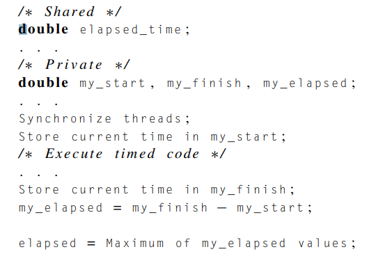{width="3.1041666666666665in" height="2.1458333333333335in"}

-   Using this approach, we're sure that all of the threads will record my_start at approximately the same time

<!-- -->

-   Debugging

    -   We can, of course, have each thread print a message indicating which point it's reached in the program, but it doesn't take long for the volume of the output to become overwhelming. Barriers provide an alternative:

> 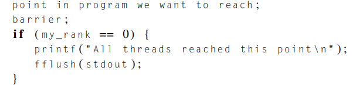{width="4.416666666666667in" height="1.0416666666666667in"}
>
>  

Many implementations of Pthreads don't provide barriers, so if our code is to be portable, we need to develop our own implementation

-   **Busy-waiting and a mutex**

    -   Implementing a barrier using busy-waiting and a mutex is straightforward: we use a shared counter protected by the mutex. When the counter indicates that every thread has entered the critical section, threads can leave the busy-wait loop.

    -   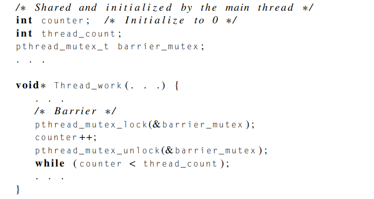{width="4.385416666666667in" height="2.3229166666666665in"}

    -   Of course, this implementation will have the same problems that our other busywait codes had: we'll waste CPU cycles when threads are in the busy-wait loop, and, if we run the program with more threads than cores, we may find that the performance of the program seriously degrades

    -   It also suffers from errors that are prone to happen with the shared variable counter

-   **Semaphores**

    -   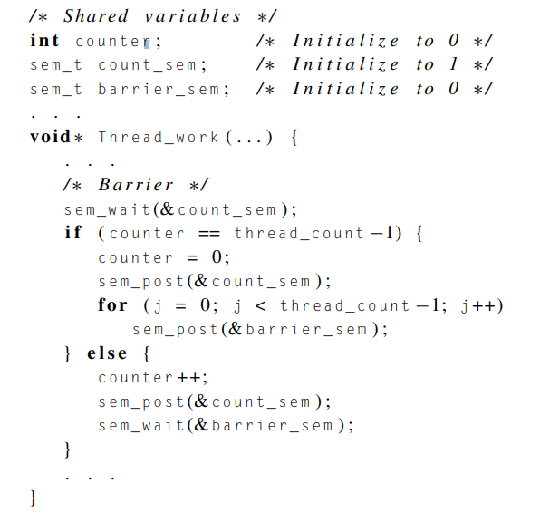{width="4.104166666666667in" height="3.96875in"}

        -   As with the busy-wait barrier, we have a counter that we use to determine how many threads have entered the barrier. We use two semaphores: count_sem protects the counter, and barrier_sem is used to block threads that have entered the barrier.

        -   What the code is doing:

> "When a thread has exclusive access to the counter, it checks to see if counter < thread_count-1. If it is, the thread increments counter, relinquishes the lock (sem_post(&count_sem)), and blocks in sem_wait(&barrier_sem). On the other hand, if counter == thread_count-1, the thread is the last to enter the barrier, so it can reset counter to zero and "unlock" count_sem by calling sem_post(&count_sem). Now, it wants to notify all the other threads that they can proceed, so it executes sem_post(&barrier_sem) for each of the thread_count-1 threads that are blocked in sem_wait(&barrier_sem)."

-   It should be clear that this implementation of a barrier is superior to the busy-wait barrier, since the threads don't need to consume CPU cycles when they're blocked in sem_wait.

-   Can we reuse the data structures from the first barrier if we want to execute a second barrier?

    -   The counter can be reused, since we were careful to reset it before releasing any of the threads from the barrier.

    -   Also, count_sem can be reused, since it is reset to 1 before any threads can leave the barrier.

    -   Barrier_sem cannot be reused caused by race condition

<!-- -->

-   **Condition variables**: is a data object that allows a thread to suspend execution until a certain event or condition occurs.

    -   A somewhat better approach to creating a barrier in Pthreads is provided by condition variables

    -   When the event or condition occurs another thread can signal the thread to "wake up."

    -   A condition variable is always associated with a mutex.

    -   Pseudocode:

> 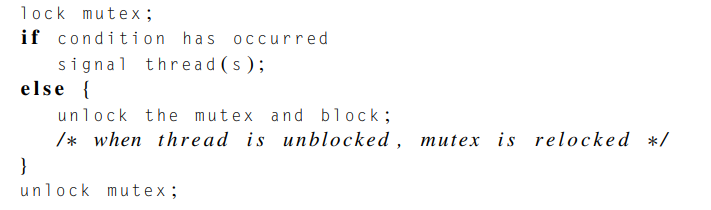{width="4.791666666666667in" height="1.4166666666666667in"}

-   Condition variables in Pthreads have [type]{.underline} pthread_cond_t.

-   Functions

    -   Will unblock one of the blocked threads:

> 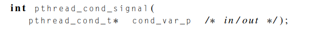{width="5.28125in" height="0.5625in"}

-   will unblock all of the blocked threads.

> 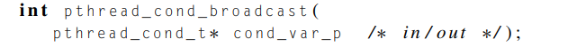{width="5.3125in" height="0.5104166666666666in"}

-   This is one advantage of condition variables; recall that we needed a for loop calling sem_post to achieve similar functionality with semaphores.

<!-- -->

-   Does three things: mutex unlock, wait, mutex lock

> 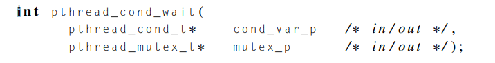{width="5.25in" height="0.6666666666666666in"}
>
>  

-   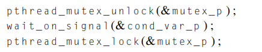{width="3.0416666666666665in" height="0.6041666666666666in"}

>  

-   Example:

> 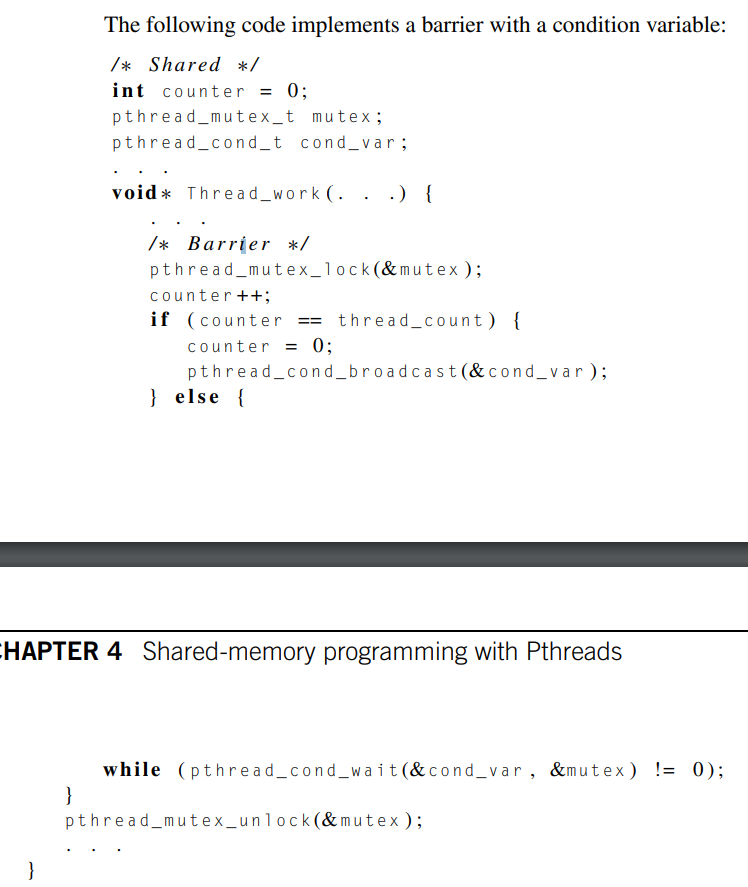{width="4.197916666666667in" height="4.979166666666667in"}

-   Things to look out for:

    -   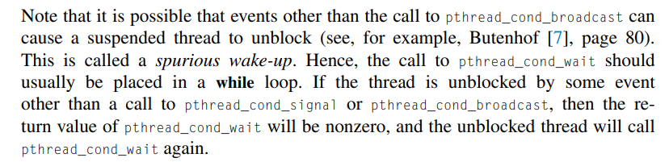{width="4.71875in" height="1.1458333333333333in"}

    -   If a single thread is being awakened, it's also a good idea to check that the condition has, in fact, been satisfied before proceeding. In our example, if a single thread were being released from the barrier with a call to pthread_cond_signal, then that thread should verify that counter == 0 before proceeding.

    -   Note that in order for our barrier to function correctly, it's essential that the call to pthread_cond_wait unlock the mutex.

    -   Also note that the semantics of mutexes require that the mutex be relocked before we return from the call to pthread_cond_wait.

<!-- -->

-   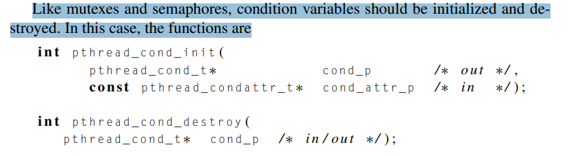{width="6.322916666666667in" height="1.6875in"}

    -   We won't be using the second argument to pthread_cond_init---as with mutexes, the default the attributes are fine for our purposes---so we'll call it with second argument set to NULL

    -   {width="6.354166666666667in" height="0.40625in"}

        -   Same shit as pthread_cond_init

<!-- -->

-   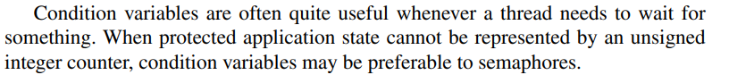{width="6.822916666666667in" height="0.7708333333333334in"}

Note:

-   The count_sem semaphore is initialized to 1 (that is, "unlocked"), so the first thread to reach the barrier will be able to proceed past the call to sem_wait.

-   Subsequent threads, however, will block until they can have exclusive access to the counter.

-   Essentially coun_sem protects the counter itself and barrier_sem protects the threads from advancing from this portion of the code until everything is done

