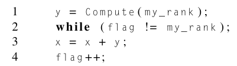
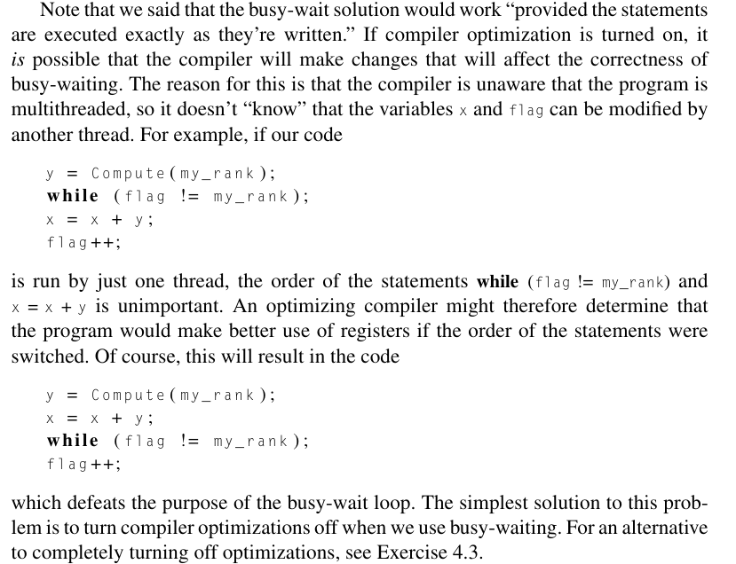
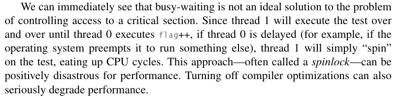
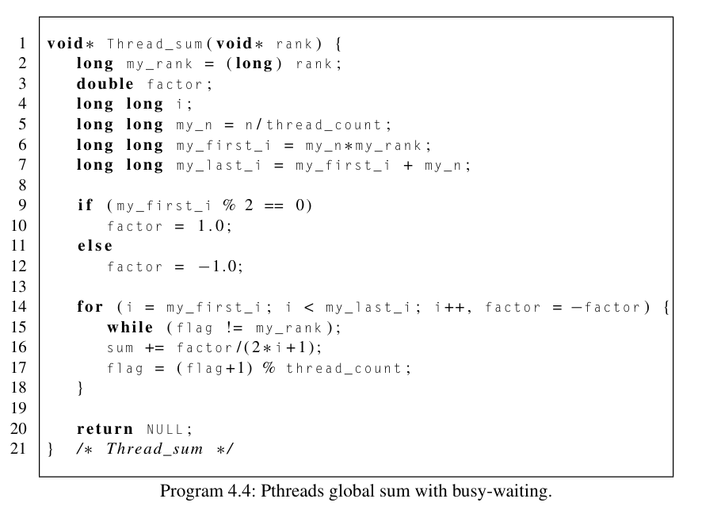

# Busy-waiting

Created: 2024-04-21 23:10:24 -0400

Modified: 2024-04-23 21:13:40 -0400

---

-   One way to solve this problem is using a simple flag variable.

    -   Lets suppose flag is a shared int variable set to 0 in our main thread.

    -   We add the following code to our example:

> {width="4.177083333333333in" height="1.15625in"}

-   Note: The while loop has an empty body. This means that in our program as long as flag isnt equal to my_rank we will continue to re-exectute the condition until it is false. We are essentially stuck here until given the go ahead to continue.

<!-- -->

-   Since we're assuming that the main thread has initialized flag to 0, thread 1 won't proceed to the critical section in Line 3 until thread 0 executes the statement flag++.

-   The key here is that thread 1 cannot enter the critical section until thread 0 has completed the execution of flag++.

-   The while loop is an example of **busy-waiting**.

    -   In busy-waiting, a thread repeatedly tests a condition, but, effectively, does no useful work until the condition has the appropriate value (false in our example).

-   Sometimes with busy-waiting solution we can have situations where compiler optimizations will change our code and destroy our busy-waiting solution.

    -   {width="4.166666666666667in" height="3.1979166666666665in"}

>  

-   {width="7.354166666666667in" height="2.0104166666666665in"}

 

Example of busy waiting code in a thread function:

Computing Pi

{width="5.958333333333333in" height="4.239583333333333in"}

Note:

-   We replaced flag++ with flag = (flag+1) mod thread_count

    -   This is because with flag++ eventually we will see that our flag will just advance past the thread_count which will have our busy_waiting condition to never fail since it will never be equal to any rank

        -   Why is this the case? It is important to understand what the code is doing. Lets say we have two threads. Each thread takes care of half of the work. In the for loop each thread will go through its iterations one at a time. It is important to understand that both threads in this scenerio will take turns during their iterations, going back and forth between each other caused by the busy-waiting.

        -   The reason for flag = (flag+1) mod thread_count is so that we can always go back to the first thread so that it can do its next iteration and so on...

        -   The for loop and busy-waiting do this -> thread0 passes busy-waiting condition and does iteration and then sets flag to be +1 and then it waits, thread1 passes busy-waiting condition and does iteration and then sets flag to be +1 but the mod takes it back to thread0 and thread1 waits. Thread0 passes busy-waiting condition... WE REPEAT.

    -   This is all incredibly inefficient and with two threads, we actually see serial programs do better.

        -   This is because the flag incrementing code on like 17 causes too much delay as well as the continuious swapping of threads each time for each iteration.

        -   How to improve code:

            -   Therefore, if it's at all possible, we should minimize the number of times we execute critical section code. One way to greatly improve the performance of the sum function is to have each thread use a private variable to store its total contribution to the sum. Then, each thread can add in its contribution to the global sum once, after the for loop. See Program 4.5. When we run this on the dual core system with n = 10^8, the elapsed time is reduced to 1.5 (vs 19.5 seconds which is what it would be with the current code) seconds for two threads, a substantial improvement.

Code added:

while(flag!=my_rank);

flag++

