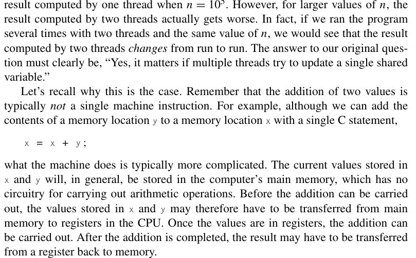
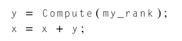
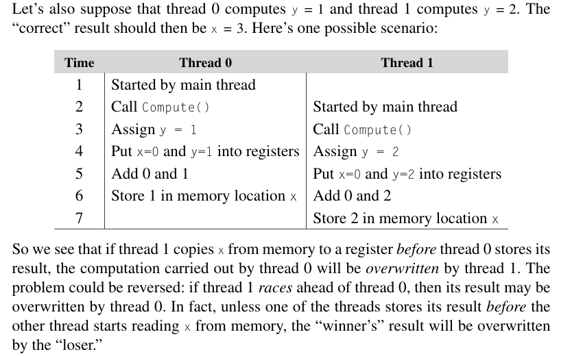
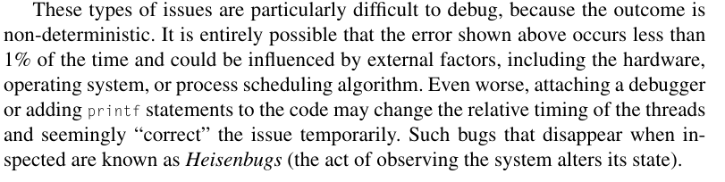

# Critical sections

Created: 2024-04-21 21:28:48 -0400

Modified: 2024-04-21 23:10:05 -0400

---

{width="5.791666666666667in" height="3.59375in"}

 

{width="2.25in" height="0.5104166666666666in"}

{width="5.770833333333333in" height="3.53125in"}

-   In this example, x = x + y is the code with a shared resource that we identify as x.

    -   I think its because x is being used to add with y and then stored which if x is overwritten by another thread it can effect the addition.

    -   This code is known as a **critical section**, that is, it's a block of code that updates a shared resource that can only be updated by one thread at a time.

 

Race conditions and buggy critical sections are hard to identify and debug:

{width="6.427083333333333in" height="1.6145833333333333in"}

 

Notes:

-   In this pi program example, when we only have one thread running the program we see that as we increase n, the closer we get to pi.

-   But when we run 2 threads with the program we see that as we increase n, we get worse results.

-   Why is that? This is because when we try and modify shared variables b/w threads we get race conditions which can severely mess up computations and results

 

Note:

-   As you can see Thread 0 is known as the "winner" because it finishes faster than thread 1 "loser" but what happens in a race condition is that the "loser" ends up overwriting what the "winner" thread had which can effect the outcome of the program in an unwanted way

