# Hello, world

Created: 2024-04-19 19:43:28 -0400

Modified: 2024-04-21 18:57:20 -0400

---

How to execute a pthreads program:

-   How to compile a pthreads program:

    -   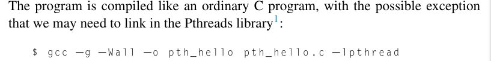{width="5.354166666666667in" height="0.6666666666666666in"}

        -   The -l pthread links the pthreads library

>  

-   How to run/execute a pthreads program once compiled:

    -   ./[program name][number of threads you want]

        -   p.s. it is compiled like a regular c file only difference is you need to include number of threads you want

 

Hello World Pthreads Program:

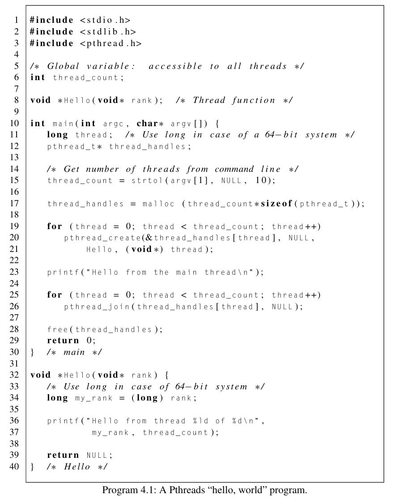{width="4.9375in" height="6.291666666666667in"}

-   **Preliminaries** of the hello world pthreads code

    -   First notice that this is just a C program with a main function and one other function.

    -   In Line 3 we include pthread.h, the Pthreads header file, which declares the various Pthreads functions, constants, types, and so on.

    -   In Line 6 we define a global variable thread_count.

        -   In pthreads prgs, global variables are shared by all threads

        -   Local variables and function arguments---that is, variables declared in functions---are (ordinarily) private to the thread executing the function.

            -   If several threads are executing the same function, each thread will have its own private copies of the local variables and function arguments.

                -   This makes sense if you recall that each thread has its own stack.

        -   Also note that global variables can cause bugs in pthread prgs. Try and minimize using them.

    -   In Line 15 the program gets the number of threads it should start from the command line.

        -   Unlike MPI programs, Pthreads programs are typically compiled and run just like serial programs, and one relatively simple way to specify the number of threads that should be started is to use a command-line argument.

    -   What does the long strtol() function do?

> 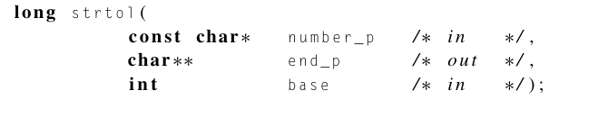{width="4.34375in" height="0.8541666666666666in"}

-   The purpose of the strtol() is that it returns a long.

-   Strtol() has three params.

    -   Number_p which is a pointer to the first character in the string that is a number

    -   End_p is a param which can be null but it tells you if the string has an invalid (non numerical char)

    -   Base which can be anywhere from base 2 to base 32, base 10 is the system we use like 0,1,2,..

<!-- -->

-   **Starting the threads**: As we already noted, unlike MPI programs, in which the processes are usually started by a script, in Pthreads the threads are started by the program executable. This introduces a bit of additional complexity, as we need to include code in our program to explicitly start the threads, and we need data structures to store information on the threads.

    -   In Line 17 we allocate storage for one pthread_t object for each thread.

        -   The pthread_t data structure is used for storing thread-specific information.

        -   It's declared in pthread.h.

        -   {width="3.7916666666666665in" height="0.28125in"}

            -   Of type pthread_t pointer

        -   The pthread_t objects are examples of opaque objects. The actual data that they store is system specific, and their data members aren't directly accessible to user code.

            -   However, the Pthreads standard guarantees that a pthread_t object does store enough information to uniquely identify the thread with which it's associated.

    -   In Lines 19--21,we use the pthread_create function to start the threads.

        -   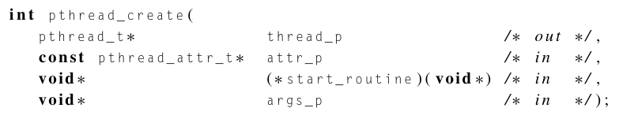{width="5.427083333333333in" height="1.0416666666666667in"}

            -   The first argument is a pointer to the appropriate pthread_t object.

                -   Note that the object is not allocated by the call to pthread_create; it must be allocated before the call.

                -   In this case we allocated for the object on line 17

            -   We won't be using the second argument, so we just pass NULL in our function call.

            -   The third argument is the function that the thread is to run

                -   The function that's started by pthread_create should have a prototype that looks something like this:

> {width="4.052083333333333in" height="0.3125in"}

-   Recall that the type void∗ can be cast to any pointer type in C, so args_p can point to a list containing one or more values needed by thread_function. Similarly, the return value of thread_function can point to a list of one or more values.

<!-- -->

-   last argument is a pointer to the argument that should be passed to the function start_routine.

    -   we're effectively assigning each thread a unique integer rank.

    -   if when we start the threads, we assign the first thread rank 0, and the second thread rank 1, we can easily determine which thread

    -   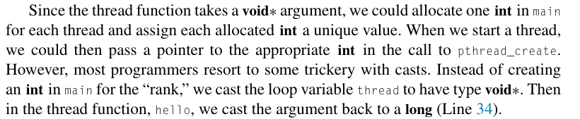{width="4.760416666666667in" height="0.9791666666666666in"}

>  

-   {width="5.791666666666667in" height="1.1458333333333333in"}

> 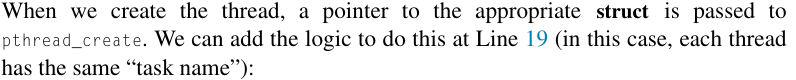{width="5.78125in" height="0.5729166666666666in"}
>
> 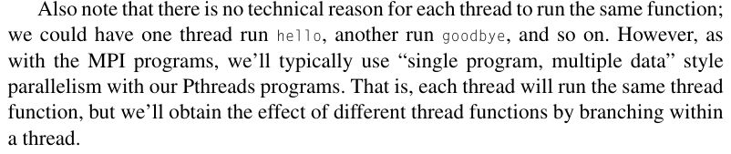{width="5.78125in" height="1.21875in"}

-   All of this is saying that we can pass in using a struct any number of arguments into the function that the threads will be using. We would allocate space in the heap of type stuct-we-created multiplied by the number of threads we will be running

<!-- -->

-   The return value for most Pthreads functions indicates if there's been an error in the function call.

<!-- -->

-   Also note that there is no technical reason for each thread to run the same function; we could have one thread run hello, another run goodbye, and so on.

    -   However, as with the MPI programs, we'll typically use "single program, multiple data" style parallelism with our Pthreads programs.

    -   That is, each thread will run the same thread function, but we'll obtain the effect of different thread functions by branching within a thread.

>  

-   **Running the Threads**

    -   The thread running the main function is sometimes called the main thread

        -   Hence why it prints out "Hello from the main thread"

        -   In the meantime the threads started by the calls to pthread_create() are also running

            -   They get their rank and then they print their rank

        -   The function running the thread has a return value but in this case we don't need it to return anything so we return NULL

        -   There's no argument in pthread_create saying which core should run which thread; thread placement is controlled by the operating system.

            -   Indeed, on a heavily loaded system, the threads may all be run on the same core.

            -   In fact, if a program starts more threads than cores, we should expect multiple threads to be run on a single core.

            -   However, if there is a core that isn't being used, operating systems will typically place a new thread on such a core.

-   Stopping the threads

    -   In Lines 25 and 26, we call the function pthread_join once for each thread.

        -   A single call to pthread_join will wait for the thread associated with the pthread_t object to complete.

            -   Pthread_t object essentially holds the thread, almost like a casing, so when we talk about a thread we talk about the object

            -   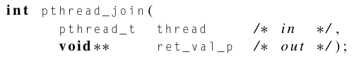{width="3.9479166666666665in" height="0.7291666666666666in"}

                -   The first param is the thread object

                -   The second param is the return value(s)(could be a struct) of that thread

            -   eventually the main thread will call pthread_join on that thread to complete its termination.

            -   This function is called pthread_join because of a diagramming style that is often used to describe the threads in a multithreaded process.

> 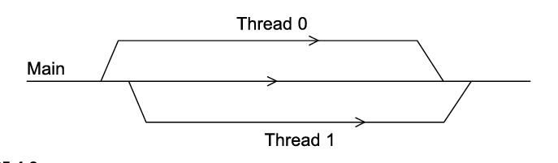{width="3.875in" height="1.125in"}

-   If we think of the main thread as a single line in our diagram, then, when we call pthread_create, we can create a branch or fork off the main thread.

-   Multiple calls to pthread_create will result in multiple branches or forks.

-   Then, when the threads started by pthread_create terminate, the diagram shows the branches joining the main thread.

<!-- -->

-   As noted previously, every thread requires a variety of resources to be allocated, including stacks and local variables.

    -   The pthread_join function not only allows us to wait for a particular thread to finish its execution but also frees the resources associated with the thread.

    -   In fact, not joining threads that have finished execution produces zombie threads that waste resources and may even prevent the creation of new threads if left unchecked.

        -   If your program does not need to wait for a particular thread to finish, it can be detached with the pthread_detach function to indicate that its resources should be freed automatically upon termination.

<!-- -->

-   **Error Checking**

> 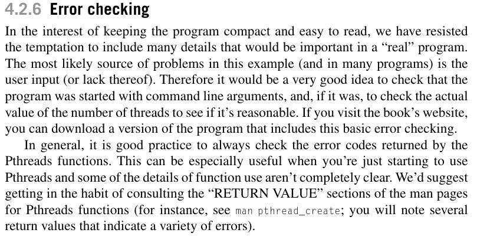{width="6.270833333333333in" height="3.2291666666666665in"}
>
>  

-   Other approaches to thread startup

    -   In our example, the user specifies the number of threads to start by typing in a command-line argument. The main thread then creates all of the "subsidiary" threads. While the threads are running, the main thread prints a message, and then waits for the other threads to terminate. This approach to threaded programming is very similar to our approach to MPI programming, in which the MPI system starts a collection of processes and waits for them to complete.

    -   There is however another way to go about creating a pthread program which creates all the threads at the start and they sit idle until they are needed

        -   This approach saves on resources because it doesn't need to continuously make overhead calls to make and delete threads.

    -   Here is a more in depth look at this:

> 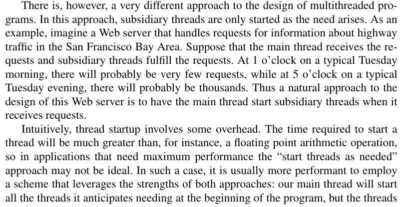{width="5.854166666666667in" height="3.0in"}
>
> 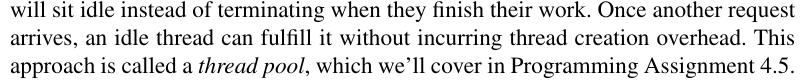{width="5.864583333333333in" height="0.59375in"}
>
>  

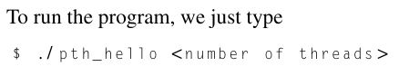{width="2.6458333333333335in" height="0.4895833333333333in"}{width="2.6458333333333335in" height="2.375in"}

Note: that we usually don't have direct control of the order in which threads execute and thus the output isnt always in the order you expect it to be in

 

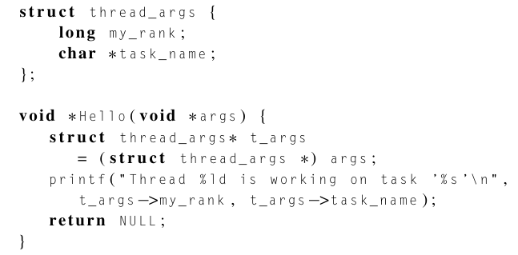{width="3.6145833333333335in" height="1.78125in"}

<- it creates its own struct to house the values

-   in the thread function, each thread deconstructs the struct to access its values.

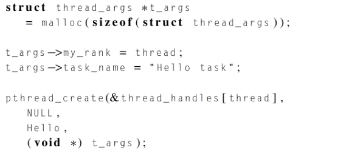{width="2.6354166666666665in" height="1.1666666666666667in"}

<- creating space in heap for stroring the args that will go into each function

<- changing the pthreads_create() function to now include the struct of args

