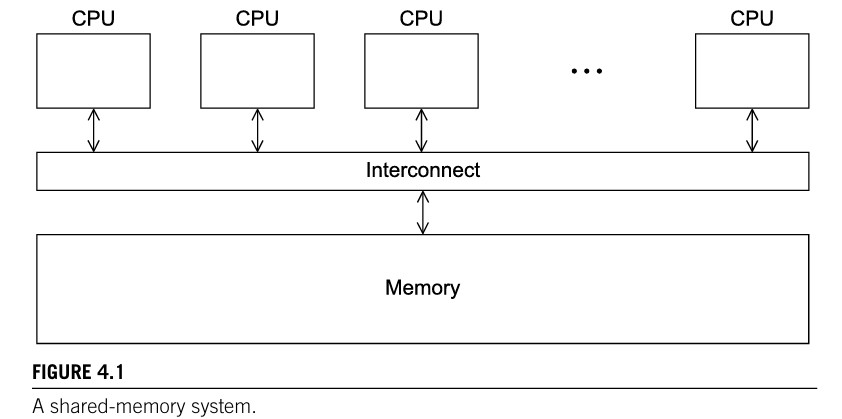

# INTRO AND RECALL

Created: 2024-04-19 18:29:15 -0400

Modified: 2024-04-19 19:18:45 -0400

---

-   Why not use shared memory systems all the time? Because there are issues that we will dive into later that come from this idea of shared memory systems.

    -   For example, different cores attempt to update a single shared-memory location, then the contents of the shared location can be unpredictable.

    -   The code that updates the shared location is an example of a ***critical section***. We'll see some other examples of critical sections, and we'll learn several methods for controlling access to a critical section.

 

{width="5.416666666666667in" height="2.6875in"}

 

In shared-memory programming, an instance of a program running on a processor is usually called a ***thread*** (unlike MPI, where it's called a process).

-   We will learn..

    -   how to synchronize threads so that each thread will wait to execute a block of statements until another thread has completed some work.

    -   We'll learn how to put a thread "to sleep" until a condition has occurred.

    -   We'll see that there are some circumstances in which it may at first seem that a critical section must be quite large.

        -   However, we'll also see that there are tools that can allow us to "fine-tune" access to these large blocks of code so that more of the program can truly be executed in parallel.

-   We'll see that the use of cache memories can actually cause a shared-memory program to run more slowly.

-   Finally, we'll observe that functions that "maintain state" between successive calls can cause inconsistent or even incorrect results.

-   In this chapter we'll be using POSIX threads for most of our shared-memory functions as opposed to OpenMP which we will use in the next chapter. They both take a different approach to Shared memory systems.

 

