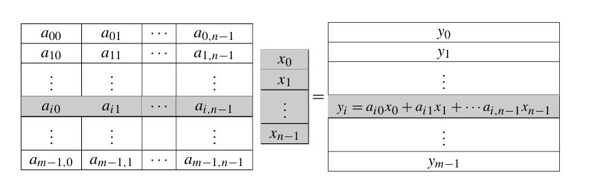
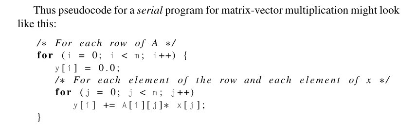
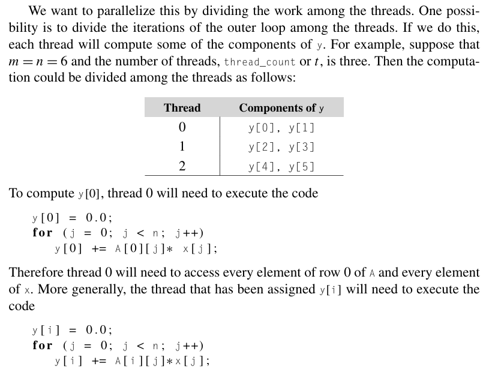
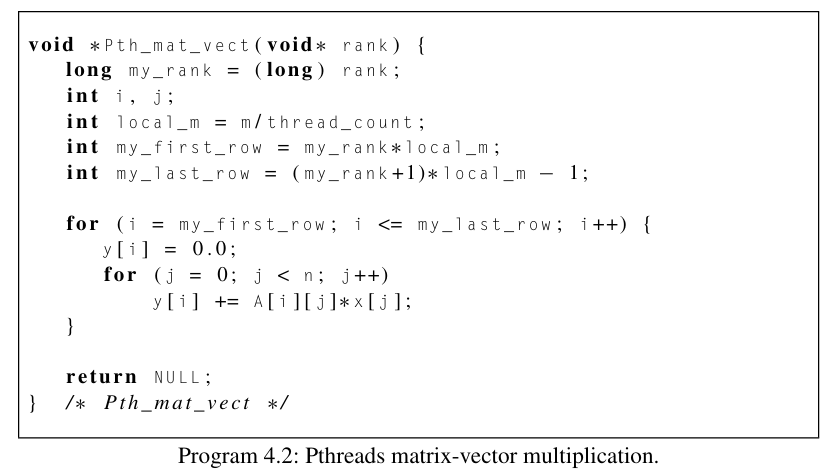
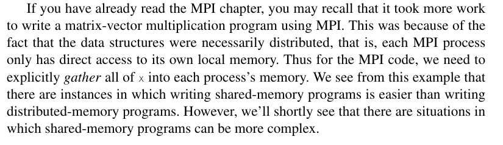

# Matrix-vector multiplication

Created: 2024-04-21 18:58:01 -0400

Modified: 2024-04-21 21:28:44 -0400

---

-   You are essentially taking the value of the matrix represented as a~ij~ and the vector as x~j~ and multiplying them together and then summing all of them up

Difference between matrix and vector:

-   Matrix: is a an array of m rows x n columns

-   Vector: is an array of 1 row x n columns or 1 columns x n rows

-   In matrix vector multiplication you need the amount of columns in the matrix to match up with the number of rows in vector

 

What it looks like:

{width="6.083333333333333in" height="1.9583333333333333in"}

-   Matrix on the left and vector in the middle, which gives you a y for each completion of a row in the matrix times the vector.

Pseudocode:

{width="6.145833333333333in" height="2.03125in"}

 

 

We want to parallelize this by dividing the work among the threads.

-   One way to do this is to have each thread handle an even amount of rows from the matrix and have each thread compute the sum of the rows it handles

> {width="4.59375in" height="3.46875in"}
>
> {width="4.59375in" height="1.5625in"}

-   Code for the thread function

> {width="4.770833333333333in" height="2.6770833333333335in"}

-   Here we are going to assume that..

> at a minimum, x should be shared. Let's also make A and y shared. This might seem to violate our principle that we should only make variables global that need to be global. However, in the exercises, we'll take a closer look at some of the issues involved in making the A and y variables local to the thread function, and we'll see that making them global can make good sense. At this point, we'll just observe that if they are global, the main thread can easily initialize all of A by just reading its entries from stdin, and the product vector y can be easily printed by the main thread.

-   Some programs are easier to write with threads than with processes due to shared memory...

> {width="5.666666666666667in" height="1.6354166666666667in"}
>
>  

