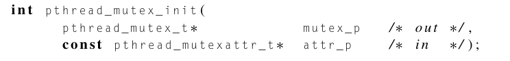
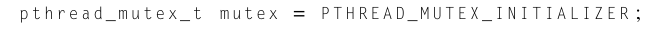
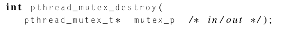
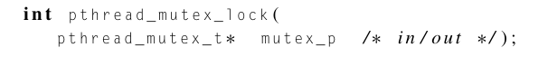
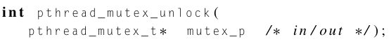
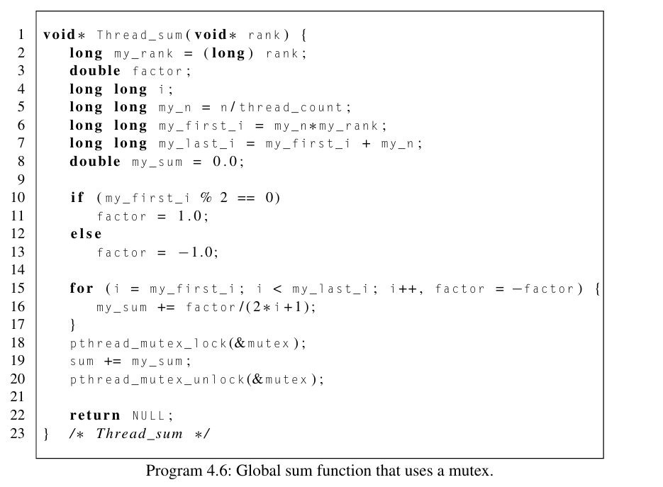
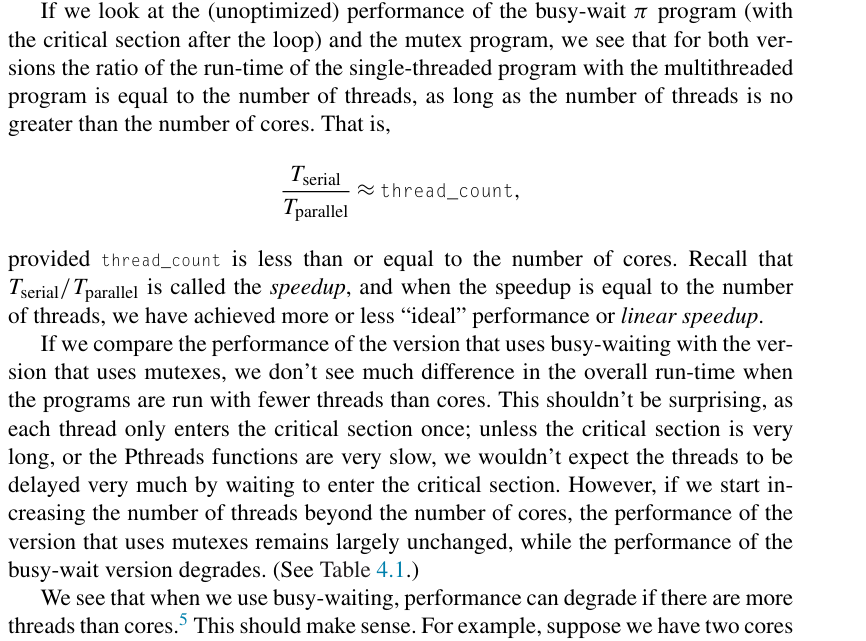
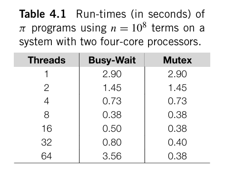

# Mutexes

Created: 2024-04-23 21:13:54 -0400

Modified: 2024-04-23 22:06:48 -0400

---

**Mutex** is an abbreviation of mutual exclusion, and a mutex is a special type of variable that, together with a couple of special functions, can be used to restrict access to a critical section to a single thread at a time.

-   Thus a mutex can be used to guarantee that one thread "excludes" all other threads while it executes the critical section.

    -   Hence, the mutex guarantees mutually exclusive access to the critical section.

-   The Pthreads standard includes a special [type]{.underline} for mutexes: pthread_mutex_t.

    -   A variable of type pthread_mutex_t needs to be initialized by the system before it's used.

    -   This can be done by

> {width="6.65625in" height="0.8020833333333334in"}

-   We won't make use of the second argument, so we'll just pass in NULL to use the default attributes.

-   Sometimes you will see

> {width="6.78125in" height="0.375in"}
>
> Which does the same thing

-   When a Pthreads program finishes using a mutex it should call

> {width="5.739583333333333in" height="0.6458333333333334in"}

-   The point of a mutex is to protect a critical section from being entered by more than one thread at a time. To gain access to a critical section, a thread will lock the mutex, do its work, and then unlock the mutex to let other threads execute the critical section.

    -   To lock the mutex:

> {width="3.9270833333333335in" height="0.40625in"}

-   To unlock mutex:

> {width="4.0in" height="0.4479166666666667in"}

-   Pthread_mutex_lock will cause the thread to wait until no other thread is in the crit section and the call to pthread_mutex_unlock notifies the system that the calling thread has completed execution of the code in crit section

<!-- -->

-   We can use mutexes instead of busy-waiting in our global sum program by declaring a global mutex variable, having the main thread initialize it, and then, instead of busy-waiting and incrementing a flag, the threads call pthread_mutex_lock before entering the critical section, and they call pthread_mutex_unlock when they're done with the critical section.

    -   Example:

> {width="5.21875in" height="3.8333333333333335in"}

-   We see that when we use busy-waiting, performance can degrade if there are more threads than cores while mutexes don't suffer this.

> {width="4.729166666666667in" height="3.5in"}

-   Notes:

    -   In busy waiting we have to use more of the CPU to run operations that will keep us in busy-waiting, all these calls add up as well as all the waiting that has to be done

    -   When we have less threads than cores we see that performance between busy-waiting and mutexes are the same but when there are more threads than cores we see a poor performance by busy-waiting while mutexes stay the same

        -   This is because when there are less threads than cores there isnt too much waiting and less jumps between cores. This is all amplified when there are more threads than cores.

{width="2.2083333333333335in" height="1.71875in"}

