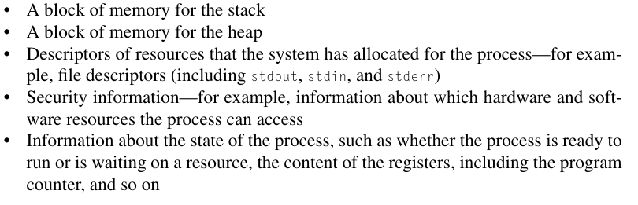
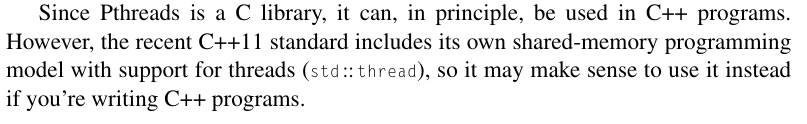

# Processes, threads, and Pthreads

Created: 2024-04-19 19:18:55 -0400

Modified: 2024-04-19 19:43:26 -0400

---

-   However, it can, in principle, be "lighter-weight."

-   A process is an instance of a running (or suspended) program. In addition to its executable, it consists of the following:

> {width="5.166666666666667in" height="1.65625in"}

-   However, this isn't desirable when we're running shared-memory programs.

    -   At a minimum, we'd like certain variables to be available to multiple processes, allowing much easier memory access.

    -   It is also convenient for the processes to share access to things like stdout and all other process-specific resources, except for their stacks and program counters.

    -   This can be arranged by starting a single process and then having the process start these additional "lighter-weight" processes.

        -   For this reason, they're often called light-weight processes (threads).

 

Thread: comes from the concept of "thread of control."

-   A "thread of control" is just a sequence of statements in a program.

    -   The term suggests a stream of control in a single process, and in a shared-memory program a single process may have multiple threads of control.

        -   A single shared memory program can run multiple thread

-   As we noted earlier, in this chapter the particular implementation of threads that we'll be using is called POSIX threads or, more often, Pthreads.

 

POSIX/Pthreads : is a standard for Unix-like operating systems---for example, Linux and macOS.

-   Pthreads is not a programming language (like C or Java). Rather, like MPI, Pthreads specifies a library that can be linked with C programs.

-   Unlike MPI, the Pthreads API is only available on POSIX systems --- Linux, macOS, Solaris, HPUX, and soon.

-   Also unlike MPI,there are a number of other widely used specifications for multithreaded programming: Java threads, Windows threads, Solaris threads.

-   Side note:

    -   {width="4.71875in" height="0.71875in"}

 

