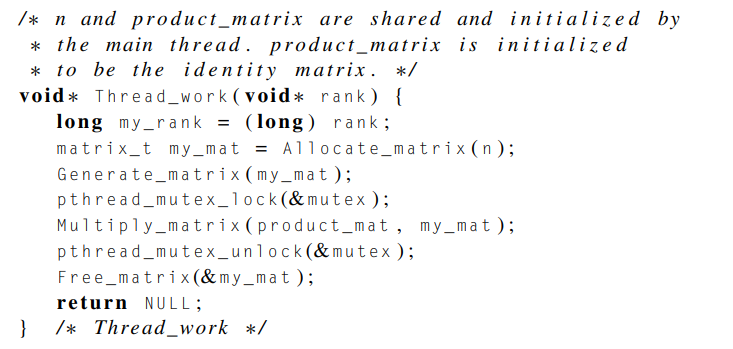
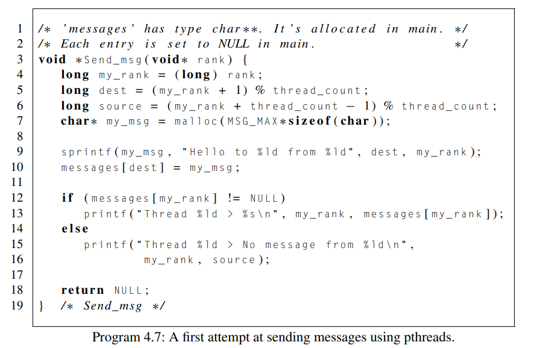
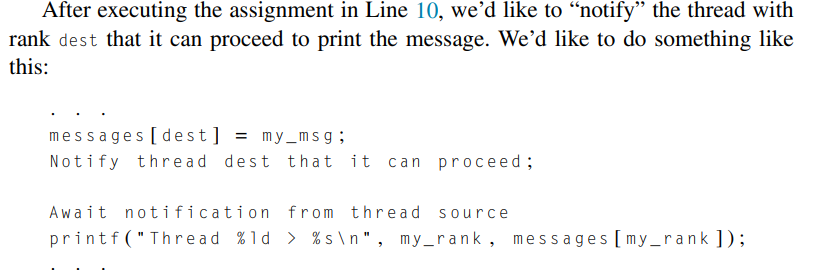
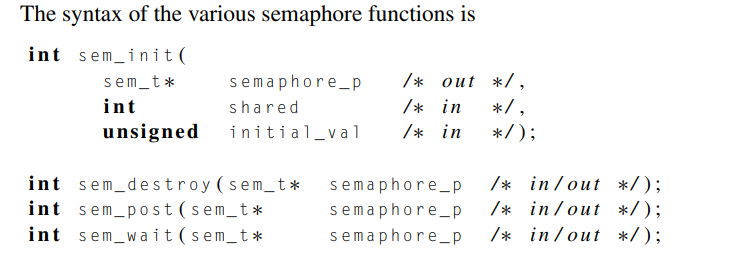

# Producer–consumer synchronization and semaphores

Created: 2024-04-23 23:59:59 -0400

Modified: 2024-04-24 00:51:03 -0400

---

-   Since addition is commutative, this doesn't matter in our program for estimating π.

-   However, it's not difficult to think of situations in which we also want to control the order in which the threads execute the code in the critical section.

    -   For example, suppose each thread generates an n × n matrix, and we want to multiply the matrices together in thread-rank order. Since matrix multiplication isn't commutative, our mutex solution would have problems:

> {width="4.552083333333333in" height="2.1666666666666665in"}

-   Here we see that we wont know which threads will access the crit section (shared matrix) in what order thus we wont get a matrix back that is in thread order 0,1,2,3,..

<!-- -->

-   A somewhat more complicated example involves having each thread "send a message" to another thread.

    -   For example, suppose we have thread_count or t threads and we want thread 0 to send a message to thread 1, thread 1 to send a message to thread 2, . . . , thread t − 2 to send a message to thread t − 1 and thread t − 1 to send a message to thread 0.

    -   After a thread "receives" a message, it can print the message and terminate.

    -   To implement the message transfer, we can allocate a shared array of char∗. Then each thread can allocate storage for the message it's sending, and, after it has initialized the message, set a pointer in the shared array to refer to it.

        -   To avoid dereferencing undefined pointers, the main thread can set the individual entries in the shared array to NULL.

    -   {width="5.5625in" height="3.5625in"}

        -   When we run the program with more than a couple of threads on a dual core system, we see that some of the messages are never received.

            -   For example, thread 0, which is started first, will typically finish before thread t − 1 has copied the message into the messages array

            -   This isn't surprising, and we could fix the problem by replacing the if statement in Line 12 with a busy-wait while statement:

            -   {width="5.0in" height="0.4583333333333333in"}

                -   This will wait for the thread to have received a message before printing

            -   Of course, this solution would have the same problems that any busy-waiting solution has, so we'd prefer a different approach.

    -   A different approach:mutex(but not so good ):

> {width="5.572916666666667in" height="1.8125in"}

-   The current thread has added its msg into the messages array and now the next thread can add its own msg

-   {width="5.208333333333333in" height="1.5208333333333333in"}

> "It's not at all clear how mutexes can help here. We might try calling pthread_mutex_unlock to "notify" the thread dest. However, mutexes are initialized to be unlocked, so we'd need to add a call before initializing messages[dest] to lock the mutex. This will be a problem, since we don't know when the threads will reach the calls to pthread_mutex_lock."

-   This doesn't work because say we have two threads. thread 0 gets so far ahead of thread 1 that it reaches the second call to pthread_mutex_lock in Line 7 before thread 1 reaches the first in Line 2. Then, of course, it will acquire the lock and continue to the printf statement. This will result in thread 0 dereferencing a null pointer and it will crash.

-   Essentially, thread 0 doesn't get locked in time (on line 2) by thread 1 because thread 0 is so far ahead. This causes thread 0 to execute line 8 which tries to do a printf statement that will try to dereference messages[my_rank] which will be null since thread 1 hasn't put in its own message yet.

A solution is called **Semaphore**:

-   A semaphore can be thought of as a special type of unsigned int, so they take on the values 0, 1, 2, . . . . In many cases, we'll only be interested in using them when they take on the values 0 and 1.

    -   A semaphore that only takes on these values is called a binary semaphore

-   Very roughly speaking, 0 corresponds to a locked mutex, and 1 corresponds to an unlocked mutex.

-   Summary of how it operates:

    -   "Before the critical section you want to protect, you place a call to the function sem_wait. A thread that executes sem_wait will block if the semaphore is 0. If the semaphore is nonzero, it will decrement the semaphore and proceed. After executing the code in the critical section, a thread calls sem_post, which increments the semaphore, and a thread waiting in sem_wait can proceed."

-   For our current purposes, the crucial difference between semaphores and mutexes is that there is no ownership associated with a semaphore. The main thread can initialize all of the semaphores to 0---that is, "locked"---and then any thread can execute a sem_post on any of the semaphores.

    -   Similarly, any thread can execute sem_wait on any of the semaphores.

-   Semaphor function:

> {width="5.239583333333333in" height="1.8333333333333333in"}

-   The second argument to sem_init controls whether the semaphore is shared among threads or processes. In our examples, we'll be sharing the semaphore among threads, so the constant 0 can be passed in.

-   Note that semaphores are part of the POSIX standard, but not part of Pthreads. Hence it is necessary to ensure your operating system does indeed support semaphores, and then add the following preprocessor directive to any program that uses them

> {width="3.0833333333333335in" height="0.3854166666666667in"}

-   Thus, if we use semaphores, our Send_msg function can be written as

> {width="5.416666666666667in" height="3.4791666666666665in"}

-   Finally, note that the message-sending problem didn't involve a critical section. The problem wasn't that there was a block of code that could only be executed by one thread at a time. Rather, thread my_rank couldn't proceed until thread source had finished creating the message.

    -   This type of synchronization, when a thread can't proceed until another thread has taken some action, is sometimes called producer--consumer synchronization.

-   **Counting semaphores** can also be useful in scenarios where we wish to restrict access to a finite resource.

> {width="6.010416666666667in" height="2.8958333333333335in"}
>
>  

Note:

-   Source is the overall issue.

-   Source is the previous thread to the current thread we are on

-   Line 14 says that if we saw null then the source didn't give us a message

