# Read-write locks

Created: 2024-04-24 17:02:54 -0400

Modified: 2024-04-24 18:19:19 -0400

---

-   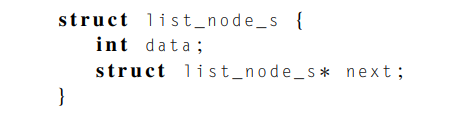{width="3.1458333333333335in" height="0.7916666666666666in"}

>  

-   {width="4.083333333333333in" height="0.5625in"}

<!-- -->

-   Functions:

> 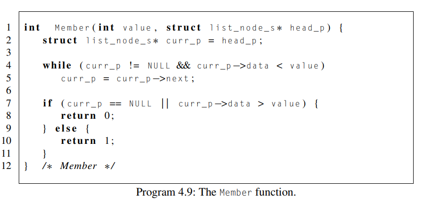{width="4.3125in" height="2.0625in"}
>
>  
>
> 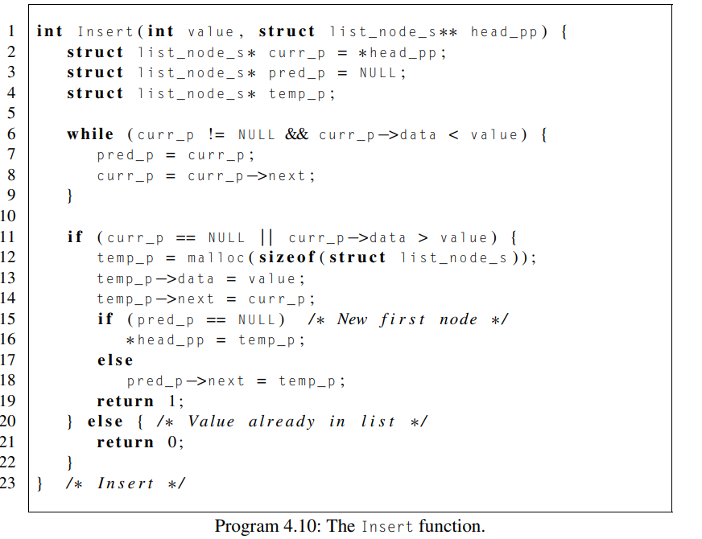{width="4.354166666666667in" height="3.34375in"}
>
>  
>
> 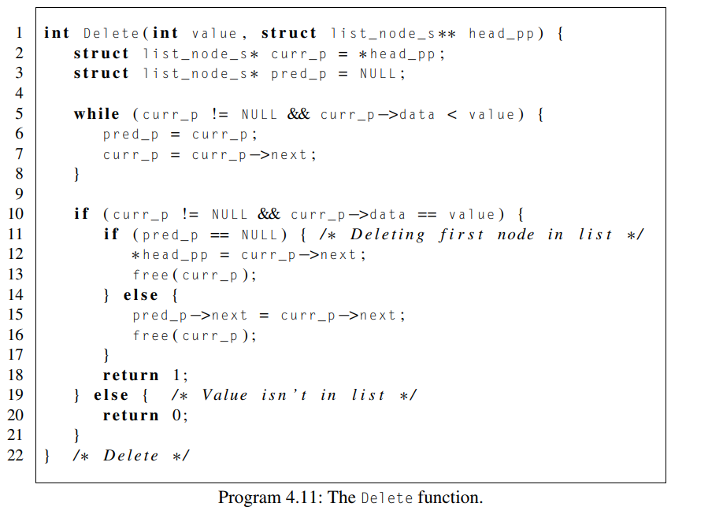{width="4.40625in" height="3.1354166666666665in"}

 

A multithreaded linked list

-   Now let's try to use these functions in a Pthreads program. To share access to the list, we can define head_p to be a global variable. This will simplify the function headers for Member, Insert, and Delete, since we won't need to pass in either head_p or a pointer to head_p, we'll only need to pass in the value of interest

-   Since multiple threads can simultaneously read a memory location without conflict, it should be clear that multiple threads can simultaneously execute Member.

-   On the other hand, Delete and Insert also write to memory locations, so there may be problems if we try to execute either of these operations at the same time as another operation.

    -   As an example, suppose that thread 0 is executing Member(5) at the same time that thread 1 is executing Delete(5), and the current state of the list is shown in Fig. 4.7. An obvious problem is that if thread 0 is executing Member(5), it is going to report that 5 is in the list, when, in fact, it may be deleted even before thread 0 returns.

    -   A second obvious problem is if thread 0 is executing Member(8), thread 1 may free the memory used for the node storing 5 before thread 0 can advance to the node storing 8.

    -   It's OK for multiple threads to simultaneously execute Member---that is, read the list nodes---but it's unsafe for multiple threads to access the list if at least one of the threads is executing an Insert or a Delete---that is, is writing to the list nodes

-   How can we deal with this problem?

    -   An obvious solution is to simply lock the list any time that a thread attempts to access it

> 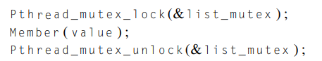{width="4.291666666666667in" height="0.8125in"}

-   An equally obvious problem with this solution is that we are serializing access to the list, and if the vast majority of our operations are calls to Member, we'll fail to exploit this opportunity for parallelism.

-   Inefficient and doesn't parallelize like we want it to

<!-- -->

-   An alternative to this approach involves "finer-grained" locking. Instead of locking the entire list, we could try to lock individual nodes.

> 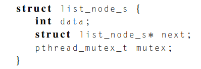{width="2.6458333333333335in" height="0.8958333333333334in"}

-   This is a much better idea but creating a mutex for each node will severely increase the size of each node and consequently the size of our list

-   With this solution, our member() function would now look like this:

> 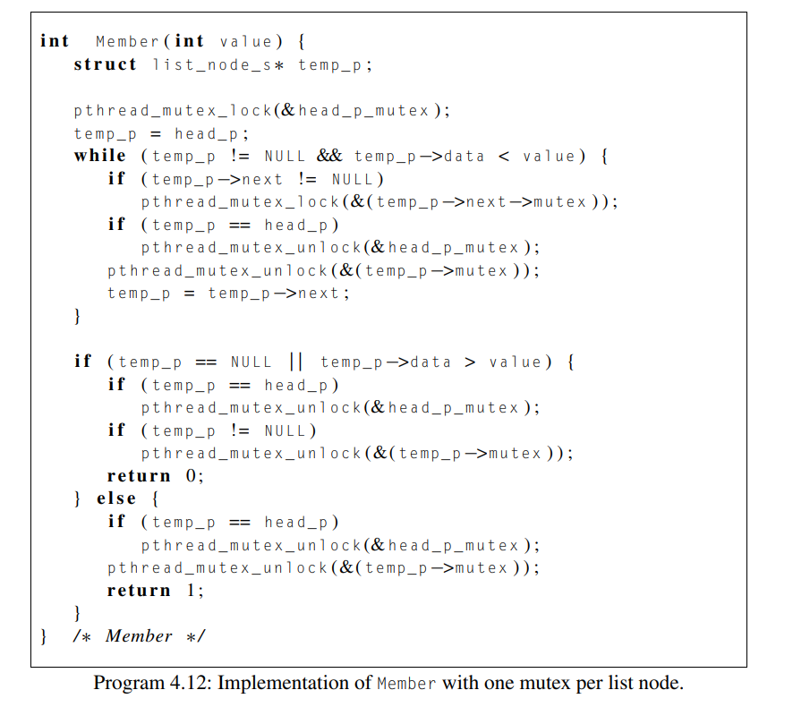{width="5.4375in" height="4.854166666666667in"}

 

Pthreads read-write locks

-   Neither of our multithreaded linked lists exploits the potential for simultaneous access to any node by threads that are executing Member.

    -   The first solution only allows one thread to access the entire list at any instant,

    -   and the second only allows one thread to access any given node at any instant.

-   An alternative is provided by Pthreads' read-write locks.

    -   A read-write lock is somewhat like a mutex except that it provides two lock functions.

        -   The first lock function locks the read-write lock for reading,

        -   while the second locks it for writing.

    -   Multiple threads can thereby simultaneously obtain the lock by calling the read-lock function, while only one thread can obtain the lock by calling the write-lock function.

        -   Thus if any threads own the lock for reading, any threads that want to obtain the lock for writing will block in the call to the writelock function.

        -   Furthermore, if any thread owns the lock for writing, any threads that want to obtain the lock for reading or writing will block in their respective locking functions.

    -   Essentially we only have two phases: reading and writing and we can lock variables, functions, etc with these

    -   Using Pthreads read-write locks, we can protect our linked list functions with the following code (we're ignoring function return values):

> 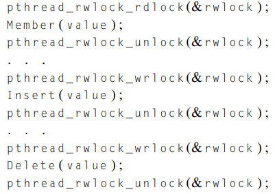{width="3.03125in" height="2.1145833333333335in"}

-   Pthread lock and unlock functions:

> 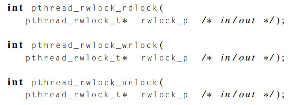{width="3.5in" height="1.2395833333333333in"}

-   We should initialize locks before using them and destroy them after use

> 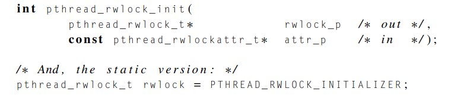{width="5.041666666666667in" height="1.0729166666666667in"}
>
>  
>
> 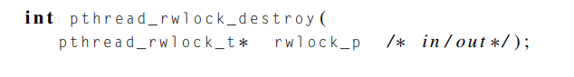{width="5.041666666666667in" height="0.6666666666666666in"}

What is the best solution of out the three?

-   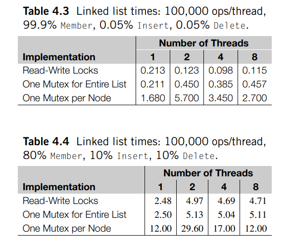{width="3.5416666666666665in" height="2.9375in"}

    -   The best solution is the read write locks in most cases

Note that this will also require that we have a mutex associated with the head_p pointer.

 

Too bulky and complex, as well as its not as efficient as we want it to be

