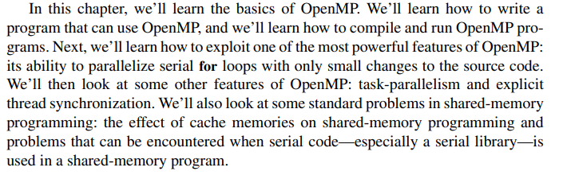

# INTRO

Created: 2024-04-21 19:41:37 -0400

Modified: 2024-04-25 15:21:39 -0400

---

-   Thus OpenMP is designed for systems in which each thread or process can potentially have access to all available memory, and when we're programming with OpenMP, we view our system as a collection of autonomous cores or CPUs, all of which have access to main memory

-   Similar to Pthreads

>  

Although OpenMP and Pthreads are both APIs for shared-memory programming, they have many fundamental differences

-   Pthreads requires that the programmer explicitly specify the behavior of each thread.

-   OpenMP, on the other hand, sometimes allows the programmer to simply state that a block of code should be executed in parallel, and the precise determination of the tasks and which thread should execute them is left to the compiler and the run-time system.

-   Unlike Pthreads which is a library that links to a C program, OpenMP, on the other hand, requires compiler support for some operations, and hence it's entirely possible that you may run across a C compiler that can't compile OpenMP programs into parallel programs.

-   Pthreads is lower level and openMPI is higher level programming.

    -   OpenMP, on the other hand, allows the compiler and run-time system to determine some of the details of thread behavior, so it can be simpler to code some parallel behaviors using OpenMP.

 

OpenMP was developed by a group of programmers and computer scientists who believed that writing large-scale high-performance programs using APIs, such as Pthreads, was too difficult, and they defined the OpenMP specification so that shared-memory programs could be developed at a higher level.

 

 

{width="7.34375in" height="2.34375in"}

 

