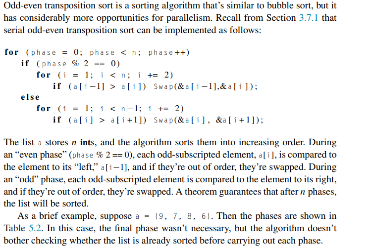
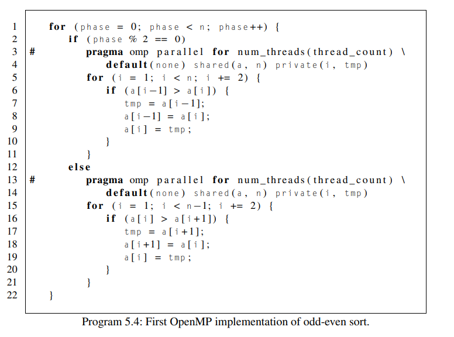
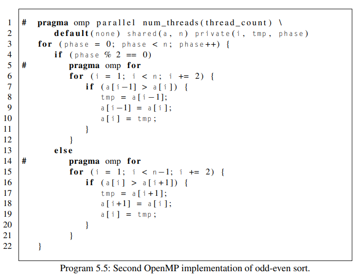

# More about loops in OpenMP: sorting

Created: 2024-04-26 14:42:27 -0400

Modified: 2024-04-26 15:55:40 -0400

---

{width="5.78125in" height="8.09375in"}

-   The parallel for directive is not a universal solution to the problem of parallelizing for loops

 

Odd even transportation sort example:

-   Summary of how the alg works:

> {width="5.447916666666667in" height="3.6354166666666665in"}

-   Where is there an loop carried dependence in this alg?

    -   It's not hard to see that the [outer loop]{.underline} has a loop-carried dependence. As an example, suppose as before that a = {9, 7, 8, 6}. Then in phase 0 the inner loop will compare elements in the pairs (9, 7) and (8, 6), and both pairs are swapped. So for phase 1, the list should be {7, 9, 6, 8}, and during phase 1 the elements in the pair (9, 6) should be compared and swapped. However, if phase 0 and phase 1 are executed simultaneously, the pair that's checked in phase 1 might be (7, 8), which is in order. Furthermore, it's not clear how one might eliminate this loop-carried dependence, so it would appear that parallelizing the outer for loop isn't an option.

-   The inner for loops, however, don't appear to have any loop-carried dependences. For example, in an even phase loop variable i will be odd, so for two distinct values of i, say i = j and i = k, the pairs {j −1, j } and {k −1, k} will be disjoint.

    -   The comparison and possible swaps of the pairs (a[j−1], a[j]) and (a[k−1], a[k]) can therefore proceed simultaneously.

    -   Our alg for even odd sort can now look like this:

> {width="4.875in" height="3.625in"}

-   There are some issues we must handle as well with this implementation

    -   First, although any iteration of, say, one even phase doesn't depend on any other iteration of that phase, we've already noted that this is not the case for iterations in phase p and phase p + 1.

        -   We need to be sure that all the threads have finished phase p before any thread starts phase p + 1.

        -   However, like the parallel directive, the parallel for directive has an implicit barrier at the end of the loop, so none of the threads will proceed to the next phase, phase p +1, until all of the threads have completed the current phase, phase p

            -   openMP handles this for us

    -   A second potential problem is the overhead associated with forking and joining the threads.

        -   In this implementation we would be asking for threads to be built for us each time for each phase which is too costly, can we do better?

        -   Each time we execute one of the inner loops, we use the same number of threads, so it would seem to be superior to fork the threads once and reuse the same team of threads for each execution of the inner loops.

        -   Not surprisingly, OpenMP provides directives that allow us to do just this. We can fork our team of thread_count threads [before]{.underline} the outer loop with a parallel directive.

            -   Then, rather than forking a new team of threads with each execution of one of the inner loops, we use a [for directive]{.underline}, which tells OpenMP to parallelize the for loop with the existing team of threads.

                -   Note that the [parallel for directive]{.underline} is different from the "solo" [for directive]{.underline}

            -   First we use the parrallel directive to initiate the threads and other stuff and then right before each for loop we call on the for directive

            -   Our new odd even sort alg would look like this:

> {width="5.729166666666667in" height="4.395833333333333in"}

-   The for directive, unlike the parallel for directive, doesn't fork any threads. It uses whatever threads have already been forked in the enclosing parallel block.

-   When we're using two or more threads, the version that uses two for directives is at least 17% faster than the version that uses two parallel for directives, so for this system the slight effort involved in making the change is well worth it.

