# Scheduling loops

Created: 2024-04-26 15:56:08 -0400

Modified: 2024-04-26 17:49:40 -0400

---

-   if there are n iterations in the serial loop, then in the parallel loop the first n/thread_count are assigned to thread 0, the next n/thread_count are assigned to thread 1, and so on.

    -   This way of dividing up the work to each thread isnt always the best/most optimal way of diving up the iterations

    -   It could be that the first thread will have less work to do than the last thread (aka the last thread does more work than any other thread)

-   A better assignment of work to threads might be obtained with a [cyclic partitioning]{.underline} of the iterations among the threads

    -   Here by default, we give each thread an iteration one at a time until there are no more iterations to give

    -   There are many situatiuons where a cyclic partition can be significantly better performance wise than block

 

The schedule clause

-   OpenMP provides us with a schedule clause that can help us control how we want the work to be partitioned among the threads

-   we already know how to obtain the default schedule: we just add a parallel for directive with a reduction clause:

> 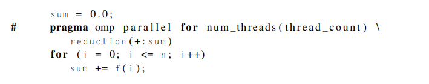{width="6.135416666666667in" height="1.2083333333333333in"}

-   To get a cyclic schedule we would do:

> 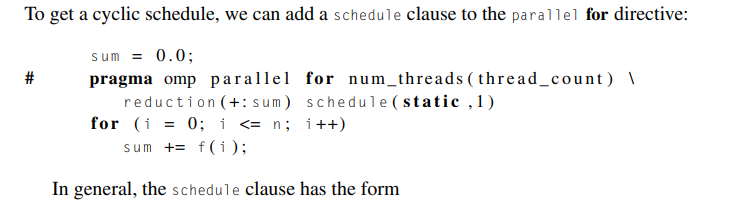{width="6.197916666666667in" height="1.7083333333333333in"}
>
>  

-   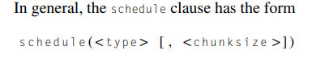{width="4.177083333333333in" height="0.7604166666666666in"}

>  

-   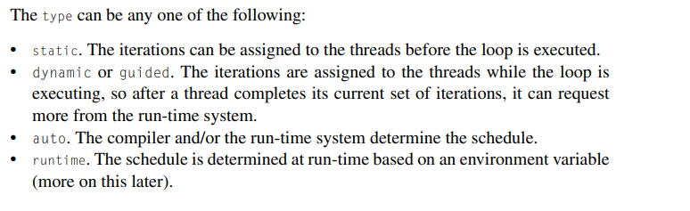{width="5.104166666666667in" height="1.5625in"}

<!-- -->

-   The [chunk size]{.underline} is a positive integer. In OpenMP parlance, a chunk of iterations is a block of iterations that would be executed consecutively in the serial loop.

    -   The number of iterations in the block is the chunksize.

    -   Only static, dynamic, and guided schedules can have a chunksize.

 

The static schedule type

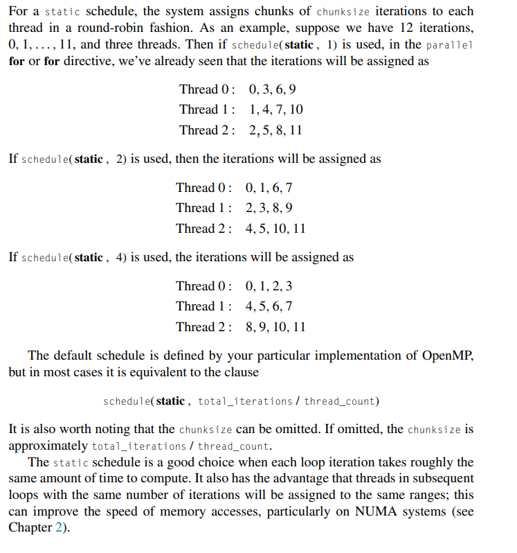{width="5.322916666666667in" height="5.6875in"}

 

The dynamic and guided schedule types

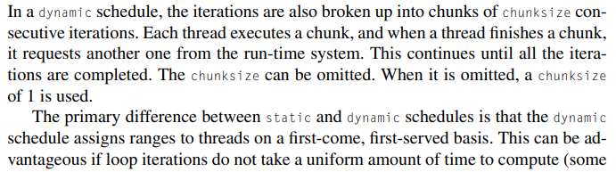{width="5.354166666666667in" height="1.4895833333333333in"}

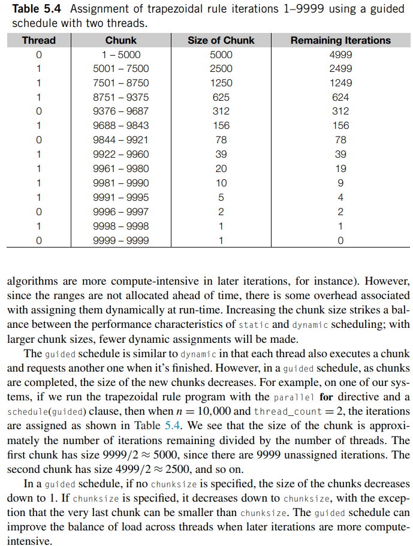{width="5.364583333333333in" height="7.09375in"}

 

The runtime schedule type

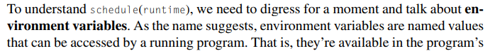{width="5.395833333333333in" height="0.5625in"}

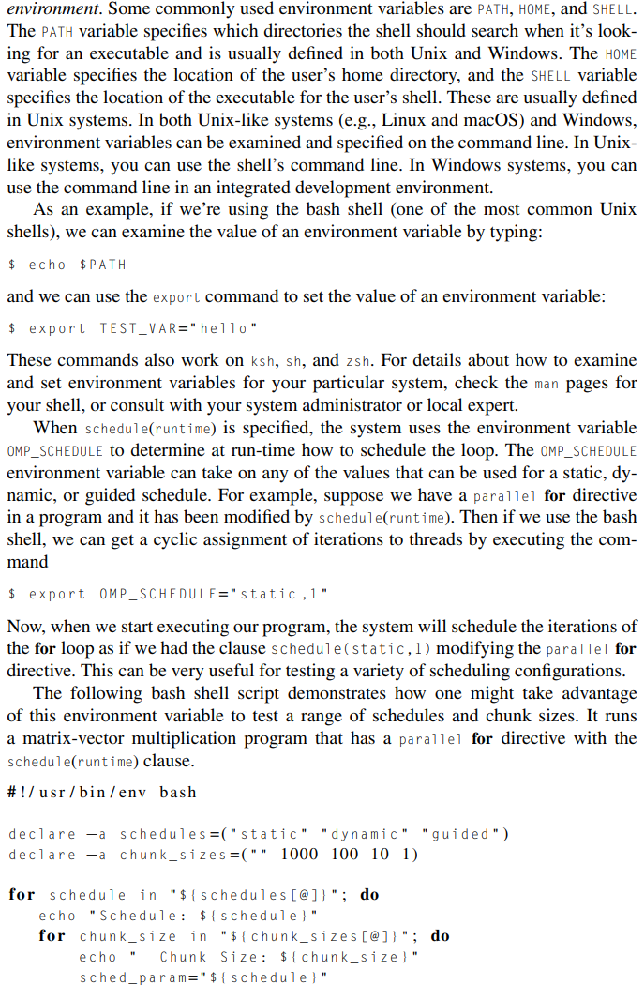{width="5.395833333333333in" height="8.375in"}

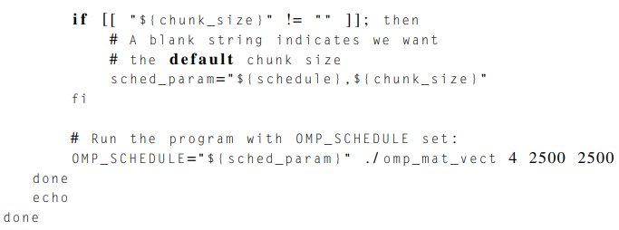{width="5.395833333333333in" height="2.0in"}

 

Which schedule is best?

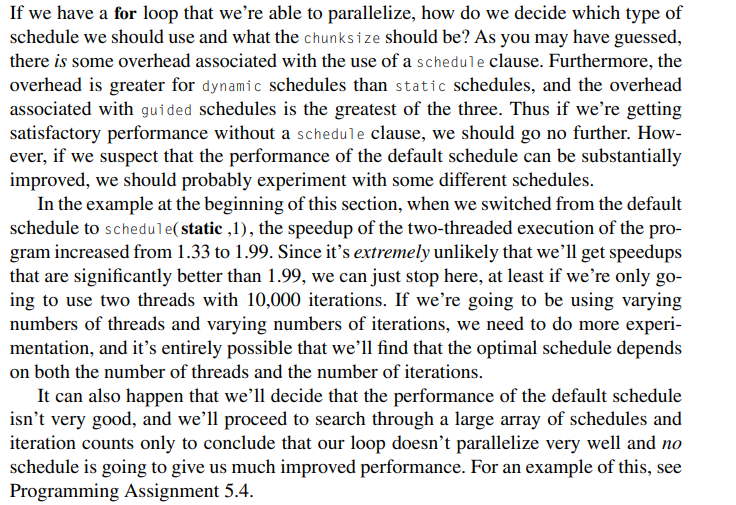{width="5.78125in" height="3.9583333333333335in"}

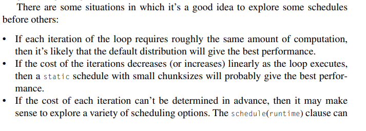{width="7.427083333333333in" height="2.65625in"}

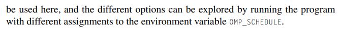{width="6.96875in" height="0.6875in"}

 

Note:
This is a really good way to schedule your program if you want to test schedule types and what not to see which one performs the best through the command line instead of changing your program each time and having to compile and run to test

