# The parallel for directive

Created: 2024-04-25 20:47:11 -0400

Modified: 2024-04-26 14:52:15 -0400

---

> 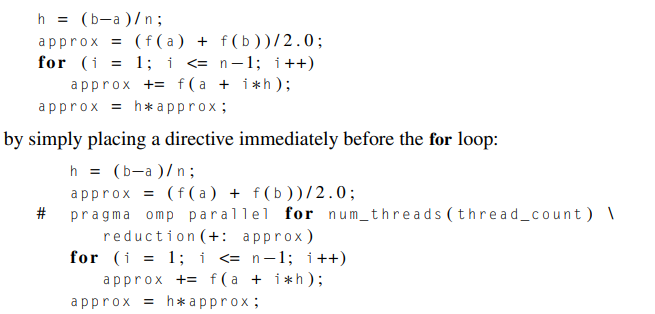{width="5.96875in" height="2.8541666666666665in"}

-   We highlight the for loop

<!-- -->

-   Like the parallel directive, the parallel for directive forks a team of threads to execute the following structured block.

    -   However, the structured block following the parallel for directive must be a for loop

    -   with the parallel for directive the system parallelizes the for loop by dividing the iterations of the loop among the threads

        -   We can say that the [parallel for]{.underline} directive is slightly different than the [parallel]{.underline} directive because the parallel for directive splits up the iterations of the for loop to the threads.

-   How is the work split up?

> 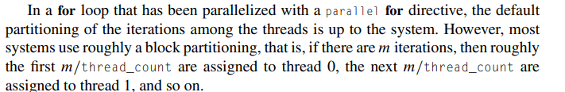{width="7.40625in" height="1.2083333333333333in"}

-   How does variable scope work in this directive handled by openMP

> 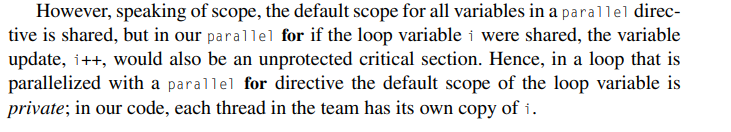{width="7.333333333333333in" height="1.3229166666666667in"}

 

Can we use a parallel for directive on every for loop? NO.

-   First, OpenMP will only parallelize for loops---it won't parallelize while loops or do−while loops directly.

    -   This may not seem to be too much of a limitation, since any code that uses a while loop or a do−while loop can be converted to equivalent code that uses a for loop instead.

    -   However, OpenMP will only parallelize for loops for which the number of iterations can be determined:

        -   • from the for statement itself (that is, the code for (. . . ; . . . ; . . .)), and

        -   • prior to execution of the loop.

        -   These are the only scenerios in which we can parallize a for loop

    -   These wont work:

> 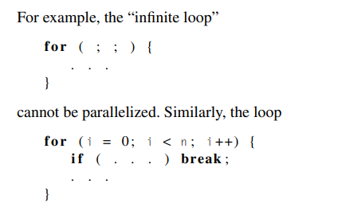{width="3.3333333333333335in" height="2.125in"}

-   openMP will only parallize for loops that are in canonical form, which take on one of the forms:

> 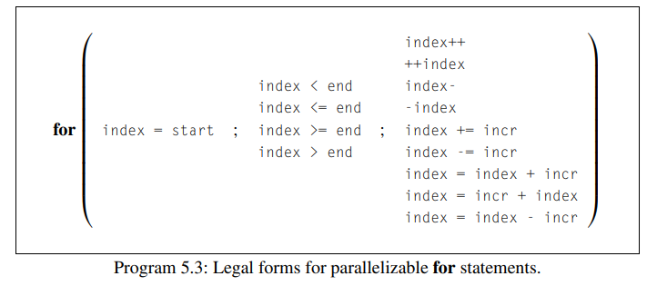{width="4.510416666666667in" height="1.9375in"}
>
> 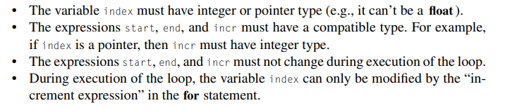{width="4.510416666666667in" height="0.9895833333333334in"}

 

Data dependences

-   If a for loop fails to satisfy one of the rules outlined in the preceding section, the compiler will simply reject it.

    -   For example:

> 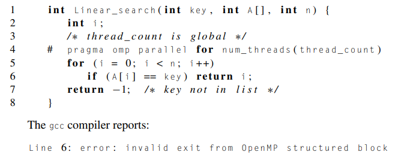{width="5.166666666666667in" height="1.96875in"}

-   Another problem occurs in loops in which the computation in one iteration depends on the results of one or more previous iterations.

    -   For example, Fibonacci numbers:

> 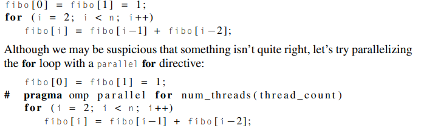{width="5.104166666666667in" height="1.5416666666666667in"}

-   The compiler will execute without complaint

-   However, we will see that the results are unpredictable and not what we want for the most part

> 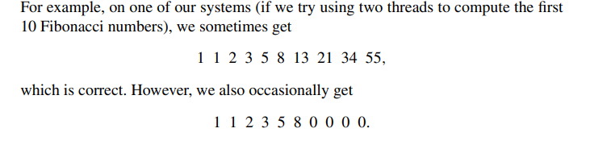{width="4.5625in" height="1.0833333333333333in"}

-   This issue occurs because of the fact the threads depend on previous threads for data and that is not good because of race conditions that can occur

<!-- -->

-   The takeaways

> 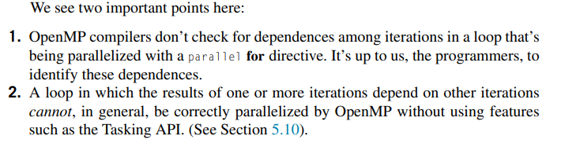{width="5.90625in" height="1.5104166666666667in"}
>
>  

Finding loop carried dependence

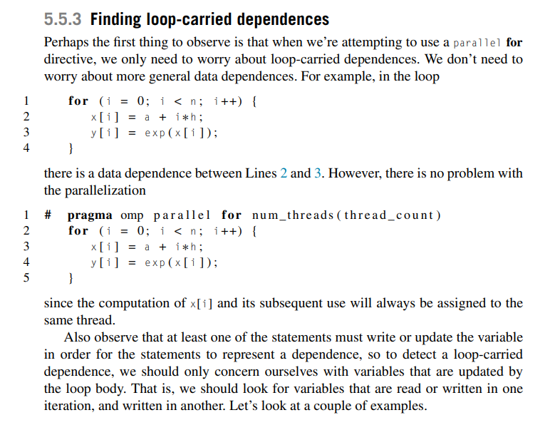{width="6.385416666666667in" height="4.885416666666667in"}

 

Estimating π example showcasing the private directive

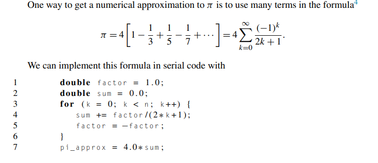{width="6.666666666666667in" height="2.8854166666666665in"}

-   How can we parallelize this with OpenMP?

    -   We might try to do:

> 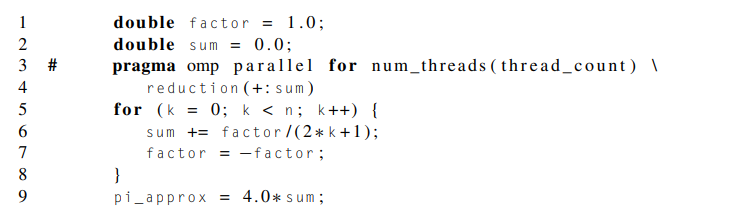{width="6.0in" height="1.7395833333333333in"}

-   This would be wrong because line 6 and 7 would depend on if subsequent threads hold both k and k+1 and if they don't then we would see errors

<!-- -->

-   We can fix this by doing

> 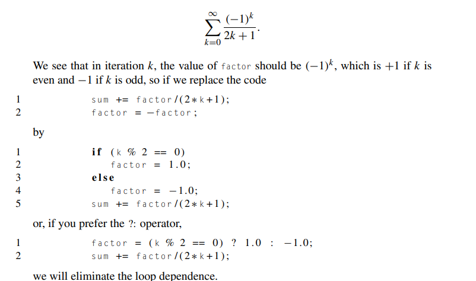{width="5.729166666666667in" height="3.3854166666666665in"}

-   However there is still something missing

    -   Recall that in a block that has been parallelized by a parallel for directive, by default any variable declared before the loop---with the sole exception of the loop variable---is shared among the threads

    -   Factor is a shared variable, there could be race conditions happening

    -   We need to ensure each thread has its own copy of factor

    -   We can do this by adding a [private clause]{.underline} to the parallel for directive.

> {width="6.291666666666667in" height="1.9375in"}

-   The private clause specifies that for each variable listed inside the parentheses, a private copy is to be created for each thread

    -   Thus, in our example, each of the thread_count threads will have its own copy of the variable factor, and hence the updates of one thread to factor won't affect the value of factor in another thread.

>  

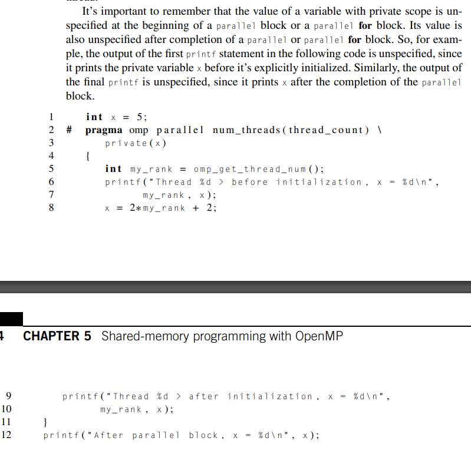{width="5.979166666666667in" height="5.770833333333333in"}

 

 

More on variable scope

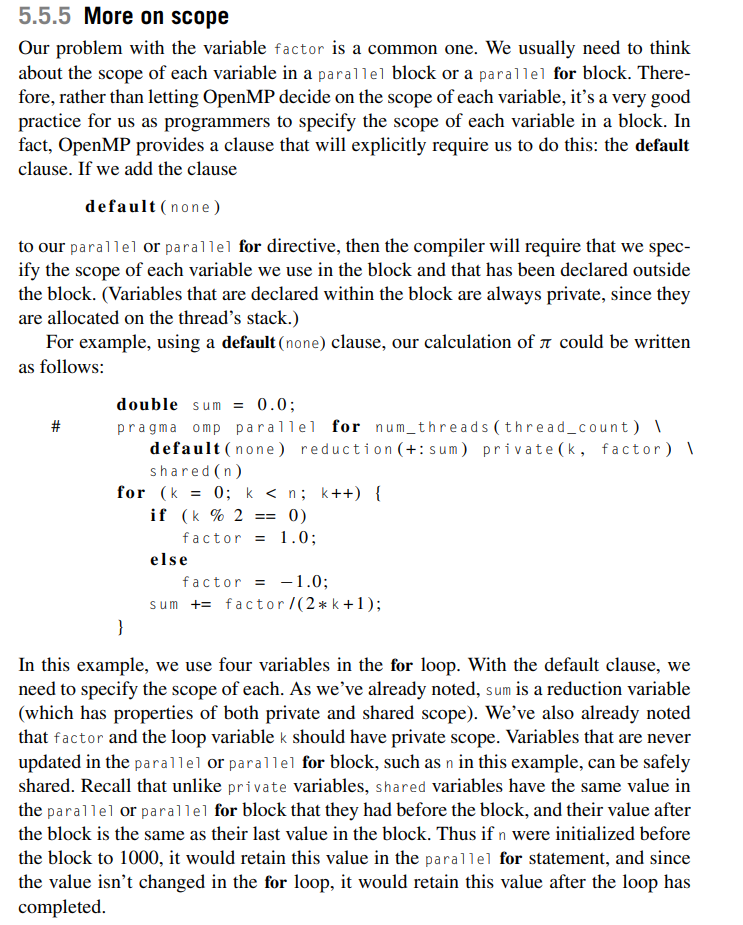{width="5.729166666666667in" height="7.135416666666667in"}

-   The takeaways here are..

    -   We can dd the [default clause]{.underline} to make it so that we have to explicitly tell openMP the scope of our variables or else we get an error thrown at us

>  

Infinite loop cannot be parallelized, since the number of iterations can't be determined from the for statement alone.

 

This for loop is also not a structured block, since the break adds another point of exit from the loop.

 

These restrictions allow the run-time system to determine the number of iterations prior to execution of the loop. The sole exception to the rule that the run-time system must be able to determine the number of iterations prior to execution is that there can be a call to exit in the body of the loop

