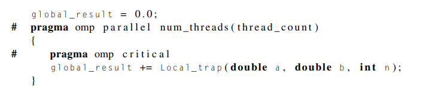
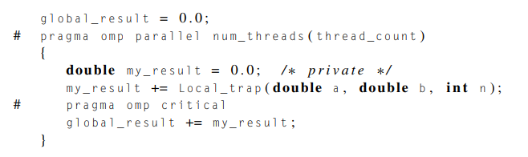
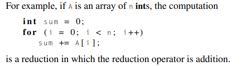
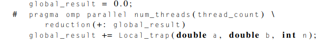
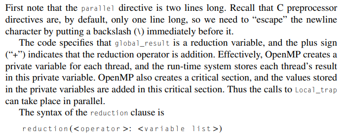
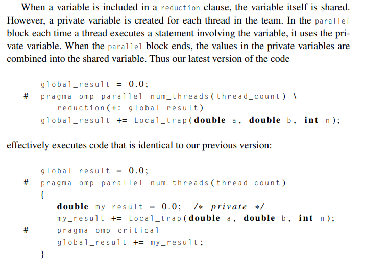
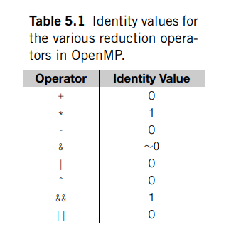

# The reduction clause

Created: 2024-04-25 19:59:55 -0400

Modified: 2024-04-25 20:47:04 -0400

---

-   What if instead of having a shared pointer variable like we do with global_result_p, we just simplify the body of the Trap function and the program by writing out the program slightly differently.

-   Instead of Trap() we use local_trap() which is the same as Trap() but it doesn't have the global_result_p and more notably the function would not have a critical section inside of it

 

How could we modify our code to work with openMP and parallizing with this new version of writing our trapezoidal program?

-   We would remove the crit section from the Trap() function and Rather, each thread would return its part of the calculation, the final value of its my_result variable. If we made this change, we might try modifying our parallel block so that it looks like this:

> {width="5.59375in" height="1.25in"}

-   Now this would be bad because we are locking our paralllel function which means that each thread has to wait to do its calculation which would in turn make our program serial which defeats the purpose of the code

<!-- -->

-   We can avoid this problem by declaring a private variable inside the parallel block and moving the critical section after the function call:

> {width="6.84375in" height="2.0416666666666665in"}

-   Now the call to Local_trap is outside the critical section, and the threads can execute their calls simultaneously. Furthermore, since my_result is declared in the parallel block, it's private, and before the critical section each thread will store its part of the calculation in its my_result variable.

<!-- -->

-   OpenMP provides a cleaner alternative that also avoids serializing execution of Local_trap: we can specify that global_result is a [reduction variable]{.underline}.

    -   A reduction operator is an associative binary operation (such as addition or multiplication), and a reduction is a computation that repeatedly applies the same reduction operator to a sequence of operands to get a single result.

        -   Example of reduction:

> {width="3.4270833333333335in" height="0.8958333333333334in"}

-   Reduction operator is addition

<!-- -->

-   In OpenMP it may be possible to specify that the result of a reduction is a reduction variable. To do this, a reduction clause can be added to a parallel directive. In our example, we can modify the code as follows:

> {width="5.197916666666667in" height="0.7083333333333334in"}
>
>  

-   {width="5.21875in" height="2.0625in"}

    -   Note that subtraction still works as intended but floats and doubles may differ when different numbers of threads are used.

-   How it works:

> {width="4.65625in" height="3.4270833333333335in"}

-   One final point to note is that the threads' private variables are initialized to 0. This is analogous to our initializing my_result to zero. In general, the private variables created for a reduction clause are initialized to the identity value for the operator. For example, if the operator is multiplication, the private variables would be initialized to 1.

    -   {width="2.3125in" height="2.2708333333333335in"}

In this version of the trapizoidal program we don't utilize a pointer for the global result

