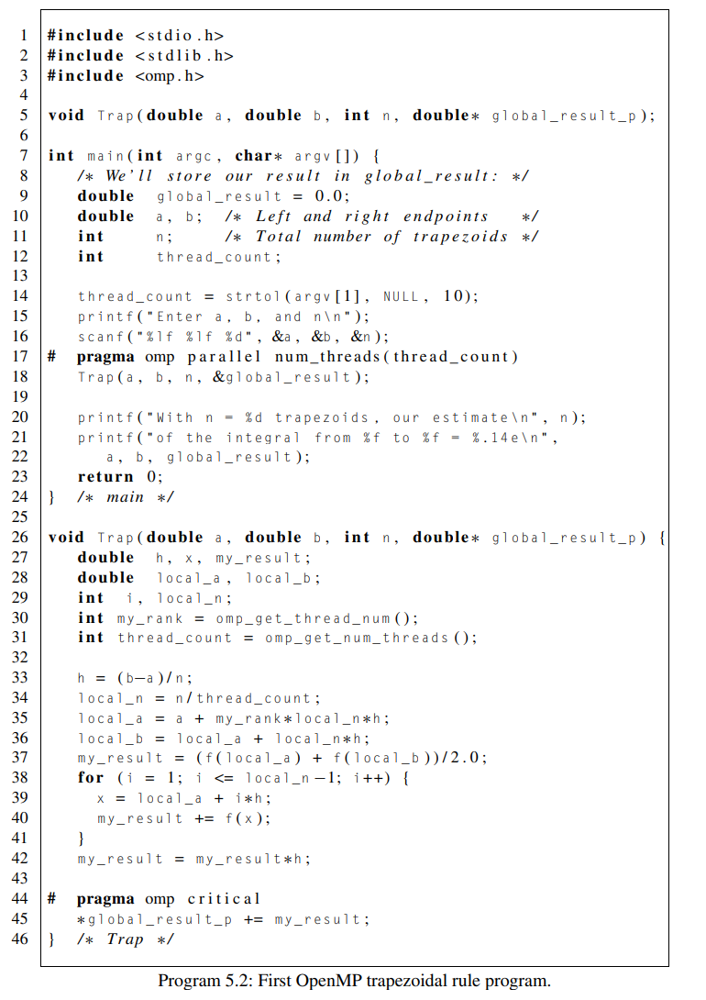
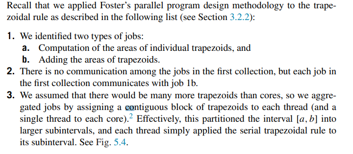
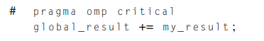
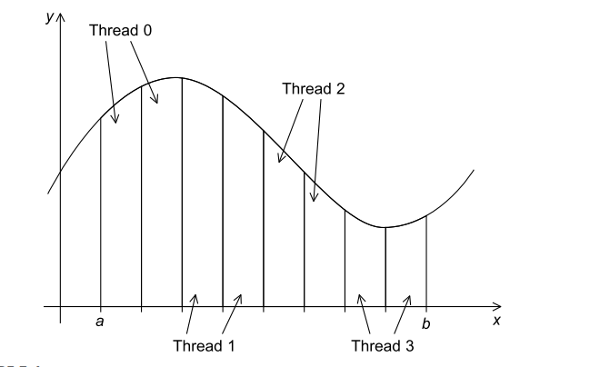
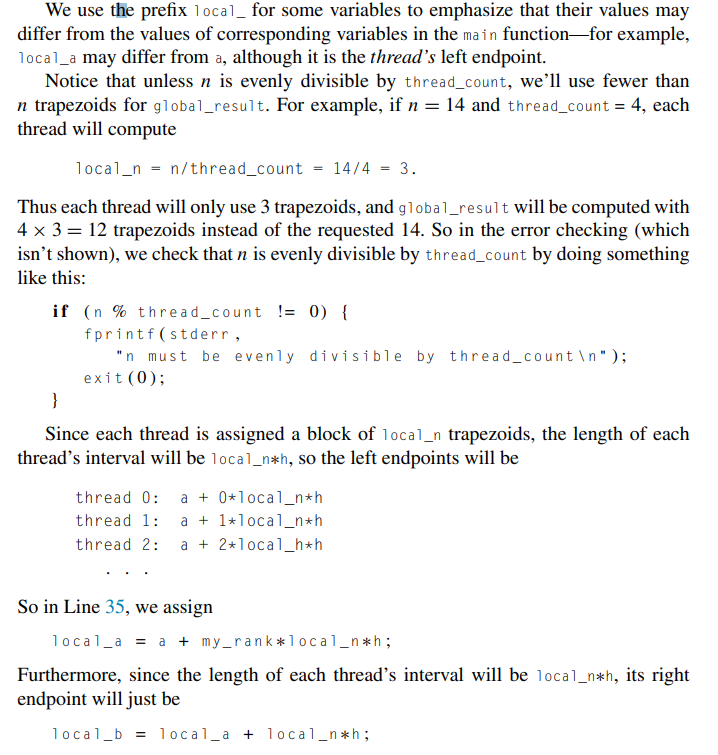

# The trapezoidal rule

Created: 2024-04-25 17:34:23 -0400

Modified: 2024-04-25 18:24:48 -0400

---

openMPI trapezoidal rule:

{width="5.145833333333333in" height="7.291666666666667in"}

 

 

Turning it into a parallel program using openMPI

-   Using Fosters methodology to turn problem into a parallel solution

> {width="5.25in" height="2.2916666666666665in"}

-   We aren't quite done, however, since we still need to add up the threads' results

    -   We can use a shared variable that all the threads can put their results into like this:

> {width="3.6041666666666665in" height="0.25in"}

-   However this would cause a race condition

<!-- -->

-   We also know that this line of code would be called a critical section.

-   We therefore need some mechanism to make sure that once one thread has started executing global_result += my_result, no other thread can start executing this code until the first thread has finished.

-   In Pthreads we used mutexes or semaphores. In OpenMP we can use the critical directive:

> {width="3.875in" height="0.6041666666666666in"}

-   This directive tells the compiler that the system needs to arrange for the threads to have mutually exclusive access to the following structured block of code.

<!-- -->

-   Summary of how the program works:

> In the main function, prior to Line 17, the code is single-threaded, and it simply gets the number of threads and the input (a, b, and n). In Line 17 the parallel directive specifies that the Trap function should be executed by thread_count threads. After returning from the call to Trap, any new threads that were started by the parallel directive are terminated, and the program resumes execution with only one thread. The one thread prints the result and terminates.

-   {width="5.239583333333333in" height="1.6041666666666667in"}

 

{width="3.4166666666666665in" height="2.125in"}

 

{width="3.8333333333333335in" height="4.03125in"}

Above is some clarifying info about what the program is doing, most notably...

-   What does local_[something] mean?

-   What code figures out what threads take care of what intervals [local_a,local_b]

-   Error checking in case we don't get an evenly divisible n

