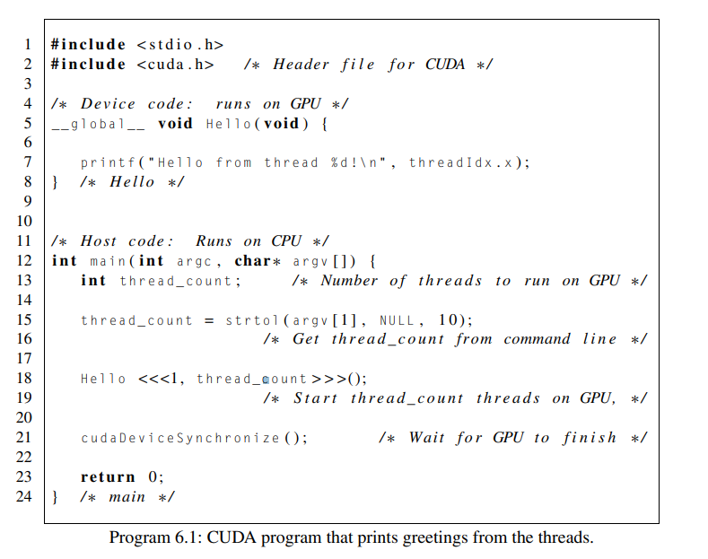
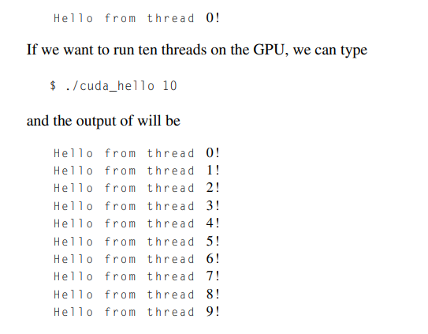
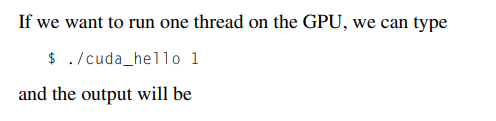
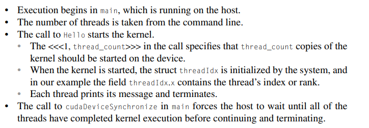
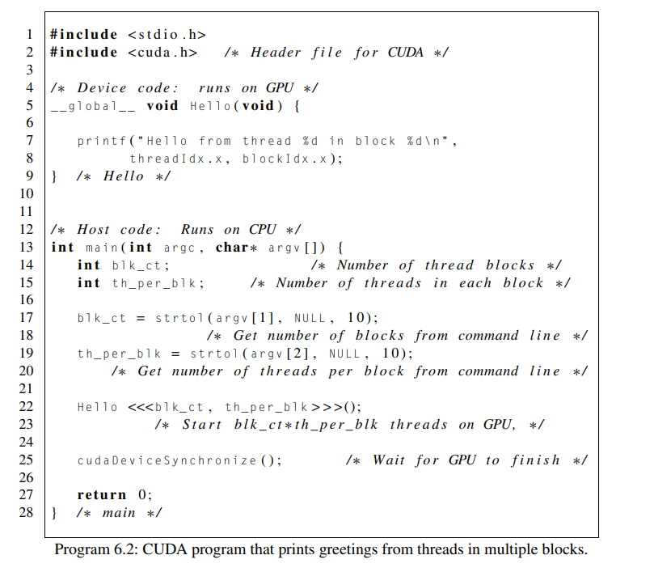
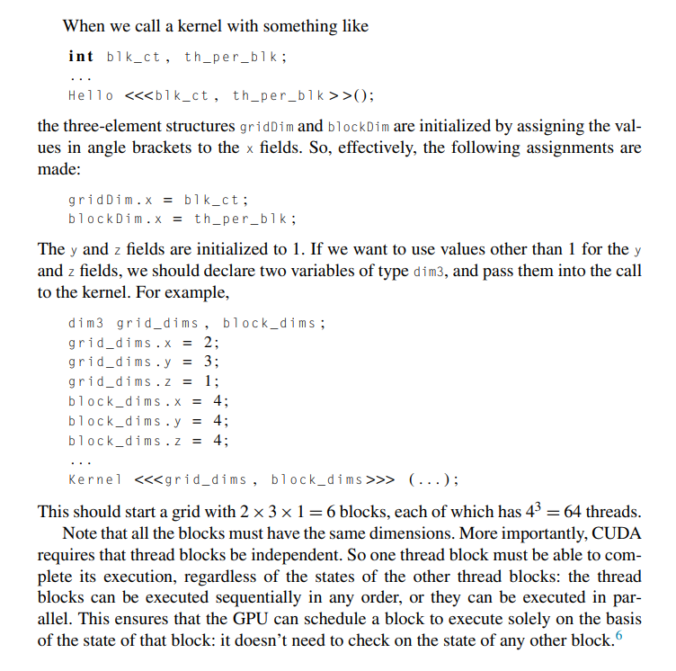

# CUDA hello

Created: 2024-05-07 20:45:20 -0400

Modified: 2024-05-08 01:43:28 -0400

---

-   CUDA is a software platform that can be used to write GPGPU programs for heterogeneous systems equipped with an Nvidia GPU

-   CUDA was originally an acronym for "Compute Unified Device Architecture," which was meant to suggest that it provided a single interface for programming both CPU and GPU

    -   More recently, however, Nvidia has decided that CUDA is not an acronym; it's simply the name of an API for GPGPU programming

-   There is a language-specific CUDA API for several languages; for example, there are CUDA APIs for C, C++, Fortran, Python, and Java.

    -   We'll be using CUDA C

        -   but we need to be aware that sometimes we'll need to use some C++ constructs.

        -   This is because the CUDA C compiler can compile both C and C++ programs, and it can do this because it is a modified C++ compiler.

        -   So where the specifications for C and C++ differ the CUDA compiler sometimes uses C++. (preference for c++)

            -   For example, since the C library function malloc returns a void∗ pointer

            -   a C program doesn't need a cast in the instruction float ∗x = malloc ( n∗ sizeof ( float ));

            -   However, in C++ a cast is required float ∗x = ( float ∗) malloc ( n∗ sizeof ( float ));

 

As usual, we'll begin by implementing a version of the "hello, world" program.

-   We'll write a CUDA C program in which each CUDA thread prints a greeting.

-   Since the program is heterogeneous, we will, effectively, be writing two programs: a host or CPU program and a device or GPU program.

-   Special compiler for CUDA

    -   {width="5.78125in" height="1.28125in"}

-   Source Code

> {width="6.145833333333333in" height="4.854166666666667in"}

-   Output

> {width="4.635416666666667in" height="3.6041666666666665in"}
>
>  

-   How to compile:

    -   A CUDA program file that contains both host code and device code should be stored in a file with a ".cu" suffix.

        -   For example, our hello program is in a file called cuda_hello.cu.

    -   We can compile it using the CUDA compiler nvcc.

        -   Command:

> {width="3.8229166666666665in" height="0.375in"}

-   Running it:

> {width="4.322916666666667in" height="1.0520833333333333in"}

 

So what exactly happens when we run cuda_hello?

-   As we noted earlier, execution begins on the host in the main function. It gets the number of threads from the command line by calling the C library strtol function

-   On line 18, the Hello <<<1,thread_count>>>();

    -   We tell the system how many threads to start on the GPU.

    -   If there were any arguments in the Hello function we would put them in the parenthesis

-   The kernel (which in this case is the Hello function denoted by __global__) specifies the code that each thread will execute. So each of our threads will print a message using printf("Hello from thread %dn, threadIdx.x" );

    -   The threadIdx.x is a struct variable provided by CUDA when a kernel is started

    -   The field x gives us the rank

-   After a thread has printed its message, it terminates execution.

-   Notice that our kernel code uses the Single-Program Multiple-Data or SPMD paradigm: each thread runs a copy of the same code on its own data. In this case, the only thread-specific data is the thread rank stored in threadIdx.x.

-   One very important difference between the execution of an ordinary C function and a CUDA kernel is that kernel execution is asynchronous.

    -   What we mean by asynchronous is that once the host (cpu) makes the call to the kernel that it should start running it will return even though the threads executing the kernel may not have finished executing.

    -   Essentially all we do from the host side is make the call to start running and then we return to main while the threads run the kernels

-   The call to cudaDeviceSynchronize in Line 21 forces the main function to wait until all the threads executing the kernel have completed.

    -   If we don't use this here the program could terminate before we even get any output from the threads

-   In summary:

-   {width="7.53125in" height="2.625in"}

 

Threads, blocks, and grids

-   You're probably wondering why we put a "1" in the angle brackets in our call to Hello:

    -   Hello <<<1, thread_count >>>();

-   Recall that an Nvidia GPU consists of a collection of streaming multiprocessors (SMs), and each streaming multiprocessor consists of a collection of streaming processors (SPs). When a CUDA kernel runs, each individual thread will execute its code on an SP.

-   With the "1" as the first value in the brackets we specify that all the threads started by the kernel call will run on one SM.

    -   If our GPU had two SM's we can try to use both of them with the kernel call:

> Hello <<<2, thread_count/2 >>>();

-   If thread_count is even, this kernel call will start a total of thread_count threads, and the threads will be divided between the two SMs: thread_count/2 threads will run on each SM**.**

<!-- -->

-   CUDA organizes threads into blocks and grids.

    -   Thread block (block) is a collection of threads that run on a single SM

        -   In a kernel call, like Hello<<<1, thread_count>>>() the first value in the angled brackets specifies the number of thread_blocks we want.

        -   The second value thread_count is the number of threads we want in each block

    -   Hello<<<1, thread_count>>>() means one thread block, which consist of thread_count threads, and, as a consequence, we only used one SM

-   We can modify our greetings program so that it uses a user-specified number of blocks, each consisting of a user-specified number of threads.

> {width="5.895833333333333in" height="5.145833333333333in"}

-   A grid is just a collection of thread blocks started by a kernel

    -   A thread block consists of threads and a grid consists of thread blocks

-   There are several built-in variables that a thread can use to get information on the grid started by the kernel.

    -   threadIdx: the rank or index of the thread in its thread block.

    -   blockDim: the dimensions, shape, or size of the thread blocks.

    -   blockIdx: the rank or index of the block within the grid

    -   gridDim: the dimensions, shape, or size of the grid.

>  

-   All of these structs have three fields, x, y, and z, 5 and the fields all have unsigned integer types.

    -   The fields are often convenient for applications.

        -   For example, an application that uses graphics may find it convenient to assign a thread to a point in two- or

        -   three-dimensional space, and the fields in threadIdx can be used to indicate the point's position.

    -   {width="5.270833333333333in" height="5.229166666666667in"}

>  

Note:

-   The source code for a CUDA program that prints a greeting from each thread on the GPU is shown in Program

-   As you might guess, there's a header file for CUDA programs, which we include in Line 2

-   The Hello function follows the include directives and starts on Line 5.

    -   This function is run by each thread on the GPU.

    -   In CUDA parlance, it's called a **[kernel]{.underline}**, a function that is started by the host but runs on the device.

        -   CUDA kernels are identified by the keyword __global__, and they always have return type void.

-   The main function follows the kernel on Line 12.

    -   Like ordinary C programs, CUDA C programs start execution in main, and the main function runs on the host.

    -   The function first gets the number of threads from the command line.

    -   It then starts the required number of copies of the kernel on Line 18.

    -   The call to cudaDeviceSynchronize will cause the main program to wait until all the threads have finished executing the kernel, and when this happens, the program terminates as usual with return 0.

 

In this program we get both the number of thread blocks and the number of threads in each block from the command line. Now the kernel call starts blk_ct thread blocks, each of which contains th_per_blk threads.

 

When the kernel is started, each block is assigned to an SM, and the threads in the block are then run on that SM. The output is similar to the output from the original program, except that now we're using two system-defined variables: threadIdx.x and blockIdx.x.

 

As you've probably guessed, threadIdx.x gives a thread's rank or index in its block, and blockIdx.x gives a block's rank in the grid.

 

Note:

-   If we want to change the dimensions of the grid and blocks we must do so manually

    -   We must declare two variables with the types dim3 (given by CUDA) and pass them into the call to kernel (given by CUDA)

-   Also note that all the blocks, in this case we are referring to the code block_dims.[] must have the same dimensions, aka same number value

 

