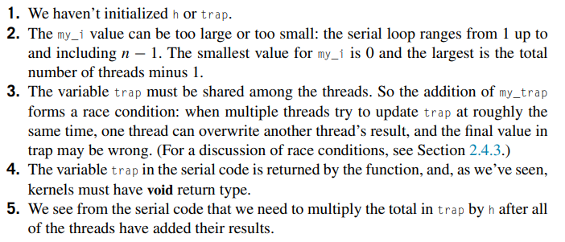
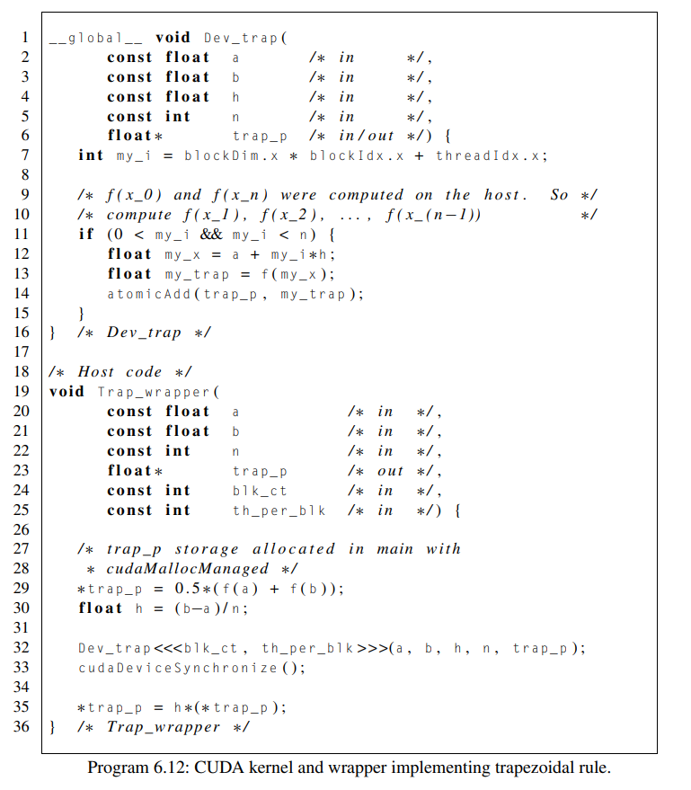
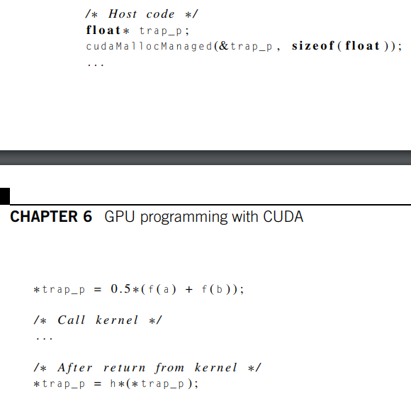
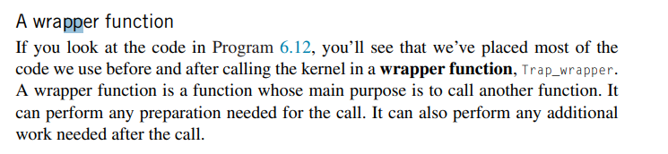
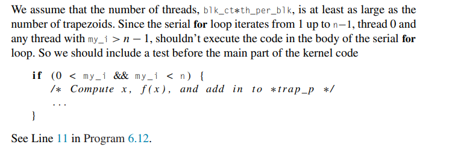
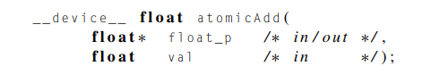
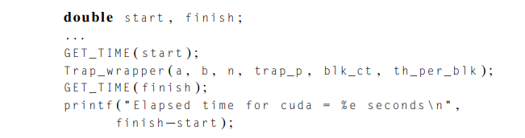
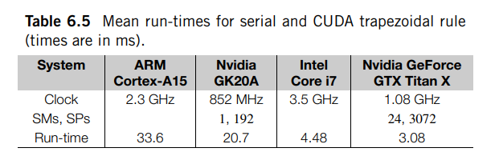
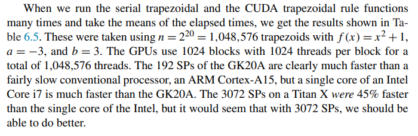

# CUDA trapezoidal rule I

Created: 2024-05-09 12:04:30 -0400

Modified: 2024-05-10 18:22:06 -0400

---

-   Note, this is a serial implementation for the trapezoidal rule

 

Implementing the trapezoidal rule with CUDA

-   Applying Fosters methodology

    -   If n is large, the vast majority of the work in the serial implementation is done by the for loop.

    -   we're mainly interested in two types of tasks:

        -   the first is the evaluation of the function f at x~i~

        -   the second is the addition of f (x~i~) into trap.

    -   We also note that the second task depends on the first so we package them together

    -   This suggests that each thread in our CUDA implementation might carry out one iteration of the serial for loop.

        -   We can assign a unique integer rank to each thread as we did with the vector addition program.

-   What we can do is compute an x-value, the function value, and add the function value to the "running sum"

    -   The kernel would look something like this:

>  

-   There are many problems wit this implementation:

> {width="6.0625in" height="2.59375in"}

 

How would we write the CUDA implementation that would deal with the problems highlighted above

-   The program:

> {width="6.864583333333333in" height="7.854166666666667in"}

 

-   Below we are going to look deeper into why we made the choices we made in this CUDA implementation and how it handled the problems above

-   One way we could try to solve many of the problems (1-5) listed above is by having one thread, say thread 0 from block 0, initialize all of the things we need and then send out that data to all the other threads.

    -   This is not a good idea and wrong.

    -   The reason we first bring this up is to make the point that kernel and function arguments are private to the executing thread

        -   Each thread has its own stack, private variables (h and trap).

        -   Any changes to these variables made on one thread wont be visible to other threads.

-   The more sensible approach would be to initialize these variables, like h and trap, on the host and then give each thread a copy of these variables

    -   The variable h is fine since it never changes

    -   Things are more complicated with trap variable since it is updated by the threads.

        -   We can first create a pointer to the trap variable and allocate trap and finally before the call to the kernel we can pass that trap pointer to the kernel using cudaMallocMemory.

> {width="4.0in" height="3.8854166666666665in"}

-   Note that we use a pointer to float because if we tried to use a regular float value, we would have to return it on the kernel side which isnt allowed, kernels cannot return values

<!-- -->

-   When we do this each thread essentially gets a copy of the trap variable but all the copies of trap will refer to the same memory location on the GPU (or kernel side of things).

<!-- -->

-   {width="7.75in" height="1.78125in"}

-   Using the correct threads

> {width="7.8125in" height="2.6354166666666665in"}

-   This code ensures that since each thread is handling one iteration, the thread is withing the bounds of the number of trapizoids we are using.

    -   All the other threads not in this scope should do nothing

<!-- -->

-   Updating the return value and atomicAdd

    -   What happens when we update the trap variable in the kernel

> {width="3.125in" height="0.3645833333333333in"}

-   An issue is that we will have a race condition if we don't handle this variable since it is being updated by all the threads.

-   We will solve this problem by using a function provided by CUDA function called atomicAdd

    -   What does it mean for an operation to be atomic?

> if it appears to all the other threads as if it were "indivisible."

-   So if another thread tries to access the result of the operation or an operand used in the operation, the access will occur either before the operation started or after the operation completed.

-   Effectively, then, the operation appears to consist of a single, indivisible, machine instruction.

-   This all means that to make addition atomic, no other thread should be able to update trap in the kernel while one is updating it

<!-- -->

-   Adding is not ordinarily atomic as there are mulitple instructions at play when adding

    -   Meaning that if one thread is executing an addition, it's possible for another thread to access the operands and the result while the addition is in progress.

-   For this reason, we CUDA provided many atomic addition funcitons, we use atomicAdd

> {width="4.90625in" height="0.8541666666666666in"}

-   This atomically adds the contents of val to the contents of the memory referred to by float_p and stores the result in the memory referred to by float_p. It returns the value of the memory referred to by float_p at the beginning of the call.

<!-- -->

-   Performance of the CUDA trapezoidal rule

    -   We can find the run-time of our trapezoidal rule by finding the execution time of the Trap_wrapper function.

        -   The execution of this function includes all of the computations carried out by the serial trapezoidal rule, including the initialization of ∗trap_p (Line 29) and h (Line 30), and the final update to ∗trap_p (Line 35).

        -   It also includes all of the calculations in the body of the serial for loop in the Dev_trap kernel.

    -   So we can effectively determine the run-time of the CUDA trapezoidal rule by timing a host function, and we only need to insert calls to our timing functions before and after the call to Trap_wrapper.

> {width="6.78125in" height="1.78125in"}

-   We typically want to measure the mean or median of our elapsed time

    -   We would run something like 50 executions to get the median or mean

    -   This is because CPU and GPU speeds play a role in the timings

> {width="6.46875in" height="1.96875in"}

-   Example:

> {width="7.28125in" height="2.375in"}
>
>  

