# CUDA trapezoidal rule II: improving performance

Created: 2024-05-10 18:20:31 -0400

Modified: 2024-05-11 23:26:44 -0400

---

> 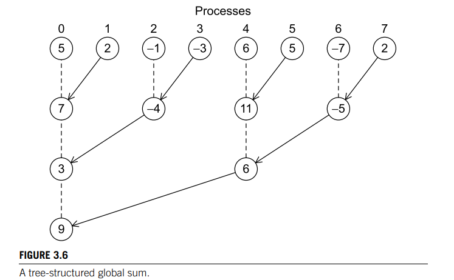{width="3.1666666666666665in" height="1.9583333333333333in"}

 

Tree-structured communication

-   In our previous implementation of the trap rule , threads are executed by our system and CUDA in more or less a random ordering when it comes to adding to our "global sum" that we called trap_p (trap variable)

    -   {width="2.8854166666666665in" height="2.3229166666666665in"}

        -   T being the time or iteration

        -   Notice that the threads are executing in a random order

        -   At the start we note that we always do the first and last iterations manually so we start with 9

-   What's important is that this approach may serialize the threads. So the computation may require a sequence of 8 calculations.

    -   So rather than have each thread wait for its turn to do an addition into ∗trap_p, we can pair up the threads so that half of the "active" threads add their partial sum to their partner's partial sum. This gives us a structure that resembles a tree

    -   Why is this good?

> 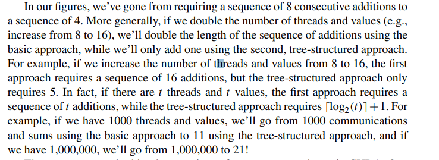{width="7.6875in" height="2.7916666666666665in"}

-   In summary, it saves us on performance

<!-- -->

-   There are two ways to implement this tree structure in CUDA: one implementation uses shared memory (best for devices with a compute capability < 3) and there are functions called [warp shuffles]{.underline} that allow a collection of threads within a [warp]{.underline} to read variables stored on other threads in the warp (able to be used in devices with a compute capability >= 3)

-   Before we talk about how warp shuffles work we will talk about how memory works in CUDA.

    -   Local variables, registers, shared and global memory

    -   we mentioned that SMs in an Nvidia processor have access to two collections of memory locations: each SM has access to its own "shared" memory, which is accessible only to the SPs belonging to the SM.

        -   More precisely, the shared memory allocated for a thread block (SM) is only accessible to the threads in that block. On the other hand, all of the SPs and all of the threads have access to "global" memory.

        -   The number of shared memory locations is relatively small, but they are quite fast, while the number of global memory locations is relatively large, but they are relatively slow.

    -   We can say that a GPU has three levels of memory:

        -   At the bottom, is the slowest, largest level: global memory.

        -   In the middle is a faster, smaller level: shared memory.

        -   At the top is the fastest, smallest level: the registers.

    -   An obvious question here: what about local variables? How much storage is available for them? And how fast is it?

        -   This depends on total available memory and program memory usage. If there is enough storage, local variables are stored in registers

        -   However, if there isn't enough register storage, local variables are "spilled" to a region of global memory that's thread private, i.e., only the thread that owns the local variables can access them.

        -   So as long as we have sufficient register storage, we expect the performance of a kernel to improve if we increase our use of registers and reduce our use of shared and/or global memory

-   Warps and warp shuffles

    -   In particular, if we can implement a global sum in registers, we expect its performance to be superior to an implementation that uses shared or global memory, and the warp shuffle functions introduced in CUDA 3.0 allow us to do this.

    -   In CUDA a **[warp]{.underline}** is a set of threads with consecutive ranks belonging to a thread block.

        -   The number of threads in a warp is currently 32

            -   Will need to have total threads in an SM be a multiple of 32, as we will see later

        -   There is a variable initialized by the system that stores the size of a warp:

> 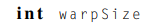{width="1.75in" height="0.25in"}

-   Essentially warps group up threads in an SM and each thread in the warp get some rank

    -   The rank of a thread within a warp is called the **[thread's lane]{.underline}**, and it can be computed using the formula

> {width="4.083333333333333in" height="0.28125in"}

-   The threads in a warp operate in SIMD fashion.

    -   So threads in different warps can execute different statements with no penalty, while threads within the same warp must execute the same statement.

<!-- -->

-   The warp shuffle functions allow the threads in a warp to read from registers used by another thread in the same warp.

> 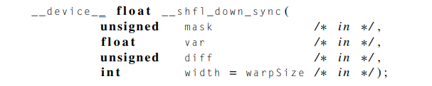{width="6.3125in" height="1.2708333333333333in"}

-   The mask argument indicates which threads are participating in the call

    -   We use hexadecimal to define this argument.

    -   We typically end up using all the threads in a warp so this argument is usually:

> 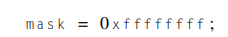{width="2.375in" height="0.375in"}
>
> Recall that 0x denotes a hexadecimal (base 16) value and 0xf is 15~1~0, which is 1111~2~. So this value of mask is 32 1's in binary, and it indicates that every thread in the warp (32 threads in each warp) participates in the call to __shfl_down_sync.

-   The var argument is the variable we are passing/shuffling from one thread to the other

-   The diff argument is The number of lane positions a thread's value is moved downward within the warp.

    -   lane + diff will match a thread in the warp with another thread in the warp to do the operation with

    -   Typically what will happen is a thread with say lane = 1 will do a lane + diff to get another thread that is higher ranked say diff=3 so 1+ 3=4 and so in this case lane 1 calls for lane 4 and then lane 4 passes its var into lane 1 to compute

-   Width is amount of threads being considered

<!-- -->

-   There are several possible issues that could occur:

> 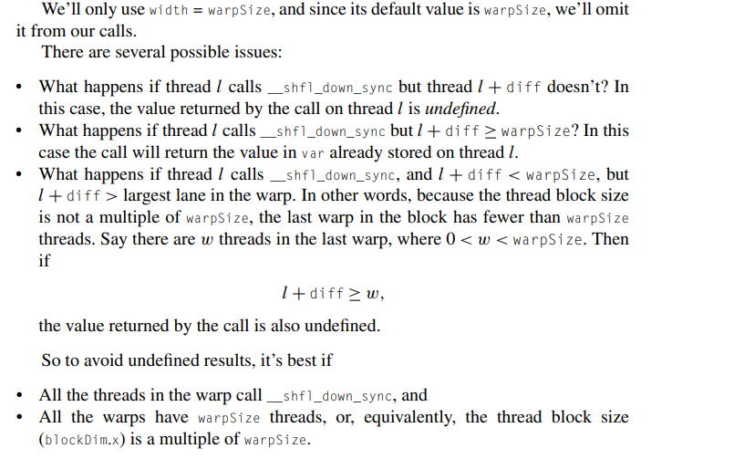{width="5.25in" height="3.28125in"}
>
>  

-   Implementing tree-structured global sum with a warp shuffle

    -   So we can implement a tree-structured global sum using the following code:

> 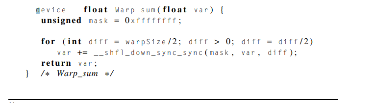{width="4.927083333333333in" height="1.34375in"}

-   It would look something like this:

> 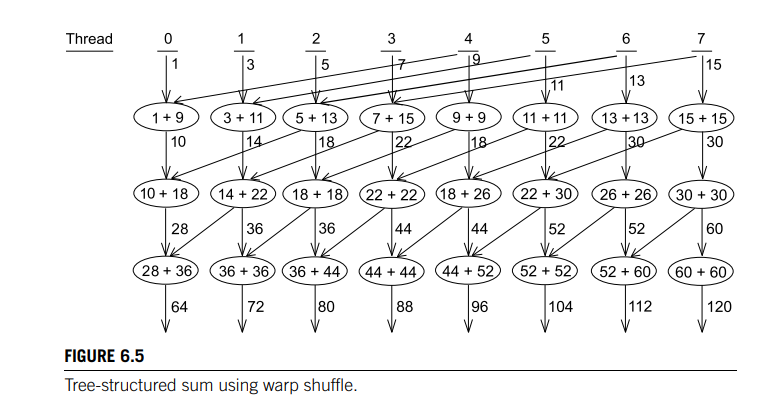{width="5.072916666666667in" height="2.6770833333333335in"}
>
>  

-   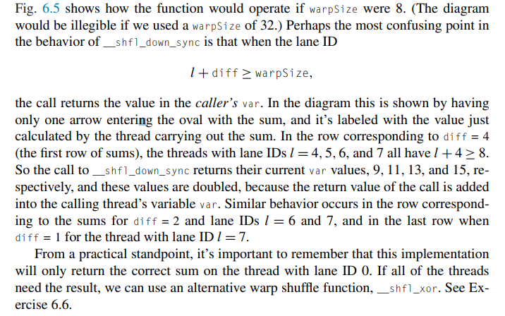{width="5.104166666666667in" height="3.1979166666666665in"}

<!-- -->

-   Note that thread with lane 0 in the warp will be the thread with the

> Final sum in this implementation

 

-   Shared memory and an alternative to the warp shuffle

    -   If your GPU has a computation capability < 3, then you cannot use the warp shuffle functions in your code and thus you cannot access the registers of other threads within the same warp.

    -   However we can implement another way of creating a tree like structure by using shared memory where threads in the same thread block can all access the same shared memory.

        -   In fact, although shared memory access is slower than register access, we'll see that the shared memory implementation can be just as fast as the warp shuffle implementation

    -   Since the threads belonging to a single warp operate synchronously, we can implement something very similar to a warp shuffle using shared memory instead of registers.

> 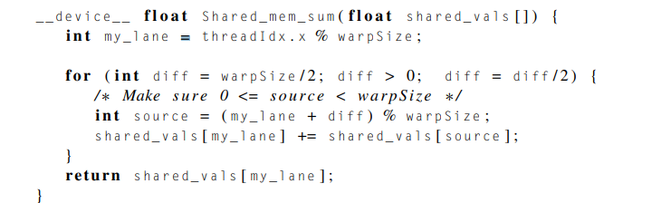{width="6.010416666666667in" height="1.8125in"}

-   This should be called by all the threads in a warp, and the array shared_vals should be stored in the shared memory of the SM that's running the warp.

    -   Technically we could have shared_vals[] be in the global memory but we should explicitly make it shared memory to take advantage of the speed shared memory has over global memory

-   Since the threads in the warp are operating in SIMD fashion, they effectively execute the code of the function in lockstep.

    -   So there's no race condition in the updates to shared_vals: all the threads read the values in shared_vals[source] before any thread updates shared_vals[my_lane].

<!-- -->

-   Technically speaking, this isn't a tree-structured sum. It's sometimes called a dissemination sum or dissemination reduction. Fig. 6.6 illustrates the copying and additions that take place.

> 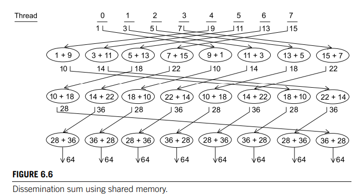{width="5.552083333333333in" height="3.03125in"}

-   Also note that every thread reads a value from another thread in each pass through the for statement unlike in warp shuffle.

-   Also note, after all these values have been added in, every thread has the correct sum---not just thread 0.

    -   This can be useful in other applications

<!-- -->

-   Also, each thread here is either executing the same instruction as every other thread or it is idle

-   An obvious question here is: how does Shared_mem_sum make use of Nvidia's shared memory?

    -   The answer is that it's not required to use shared memory. The function's argument, the array shared_vals, could reside in either global memory or shared memory.

        -   In either case, the function would return the sum of the elements of shared_vals.

    -   However, to get the best performance, the argument shared_vals should be defined to be __shared__ in a kernel.

> 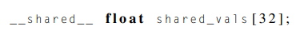{width="3.8541666666666665in" height="0.4375in"}

-   For each thread block this sets aside storage for a collection of 32 floats in the shared memory of the SM to which the block is assigned.

-   Alternatively, if it isn't known at compile time how much shared memory is needed, it can be declared as

    -   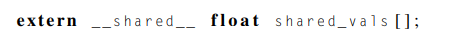{width="4.9375in" height="0.46875in"}

        -   and when the kernel is called, a third argument can be included in the triple angle brackets specifying the size in bytes of the block of shared memory

        -   For example, if we were using Shared_mem_sum in a trapezoidal rule program, we might call the kernel Dev_trap with

> 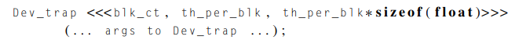{width="7.03125in" height="0.6666666666666666in"}

-   This would allocate storage for th_per_blk floats in the shared_vals array in each thread block.

 

-   Implementation of trapezoidal rule with warpSize thread blocks

    -   We will showcase both implementations of the tree structure (warp shuffle and shared memory) for our program.

    -   What we can assume in both versions and what things are similar:

        -   For both versions we'll assume that the thread blocks consist of warpSize threads

        -   we'll use one of our "tree-structured" sums to add the results of the threads in the warp

        -   After computing the function values and adding the results within a warp, the thread with lane ID 0 in the warp will add the warp sum into the total using Atomic_add.

        -   Host code:

            -   For both the warp shuffle and the shared memory versions, the host code is virtually identical to the code for our first CUDA version. The only substantive difference is that there is no th_per_blk variable in the new versions, since we're assuming that each thread block has warpSize threads.

                -   Th_per_blk will be the warpSize so no need to specify it, this also helps prevent those errors we saw in warp shuffle when we don't have a multiple of 32 for warps

>  

-   Kernel warp Shuffle implementation:

> 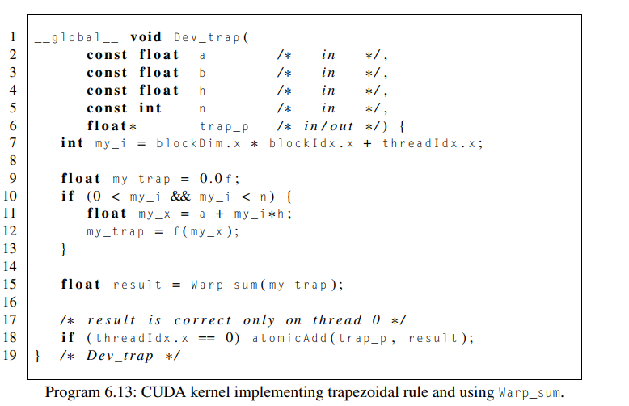{width="5.90625in" height="3.8125in"}
>
>  

-   Kernel with shared memory implementation:

> 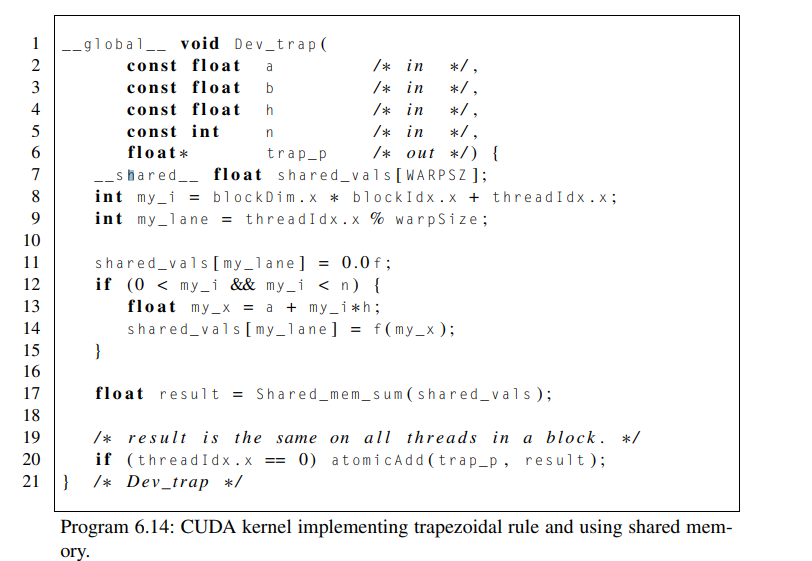{width="5.9375in" height="4.09375in"}

-   Note that for both these implementations, the functions Warp_sum and shared_mem_sum we talked about earlier (towards the top of the page)

-   Performance:

> 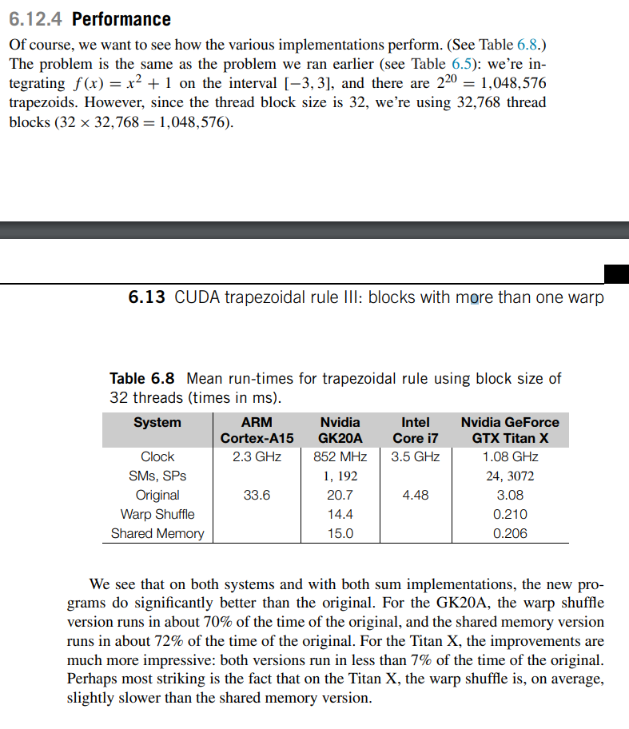{width="6.28125in" height="7.28125in"}
>
>  

Note:

1.  This one essentially says what if one thread calls the function and the other one doesn't

    a.  It is best practice for all threads in a warp to call this function

2.  This one is essentially saying that if lane + diff goes beyond the scope of the warpSize (32) then the lane calling for the other thread will just use its own var

    a.  This essentially stops the thread from influencing other threads since it has no buddy

3.  This is essentially reiterating that the thread block size must be a multiple of warpSize (32) so that all warp blocks in a warp have the same number of threads and no warp blocks are different

 

To reiterate the solutions to these problems:

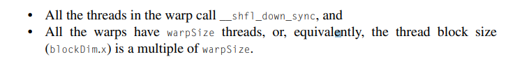{width="4.520833333333333in" height="0.5833333333333334in"}

 

Note:

-   Diff will half in two every iteration because every iteration in this program we no longer need the values from the threads (lane + diff) that we fetched data from when doing lane + diff.

    -   In this way we essentially cut off the threads we already fetched the data from the "crucial threads" still in play

 

Note:

-   this is if warpSize was 8 and not 32, like it would typically be

 

Notes:

-   We already discussed this above but to go a little further...

-   We halve the diff each time to remove from the game the threads (lane + diff) we have already read from

-   Some confusing things happen as depicted in the image above when...

    -   Lane + diff > warpSize, we see that the thread calls for a buddy and it doesn't have one in scope thus it just "plays" with itself

    -   When we half the diff the threads which were "out of play" can now find a buddy to play with but since all of these are not the "crucial" threads they don't matter and thus we don't care what they do with each other

 

Notes:

-   Very similar to original implementation

-   However, instead of adding each

-   thread's calculation directly into ∗trap_p, each warp (or, in this case, thread block) calls the Warp_sum function to add the values computed by the threads in the warp.

-   Then, when the warp returns, thread (or lane) 0 adds the warp sum for its thread block (result) into the global total.

-   Since, in general, this version will use multiple thread blocks, there will be multiple warp sums that need to be added to ∗trap_p. So if we didn't use atomicAdd, the addition of result to ∗trap_p would form a race condition.

 

Notes:

-   Very similar to the warp shuffle implantation

-   The main differences are that it declares an array of shared memory in Line 7;

    -   it initializes this array in Lines 11 and 14;

-   and, of course, the call to Shared_mem_sum is passed this array rather than a scalar register

-   Since we know at compile time how much storage we'll need in shared_vals, we can define the array by simply preceding the ordinary C definition with the CUDA qualifier __shared__: __shared__ float shared_vals [ WARPSZ ] ;

    -   Note that the CUDA defined variable warpSize is not defined at compile-time. So our program defines a preprocessor macro

> {width="2.3125in" height="0.3333333333333333in"}
>
>  

