# CUDA trapezoidal rule III: blocks with more than one warp (need to rereview was tired and did not really absorb info)

Created: 2024-05-11 23:26:54 -0400

Modified: 2024-05-12 01:13:06 -0400

---

-   So if we limited ourselves to only 32 threads in a block, we wouldn't be using one of the most useful features of CUDA: the ability to efficiently synchronize large numbers of threads.

>  

So what would a "block" sum look like if we allowed ourselves to use blocks with up to 1024 threads?

-   [Warp shuffle implementation]{.underline}:

-   We could use one of our existing warp sums to add the values computed by the threads in each warp. Then we would have as many as 1024/32 = 32 warp sums, and we could use one warp in the thread block to add the warp sums.

-   __syncthreads

    -   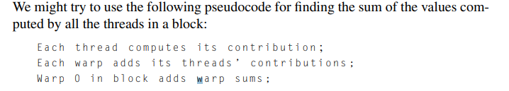{width="6.697916666666667in" height="1.1979166666666667in"}

        -   However, there's a race condition. Do you see it? When warp 0 tries to compute the total of the warp sums in the block, it doesn't know whether all the warps in the block have completed their sums.

        -   Recall that the threads in a warp operate in SIMD fashion: no thread in the warp proceeds to a new instruction until all the threads in the warp have completed (or skipped) the current instruction. But the threads in warp 0 can operate independently of the threads in warp 1.

            -   So if warp 0 finishes computing its sum before warp 1 computes its sum, warp 0 could try to add warp 1's sum to its sum before warp 1 has finished, and, in this case, the block sum could be incorrect.

    -   So we must make sure that warp 0 doesn't start adding up the warp sums until all of the warps in the block are done. We can do this by using CUDA's fast barrier:

> 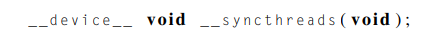{width="4.5625in" height="0.375in"}

-   New Pseudocode would look like:

> 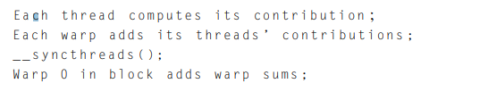{width="5.6875in" height="1.0625in"}

-   Now warp 0 won't be able to add the warp sums until every warp in the block has completed its sum

<!-- -->

-   There are a couple of important caveats when we use __syncthreads

    -   First, , it's critical that all of the threads in the block execute the call.

        -   If not we get errors

    -   The second caveat is that __syncthreads only synchronizes the threads in a block.

        -   If a grid contains at least two blocks, and if all the threads in the grid call __syncthreads then the threads in different blocks will continue to operate independently of each other. So we can't synchronize the threads in a general grid with __syncthreads.

 

-   Using shared memory to compute warps:

    -   If we try to implement the pseudocode in CUDA, we'll see that there's an important detail that the pseudocode doesn't show: after the call to __syncthreads, how does warp 0 obtain access to the sums computed by the other warps?

> 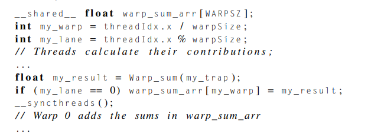{width="5.15625in" height="1.8541666666666667in"}

 

-   Shared memory implementation:

-   If we're using shared memory instead of warp shuffles to compute the warp sums, we'll need enough shared memory for each warp in a thread block.

    -   Since shared variables are shared by all the threads in a thread block, we need an array large enough to hold the contributions of all of the threads to the sum.

        -   So we can declare an array with 1024 elements---the largest possible block size---and partition it among the warps:

> 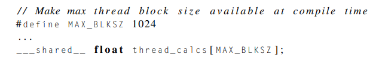{width="6.0in" height="0.9479166666666666in"}
>
>  

-   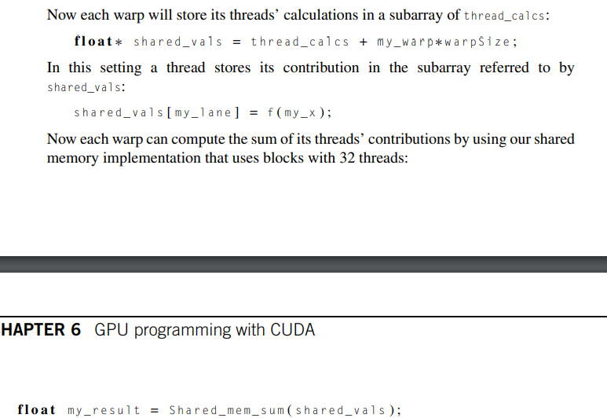{width="6.364583333333333in" height="4.375in"}

>  

-   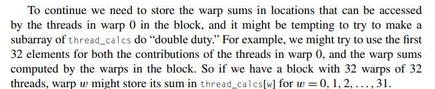{width="7.40625in" height="1.5208333333333333in"}

 

-   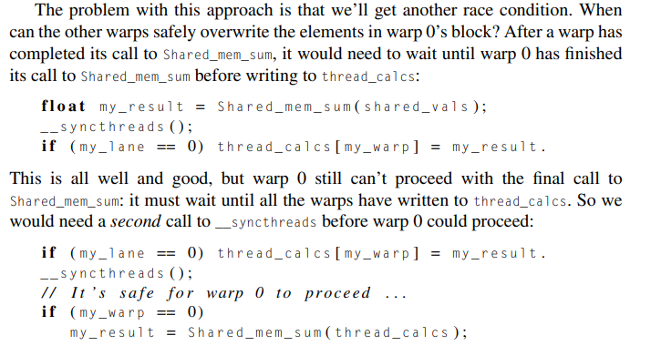{width="5.8125in" height="3.1354166666666665in"}

    -   We get a race condition if we try this

    -   We could fix it by adding another __syncthreads() but those are costly and we should try to minimize its usage if possible

<!-- -->

-   An alternative approach would be:

> 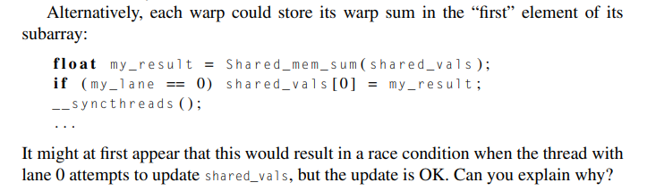{width="7.53125in" height="2.2291666666666665in"}

-   Because of how NVIDIA designed shared memory this still isnt the best approach, here is a simple but effective solution:

> 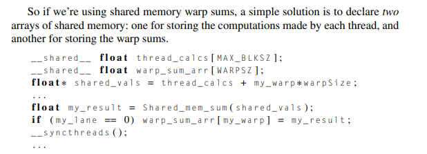{width="6.4375in" height="2.3229166666666665in"}
>
>  

-   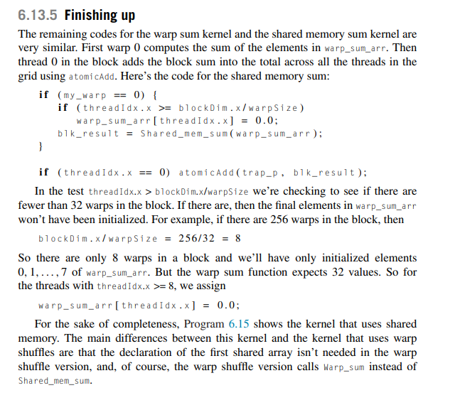{width="6.739583333333333in" height="5.9375in"}

-   Code:

> 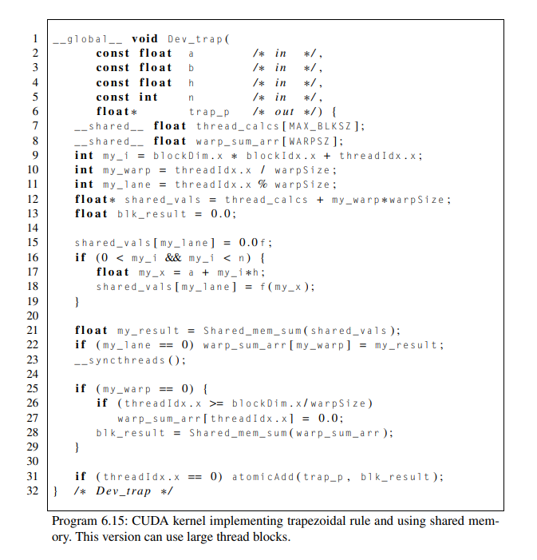{width="7.0in" height="7.302083333333333in"}

 

Performance:

-   Both do better than previous implementations

> 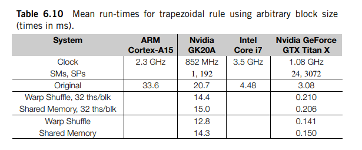{width="6.40625in" height="2.65625in"}
>
>  

Note: being lazy so took screenshot

-   Each warp will store in its shared memory a section of the thread_calcs array to add its final computation into

