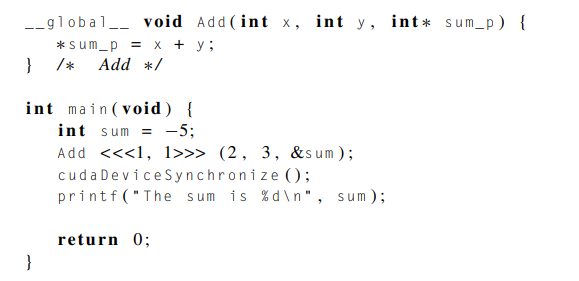
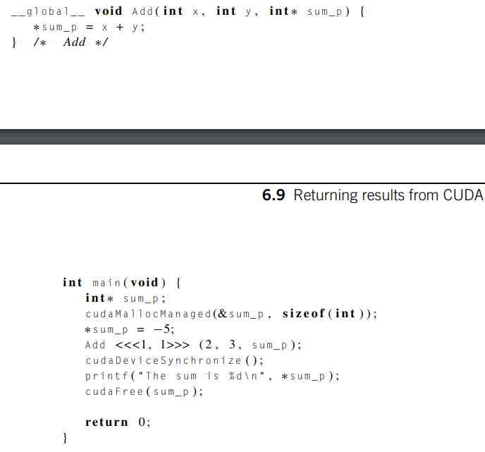
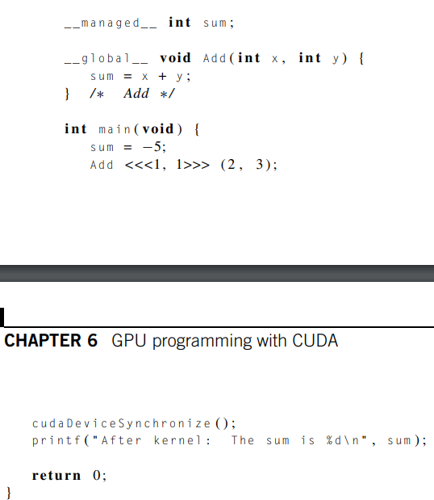

# Returning results from CUDA kernels

Created: 2024-05-09 11:49:42 -0400

Modified: 2024-05-09 12:04:02 -0400

---

-   They also cant return anything to the host via standard C pass by reference

    -   pass by reference: when you pass a function the address of a variable and it can modify that value in the function

    -   The reason for this is that addresses on the host are, in most systems, invalid on the device, and vice versa.

    -   Example:

> {width="6.03125in" height="2.9166666666666665in"}

-   This will either print -5 or the device will hang

-   The reason is that the address &sum is probably invalid on the device, thus *sum_p = x +y is t trying to assign a value to an invalid memory location

 

There are approaches to returning a "result" to the host from a kernel

-   One is to declare pointer variables and allocate a single memory location.

    -   On a system that supports unified memory, the computed value will be automatically copied back to host memory:

> {width="4.760416666666667in" height="4.4375in"}

-   If your system doesn't support unified memory, the same idea will work, but the result will have to be explicitly copied from the device to the host:

> {width="4.8125in" height="3.375in"}

-   Note that in both the unified and non-unified memory settings, we're returning a single value from the device to the host.

-   If unified memory is available, another option is to use a global managed variable for the sum:

> {width="4.770833333333333in" height="5.489583333333333in"}
>
>  

Unified memory in this program can be noted since we are using cudaMallocManaged

 

 

Note:

-   I think this program is missing a second cudaMemcpy to copy the hsum_p value of -5 into the device variable dsum_p

    -   This would probably go right before the call the kernel

 

Note:

-   The qualifier __managed__ declares sum to be a managed int that is accessible to all the functions, regardless of whether they run on the host or the device

-   Since it's managed, the same restrictions apply to it that apply to managed variables allocated with cudaMallocManaged.

> So this option is unavailable on systems with compute capability < 3.0, and on systems with compute capability < 6.0, sum can't be accessed on the host while the kernel is running.

-   So after the call to Add has started, the host can't access sum until after the call to cudaDeviceSynchronize has completed.

<!-- -->

-   Since this last approach uses a global variable, it has the usual problem of reduced modularity associated with global variables

