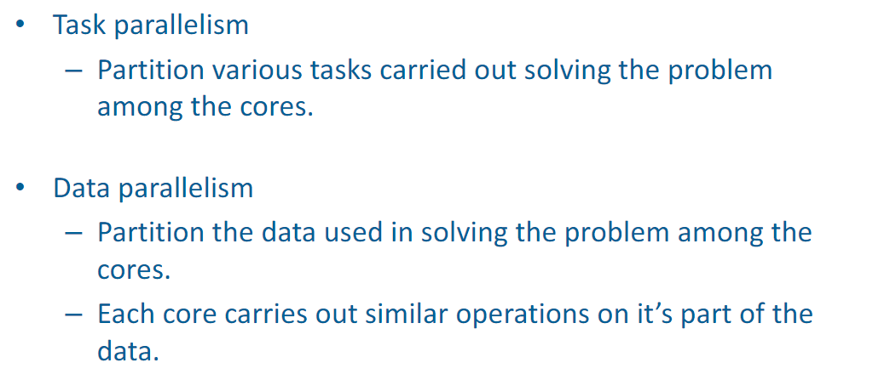
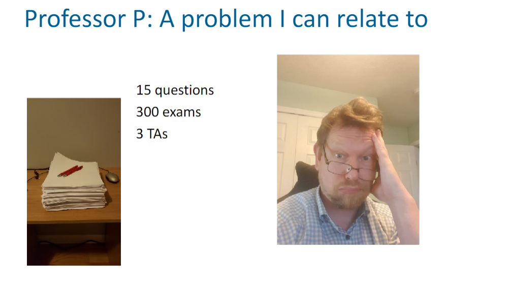
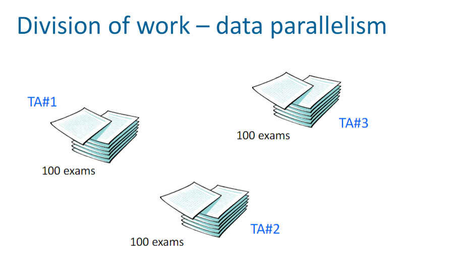
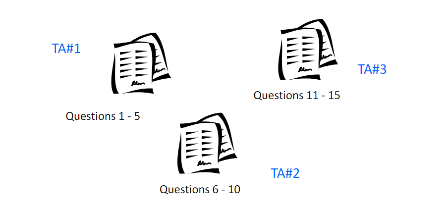
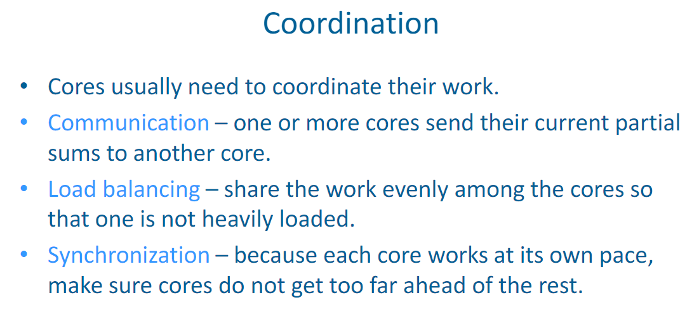
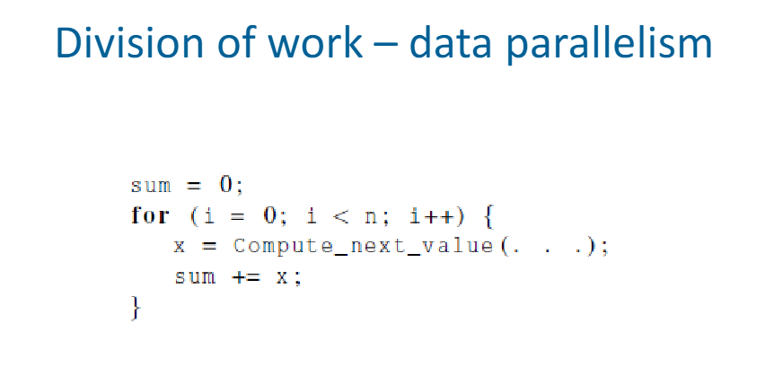
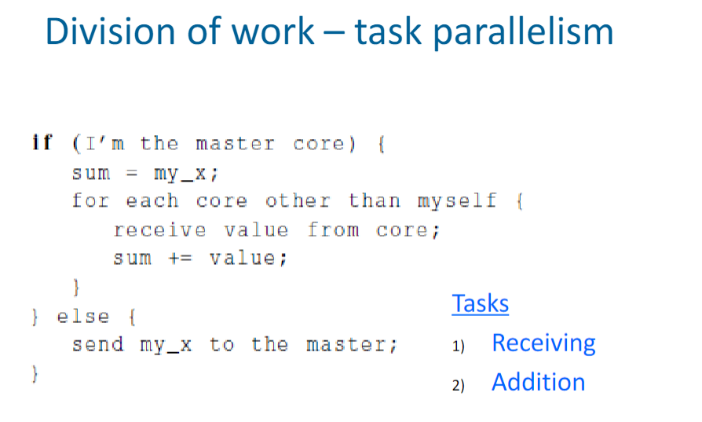

# How do we write parallel programs?

Created: 2024-02-07 18:48:09 -0500

Modified: 2024-02-07 18:53:16 -0500

---

{width="5.53125in" height="2.3229166666666665in"}

 

 

Example of both:

{width="4.645833333333333in" height="2.5625in"}

 

 

{width="2.9479166666666665in" height="1.8541666666666667in"}

Division of Work - data parallelism

{width="4.489583333333333in" height="2.6458333333333335in"}

 

Division of Work - task parallelism

{width="4.645833333333333in" height="2.1979166666666665in"}

 

{width="5.083333333333333in" height="2.2916666666666665in"}

 

{width="4.541666666666667in" height="2.1770833333333335in"}

 

{width="3.1875in" height="1.9166666666666667in"}

 

Notes:

-   Fundamentals of parallelism

