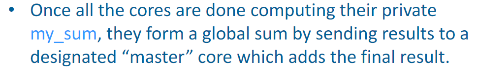
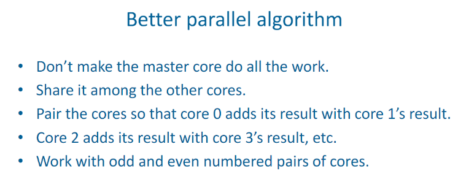
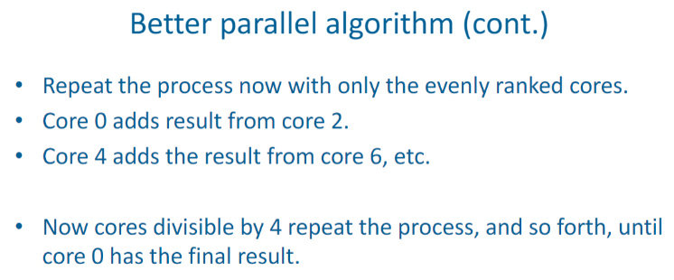
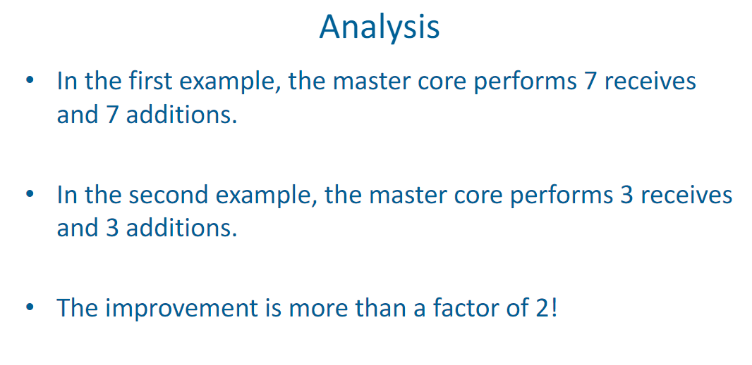
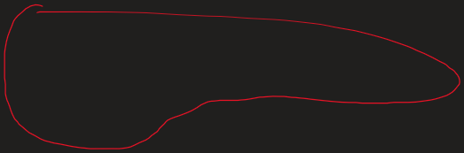
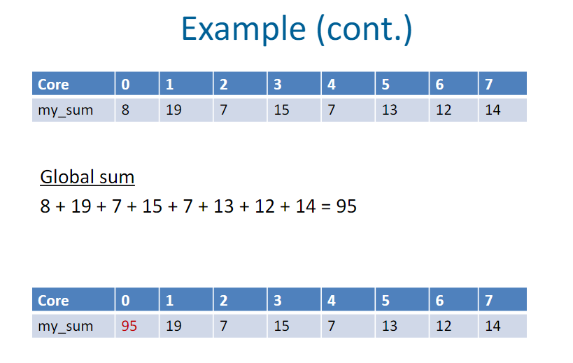
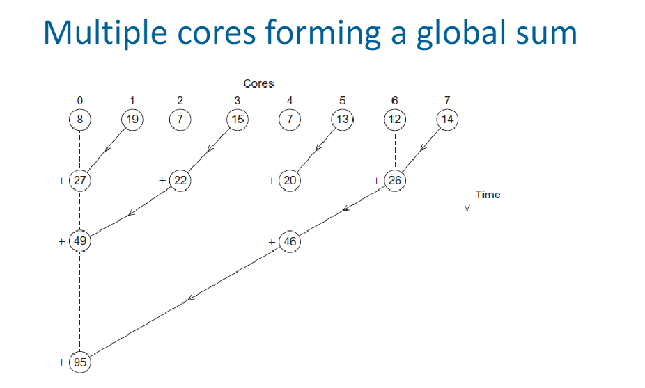
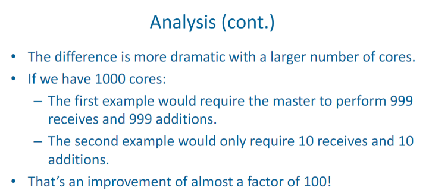

# What is Parallel Programming about?

Created: 2024-02-07 16:32:36 -0500

Modified: 2024-02-07 18:45:16 -0500

---

• The simple notion that 2 heads are better than one.

• In computing terms, 2 CPUs are better

than one

• That's really the basic idea

-   Find out how to share the work

-   Offload parts of the work to different CPUs/GPUs. Nothing more complex than that.

 

An intelligent solution

• Instead of designing and building faster microprocessors, put multiple processors on a single integrated circuit.

-   Microprocessor: is a type of CPU, that is compact and the integrated version designed to perform the functions of a CPU on a SINGLE chip or silicon (IC).

    -   Modern day CPU's that we know of

-   IC: single integrated circuit

 

What is serial programming? (diff from parallel prog.)

-   Serial programs: execute instructions sequentially, one after the other. This means that at any given moment, the program is executing a single operation before moving on to the next.

    -   Serial programs don't benefit from parallel programming (for the most part)

 

Things that parallel programming can help in:

-   Climate modeling, protein folding, drug discovery, energy research, data analysis, etc..

    -   These are all things that require ever-increasing performance which can be done possible by techniques such as parallel programing.

 

Parallelism:

-   Move away from single core systems to multicore processors

    -   Core = central processing unit (CPU)

 

Approaches to the serial problem:

-   Rewrite serial programs so that they are parallel

-   Write translation programs that automatically convert serial programs into parallel programs.

    -   Very difficult to do

    -   Success has been little

>  

Example of Serial vs Parallel solutions: compute n values and add them together

-   Serial:

> {width="4.302083333333333in" height="1.5in"}

-   Parallel:

> {width="5.78125in" height="2.0729166666666665in"}
>
>  
>
> {width="3.3541666666666665in" height="1.53125in"}
>
>  
>
> {width="3.34375in" height="0.5416666666666666in"}
>
>  
>
> {width="3.3645833333333335in" height="1.75in"}
>
>  
>
> {width="3.375in" height="1.6666666666666667in"}
>
>  
>
> {width="3.3854166666666665in" height="1.40625in"}
>
> {width="3.3854166666666665in" height="1.40625in"}
>
>  
>
> {width="3.4166666666666665in" height="1.65625in"}

Notes:

-   This will simply add to the sum after computing the value in steps starting from i all the way to n

    -   STEPS

 

 

Notes:

-   We have p cores

    -   P is much smaller than n

        -   Because of this, each core performs a partial sum of approximately n/p values

            -   Partial sum meaning:

 

 

 

-   Each summation represents a core

<!-- -->

-   Explaining the example:

    -   Each core starts with a sum of 0 and it handles a certain range from my_first_i to my_last_i and it computes the sum of that range

        -   All the cores together will handle up to n

>  

{width="0.17708333333333334in" height="0.23958333333333334in"}{width="0.19791666666666666in" height="0.22916666666666666in"}{width="0.2708333333333333in" height="0.22916666666666666in"}{width="0.13541666666666666in" height="0.21875in"}{width="0.125in" height="0.19791666666666666in"}{width="0.15625in" height="0.1875in"}{width="0.15625in" height="0.1875in"}{width="0.16666666666666666in" height="0.16666666666666666in"}{width="0.17708333333333334in" height="0.20833333333333334in"}{width="0.1875in" height="0.16666666666666666in"}{width="0.22916666666666666in" height="0.20833333333333334in"}{width="0.19791666666666666in" height="0.19791666666666666in"}{width="0.10416666666666667in" height="0.17708333333333334in"}{width="0.16666666666666666in" height="0.17708333333333334in"}{width="0.14583333333333334in" height="0.16666666666666666in"}{width="5.447916666666667in" height="1.8020833333333333in"}{width="0.20833333333333334in" height="0.10416666666666667in"}{width="0.3020833333333333in" height="0.13541666666666666in"}{width="0.11458333333333333in" height="0.13541666666666666in"}{width="0.17708333333333334in" height="0.20833333333333334in"}{width="0.10416666666666667in" height="0.11458333333333333in"}{width="0.1875in" height="0.23958333333333334in"}{width="0.11458333333333333in" height="0.19791666666666666in"}{width="0.125in" height="0.17708333333333334in"}{width="0.21875in" height="0.10416666666666667in"}{width="0.10416666666666667in" height="0.14583333333333334in"}

 

{width="0.17708333333333334in" height="0.19791666666666666in"}{width="0.11458333333333333in" height="0.20833333333333334in"}{width="0.19791666666666666in" height="0.1875in"}{width="0.11458333333333333in" height="0.20833333333333334in"}{width="0.16666666666666666in" height="0.10416666666666667in"}{width="0.11458333333333333in" height="0.16666666666666666in"}{width="0.16666666666666666in" height="0.13541666666666666in"}{width="0.11458333333333333in" height="0.14583333333333334in"}{width="0.1875in" height="0.11458333333333333in"}{width="0.13541666666666666in" height="0.14583333333333334in"}{width="0.4270833333333333in" height="0.3125in"}{width="0.2708333333333333in" height="0.34375in"}{width="0.3854166666666667in" height="0.46875in"}{width="0.10416666666666667in" height="0.21875in"}{width="0.11458333333333333in" height="0.15625in"}{width="0.125in" height="0.25in"}{width="0.13541666666666666in" height="0.23958333333333334in"}{width="0.25in" height="0.10416666666666667in"}{width="0.25in" height="0.125in"}{width="0.22916666666666666in" height="0.11458333333333333in"}{width="0.10416666666666667in" height="0.11458333333333333in"}{width="0.11458333333333333in" height="0.11458333333333333in"}{width="0.15625in" height="0.19791666666666666in"}{width="0.17708333333333334in" height="0.20833333333333334in"}{width="0.125in" height="0.125in"}{width="0.125in" height="0.11458333333333333in"}{width="0.10416666666666667in" height="0.10416666666666667in"}{width="0.13541666666666666in" height="0.125in"}{width="0.10416666666666667in" height="0.13541666666666666in"}{width="0.10416666666666667in" height="0.10416666666666667in"}{width="0.125in" height="0.10416666666666667in"}{width="0.14583333333333334in" height="0.10416666666666667in"}{width="0.13541666666666666in" height="0.11458333333333333in"}{width="0.10416666666666667in" height="0.14583333333333334in"}{width="0.14583333333333334in" height="0.10416666666666667in"}{width="0.10416666666666667in" height="0.10416666666666667in"}{width="0.125in" height="0.17708333333333334in"}{width="0.11458333333333333in" height="0.19791666666666666in"}{width="0.13541666666666666in" height="0.11458333333333333in"}{width="0.10416666666666667in" height="0.125in"}{width="0.16666666666666666in" height="0.10416666666666667in"}

 

Notes:

-   The master core will handle adding up all of the sums found from the cores

-   {width="3.7395833333333335in" height="2.3645833333333335in"}

{width="0.6458333333333334in" height="0.5208333333333334in"}{width="0.13541666666666666in" height="0.4270833333333333in"}{width="0.23958333333333334in" height="0.4479166666666667in"}{width="0.11458333333333333in" height="0.46875in"}{width="0.10416666666666667in" height="0.11458333333333333in"}{width="0.19791666666666666in" height="0.3333333333333333in"}{width="0.4375in" height="0.3229166666666667in"}{width="0.10416666666666667in" height="0.10416666666666667in"}{width="0.13541666666666666in" height="0.28125in"}{width="0.3125in" height="0.28125in"}{width="0.2604166666666667in" height="0.23958333333333334in"}{width="0.22916666666666666in" height="0.2604166666666667in"}{width="0.11458333333333333in" height="0.19791666666666666in"}{width="0.3020833333333333in" height="0.125in"}{width="0.23958333333333334in" height="0.11458333333333333in"}

 

{width="0.3125in" height="0.4166666666666667in"}{width="0.3125in" height="0.4479166666666667in"}{width="0.13541666666666666in" height="0.40625in"}{width="0.3229166666666667in" height="0.4270833333333333in"}{width="0.3541666666666667in" height="0.3541666666666667in"}{width="0.625in" height="0.3020833333333333in"}{width="0.21875in" height="0.3229166666666667in"}{width="0.5104166666666666in" height="0.2916666666666667in"}{width="0.23958333333333334in" height="0.28125in"}{width="0.2604166666666667in" height="0.3125in"}{width="0.3333333333333333in" height="0.28125in"}{width="0.53125in" height="0.3125in"}{width="0.28125in" height="0.21875in"}

Notes:

{width="3.7395833333333335in" height="2.25in"}

 

{width="0.90625in" height="0.3541666666666667in"}{width="0.78125in" height="0.23958333333333334in"}{width="0.9583333333333334in" height="0.9375in"}{width="0.6770833333333334in" height="1.1354166666666667in"}{width="0.9479166666666666in" height="0.5104166666666666in"}{width="0.20833333333333334in" height="0.34375in"}

Notes:

{width="3.28125in" height="1.4791666666666667in"}

 

{width="0.10416666666666667in" height="0.10416666666666667in"}

