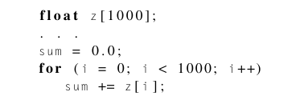
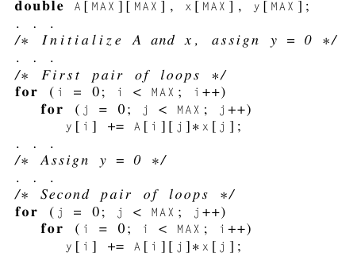
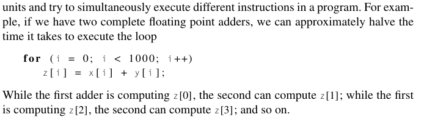
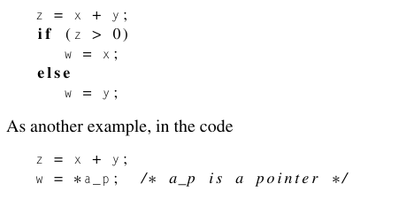

# Modifications to the von Neumann Model

Created: 2024-02-24 20:24:12 -0500

Modified: 2024-02-26 01:25:59 -0500

---

The Basics of caching:

-   The idea is rather than transporting a single instruction or data item we can have a wider interconnection that can transport more data and instructions in a single memory access run.

-   Rather than storing all the data and instructions on the main memory we can bring some of that memory up closer in special memory which will be closer to the CPU

-   [Cache]{.underline}: collection of memory locations that can be accessed in less time than some other memory locations.

    -   We typically refer to [CPU cache]{.underline}: this is collection of memory locations that the CPU can access more quickly than in main memory

        -   This cache can either be located on the same chip as the CPU or it can located on a separate special chip that can be accessed faster than main memory

-   What data and instructions are stored in the cache?

    -   The idea that most instruction and data that are relatively close to each other go together is crucial for understanding that prgs tend to use data and instructions that were close to the recently used data and instruction. Similarily, after a prg has accessed one data or instruction in a memory location, it will often access another nearby data.

        -   Remember, that the cache is controlled by the system hardware and we as programmers have no control over what gets stored in cache

    -   For example,

> {width="2.6458333333333335in" height="0.90625in"}
>
> We have a loop that will sum all the floats in z, instead of just grabbing one float at a time from main memory why don't we just grab 16 floats and store them in cache since they are nearby.

-   This is an example of [locality]{.underline}: The principle that an access of one location is followed by an access of a nearby location

    -   Spatial locality: access nearby location

<!-- -->

-   The principle of locality is often exploited using wider interconnections to bring in blocks of data and instructions instead of just one.

    -   These are called cache blocks/lines

        -   Can store up to 16 times more info as a single memory location

-   Think of CPU cache as one standalone structure

    -   Cache is usually divided into levels L1(smallest,fastest) and other levels which get bigger but slower

        -   Most Common to have 2 levels but common to have 3.

        -   Caches store copies of memory into the slower levels

-   When the CPU needs to access an instruction or data, it works its way down the cache hierarchy

    -   It checks all levels of cache

        -   If it doesn't find, then it will look in main memory

        -   A hit is when you find the memory, a miss is when you don't find the memory

            -   Example L1 miss, L2 hit or L1 hit

-   When a CPU writes data to cache, the value in the cache and the value in the main memory can be inconsistent. To solve this problem you can...

    -   Write through

    -   Write back

-   [Cache mapping]{.underline}: That is, if we fetch a cache line from main memory, where in the cache should it be placed? There are a couple of ways...

    -   Fully associative

    -   Direct mapped

    -   n-way set associative

-   Example:

> C stores two dimensional arrays in row-major order meaning A[row][column]. Although we visualize it as a rectangular block, memory is essentially one large 1D array and so when we say row-major we mean that we store the array in memory by rows so row0,row1,row2,.. Across the 1D array. Now consider these loops:
>
> {width="2.3645833333333335in" height="1.6979166666666667in"}
>
> The first loop runs 3 times faster than the second loop because of row major which has to do with the way the cache stores data from an array furthermore the first loop results in less misses than the second loop because when we fetch data from the array in main memory in the first loop which takes advantage of row major we end up grabbing elements close to each other that the loop will call and need while the second loop will result in more misses since we are going by column which main memory and cache do not play by.

[Virtual Memory]{.underline}

-   Caches make it possible for CPUs to quickly access instructions and data that are in main memory, but what happens when a large program or multiple programs cannot fit in main memory?

-   Virtual memory: main memory can function as a cache for secondary storage

    -   It exploits the principle of spatial and temporal locality by keeping in main memory only the active parts of the many running programs; those parts that are idle can be kept in a block of secondary storage, called [swap space]{.underline}.

-   [Pages]{.underline}: large blocks of data and instructions, similar to what CPU caches use.

-   [Page table]{.underline}: is used to translate the virtual address into a physical address.

    -   Virtual page numbers/addresses assigned when a program compiles or starts creating a table to avoid problems of overlapping memory blocks being used by multiple running programs.

-   [translation-lookaside buffer (TLB)]{.underline}: processors have a special address translation cache

    -   Caches a small number of page table entries in very fast memory.

-   Virtual memory uses write-back schema because for it the cost of going to disk is too expensive.

 

[Instruction level parallelism (ILP)]{.underline}: Attempts to improve processor/CPU performance by having multiple processor components or [functional units]{.underline} simultaneously executing instructions

 

There are two main approaches to ILP, pipelining and multiple issue.

-   [Pipelining]{.underline}: functional units are arranged in stages

    -   Similar to that of car door assembly line: team sanders, team painters , team put door handle,... When a team finishes their task they can start the same task again with a new part and send the part that they finished to the next team.

    -   We will save time by having multiple parts being worked on by different teams

    -   Most times a pipeline with k stages wont get k-fold improvement because

        -   If stages require more time then others we will have stall times

        -   If the times required by various functional units are different then stages will run at the speed of the slowest functional unit.

-   [Multiple Issue]{.underline}: multiple different instructions can be simultaneously initiated or done.

    -   Example:

> {width="4.291666666666667in" height="1.15625in"}

-   Static multiple issue: if the functional units are scheduled at run time

-   Dynamic multiple issue (superscalar): if the functional units are scheduled at compile time

-   Speculation: the compiler or the processor makes a guess about an instruction and then executed the instruction on the basis of the guess

    -   This is a way for the system to find instructions that can be executed simultaneously

    -   Example

> {width="3.1354166666666665in" height="1.5104166666666667in"}

-   If the speculation is wrong the compiler will correct its mistake otherwise it will store the speculation in the registry or memory

    -   It will use the buffer to store its speculations and transfer (to reg. or memory) or discard as necessary

[Hardware multithreading]{.underline}: Provides means for systems to continue doing useful work when the task being currently executed has stalled.

-   This looks to solve the problem that ILP leaves off which is that sometimes ILP can be difficult to exploit, for example fibonacci numbers algorithm

-   [Thread Level Parallelism(TLP)]{.underline}: attempts to provide parallelism through the simultaneous execution of different threads.

    -   [Coarser grained parallelism]{.underline} than ILP since its threads are larger than the fine grained (individual instructions) threads we see in ILP.

-   Hardware multithreading has two different types of multithreading which aim to tackle the problem that switching between threads can be costly.

    -   [Fine grained multithreading]{.underline}: the processor switches b/w threads after each instruction, skipping threads that are stalled.

        -   Benefit: aims to reduce wasting time on stalls

        -   Drawbacks: a thread with long sequence of instructions will have to wait to execute every instruction

    -   [Coarse grained multithreading]{.underline}: attempts to avoid the problem in fine grained by only switching threads that are stalled waiting for a time-consuming instruction to finish (loading from main memory)

    -   [Simultaneous multithreading]{.underline} is essentially a combo of both fine and coarse multithreading

 

 

 

 

 

 

 

 

 

 

 

 

 

 

 

 

