# Getting started

Created: 2024-03-12 23:37:29 -0400

Modified: 2024-03-15 20:31:47 -0400

---

**Mpi Programs**

-   They are standard c programs with a few differences

    -   Includes the Mpi.h header line

    -   All functions or things by MPI start with MPI_[capital letter]...

        -   They start with MPI_ followed by a capital letter

    -   MPI_Init and MPI_Finalize

        -   MPI_Init tells the MPI system to do all the necessary setup

            -   Things like allocate storage for message buffers, decide which processes gets which rank

            -   Not other MPI functions should be called before the prg calls MPI_Init

            -   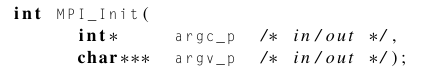{width="3.84375in" height="0.6979166666666666in"}

                -   The arugments argc_p and argv_p are pointers to Main's arguments argc and argv

                    -   If main has no arguments then in MPI_Init we can simply have MPI_Init(NULL,NULL)

        -   MPI_Finalize tells the mpi system that we are done and we can free any memory allocated for MPI

            -   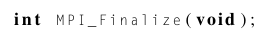{width="2.84375in" height="0.46875in"}

            -   No mpi function should be called after this

        -   Basic Outline

            -   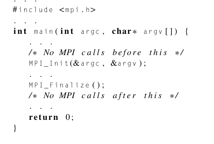{width="3.5208333333333335in" height="2.375in"}

        -   We can also note that MPI_Init and MPI_Finalize do not have to be in Main()

-   **[Communicators]{.underline}**, MPI_Comm_size, and MPI_Comm_rank

    -   In MPI a [communicator]{.underline} is a collection of processes that can send messages to each other.

        -   When we start an mpi program we start it inputting in the terminal line a number of processes.

        -   One of the purposes of MPI_Init is to define a communicator (a collection of processes who can talk to each other) that consists of all the processes started by the user

            -   This communicator is called MPI_COMM_WORLD

            -   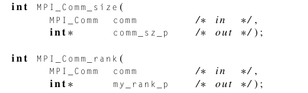{width="3.71875in" height="1.125in"}

                -   We will often use the variables comm_sz to hold the number of processes started by the user and my_rank for the process rank.

-   **SPMD Programs**

    -   Notice that we only ran one program, we didn't compile a different program for each process, and we did this in spite of the fact that process 0 is doing something fundamentally different from the other processes.

        -   Process 0 is receiving a series of messages and printing them

        -   All other processes are creating and sending a message (in this case to process 0)

    -   Most MPI programs are written this way

        -   A single program is written so that different processes carry out different actions

            -   In this case process 0 does something different from all other processes.

        -   This is achieved by simply having the program use a branch (if else statement) according to the process rank (0,1,2,3,etc) so that each process can do what it is supposed to do.

            -   In our hello world prg, process 0 with rank 0 is in one branch (else branch )and all other processes are in another branch (if branch)

    -   This is called SPMD single program multiple data

        -   The if−else statement makes our program SPMD.

    -   We can also see that our program will run with any number of processes, we could run it with as many processes as our system can handle 1 or 4 or 100 or etc

-   **Communication**

    -   In lines 17-18, each process, other than process 0, creates a message it will send to process 0

        -   The function sprintf is similar to printf but instead of writing to stdout it writes it to a string (which in this case is greeting)

    -   In lines 19-20, this is where we actually send the data (string) to process 0.

    -   In the else branch (this is where process 0 does its thing)

        -   It first prints its own message

        -   Then it uses a for loop to receive and print the messages sent by all the other processes.

            -   Note that greeting[] is a string variable which each process will create its own instance of

            -   The for loop start at 1, to avoid printing itself, and go all the way up to the number of processes held in comm_sz (obtained by MPI_Comm_size)

            -   It will receive a string and then print out that string using printf

-   **MPI_Send**: how does it work and what are its params

> 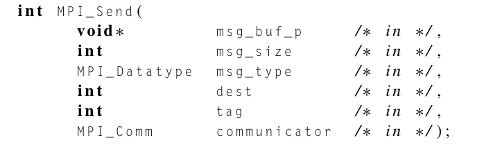{width="6.833333333333333in" height="2.0in"}

-   The first three params determine the contents of the message

    -   msg_buf_p is a pointer to memory location of the message we want to send (in this case greeting)

    -   msg_size is the size of the memory location (strlen + 1, +1 for the '/0' terminate char)

    -   msg_type tells MPI send what the type of the msg we are sending is

        -   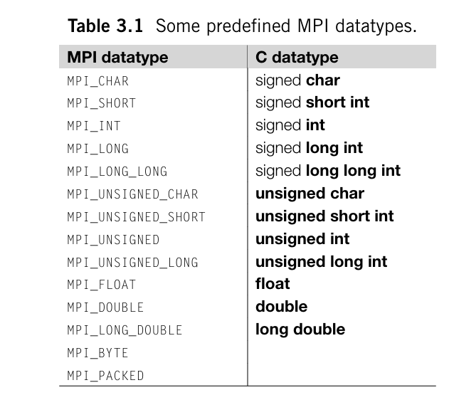{width="2.9895833333333335in" height="2.625in"}

-   The last three params determine the destination of the message

    -   dest tells MPI the rank/process that we want to send the data to

    -   tag is a label we can use to tell mpi in our program what we want to do individually with the process

        -   For example, we could have our prg handle the tags 0 and 1 where all processes with tag 0 are concatenated and all processes with tag 1 are ignored.

        -   Its essentially a way to distinguish between each process and have control over what each process does

    -   communicator tells mpi what "world" we are in. Since are able to create multiple communicators (series of processes) we need a way to tell mpi what processes belong to what world so that our prg doesn't get confused

<!-- -->

-   **MPI_Recv**: how does it work and what are its params

> 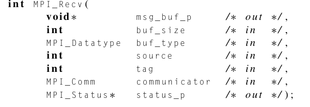{width="6.802083333333333in" height="2.3541666666666665in"}

-   The params in MPI_Recv are in response to the params in MPI_Send

-   The first three params have to do with specifying the memory available for receiving the message:

    -   Msg_buf_p is as pointer to a block of memory who will hold the msg

    -   Buf_size is the number of objects that can be stored in the block of mem

    -   Buf_type is the type of the message being received

-   The following three params have to do with identifying the message: where should it look for the msg

    -   Source will specify the process that is holding the msg

    -   Tag will check to see if the process who sent the msg equipped it with the same tag

    -   Communicator will check to see if it is receiving the msg from the sender who are both in the same "world"

-   The last param status_p will be talked about later as it isnt really used often but we can use the constant MPI_STATUS_IGNORE to avoid the param if we don't need it'

<!-- -->

-   **Message matching**

    -   What is needed to successfully send and receive a message using MPI_Send and MPI_Recv

> Comparing the message destination information

-   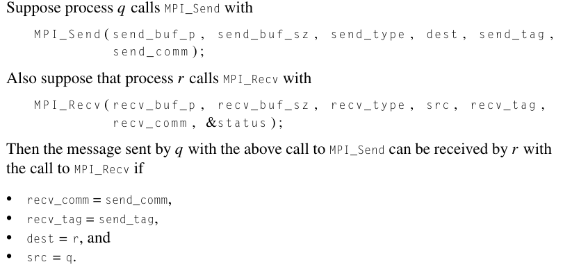{width="4.96875in" height="2.4375in"}

-   Only comparing the message destination info isnt enough we must also check...

> If recv_type = send_type and recv_buf_sz ≥ send_buf_sz

-   We also have some wildcards that MPI provides that makes it so that we do not have to be too specific about the source and the tag

    -   Note that these wildcards only work for MPI_Recv and not for MPI_Send, we must always be specific when sending messages

    -   MPI provides a special constant MPI_ANY_SOURCE that can be passed to MPI_Recv in the source Parameter.

        -   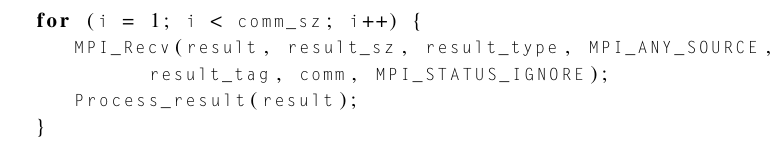{width="6.447916666666667in" height="1.21875in"}

        -   What this does is it makes it so that a process like process 0, who lets say is in charge of summing up all the information given to it by other processes can take in messages from processes at any order

            -   This can make it so that as processes finish we can take in their message and not have to wait for a specific order or anything of the sort

    -   MPI provides the special constant MPI_ANY_TAG that can be passed to the tag argument of MPI_Recv.

        -   it's possible that one process can be receiving multiple messages with different tags from another process, and the receiving process doesn't know the order in which the messages will be sent

-   Note that there are no wildcards for communicators, both sender and receiver must always specify communicators

<!-- -->

-   **The status_p argument**

    -   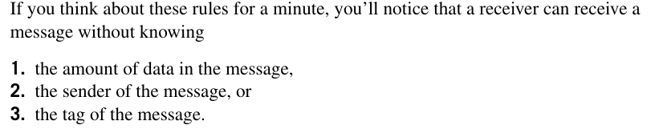{width="7.1875in" height="1.40625in"}

    -   How does a receiver (process receiving msg?) find out these values? Recall that MPI_Recv's last parameter status_p has the type MPI_Status* which is a pointer to some block of memory that holds info about the sender.

        -   Status_p param in MPI_Recv is a struct with three members: source, tag, and MPI_ERROR which we can access by..

            -   For example, say we have defined a variable MPI_STATUS status;

            -   After we call MPI_Recv and we pass in &status as its last param we now have a variable who holds the info about the sender and we can access it by doing

                -   status.MPI_SOURCE

                -   status.MPI_TAG

    -   Status_p param does not give us any info about the amount of data that has been received due to the fact that we do not know ahead of time what the type is going to be, instead we can can use MP_Get_count to figure this out

        -   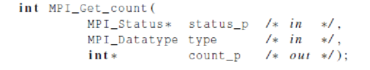{width="6.802083333333333in" height="1.2916666666666667in"}

>  

-   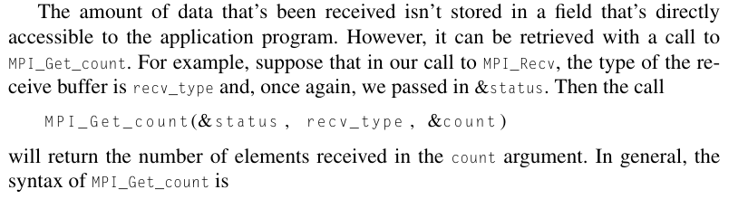{width="6.895833333333333in" height="1.8333333333333333in"}

>  

-   **Semantics of MPI_Send and MPI_Recv:** What happens when we send a message from one process to another?

    -   The sending process will assemble the message. For example, it will add the "envelope" information to the actual data being transmitted---the destination process rank, the sending process rank, the tag, the communicator, and some information on the size of the message.

    -   Once the message has been assembled or made, there are two things that can happen in the [sending (MPI_Send)]{.underline} process:

        -   The sending process can **[buffer]{.underline}**: If it buffers the message, the MPI system will place the message (data and envelope) into its own internal storage, and the call to MPI_Send will return.

        -   The sending process can **[block]{.underline}**: if the system blocks, it will wait until it can begin transmitting the message, and the call to MPI_Send may not return immediately.

>  

-   One thing we can conclude is that after MPI_Send returns we don't actually know whether or not the message has been transmitted since the message can be in block but the function call MPI_Send still returns

    -   If we want/need to know more info about whether or not the message was trasmitted or if we need the MPI call to return immediately and not wait we can use other functions that can handle these things

        -   which we will talk about later

-   The exact behavior of MPI_Send is determined by the MPI implementation. How ever, typical implementations have a default "cutoff" message size. If the size of a message is less than the cutoff, it will be buffered. If the size of the message is greater than the cutoff, MPI_Send will block.

>  

-   Unlike MPI_Send, MPI_Recv always blocks until a matching message has been received.

    -   When MPI_Recv returns we know that there is a message stored in the receive buffer

-   MPI requires that a message be non-overtaking

    -   This means that if process q sends two messages to process r, then the first message sent by q must be available to r before the second message.

    -   However, this does not apply when messages are being received from different processes

        -   That is, if q and t both send messages to r, then even if q sends its message before t sends its message, there is no requirement that q's message become available to r before t's message.

        -   For example, if q happens to be running on a machine on Mars, while r and t are both running on the same machine in San Francisco, and if q sends its message a nanosecond before t sends its message, it would be extremely unreasonable to require that q's message arrive before t's.

<!-- -->

-   **Some potential pitfalls**

    -   If a process tries to receive a message and there's no matching send, then the process will block forever. That is, the process will hang.

        -   So when we design our programs, we need to be sure that every receive has a matching send.

    -   Perhaps even more im portant, we need to be very careful when we're coding that there are no inadvertent mistakes in our calls to MPI_Send and MPI_Recv.

    -   Similarly, if a call to MPI_Send blocks and there's no matching receive, then the sending process can hang. If, on the other hand, a call to MPI_Send is buffered and there's no matching receive, then the message will be lost.

>  
>
> To compile this:

1.  Use mpicc command which is a [wrapper script]{.underline} meaning that it is a script whose main purpose is to run some program

    a.  It essentially takes the compiler and runs some extra flags so that things run more smoothly

    b.  mpi[cc] vs g[cc], wher mpicc is optimized for mpi script

2.  Then we can use mpiexec −n <number of processes> ./mpi_hello

    a.  Where number of processes can be 0,1,2,3,..

    b.  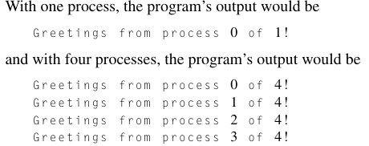{width="2.625in" height="1.03125in"}

    c.  How mpecex works: it tells the system to start <number of processes> instances of our mpi_hello program. It can also tell our system which core should run each instance of the prg. The MPI implementation takes care of making sure the processes can communicate with each other.

>  

 

We use these two functions to get info about MPI_COMM_WORD in our program so we can fuck with it since MPI handles that on there end and all we have to do is obtain info about it with these functions

 

Notice that the second arguments in both functions are variables we define which will hold info about MPI_COMM_WORLD given by the output of the functions

 

Note:

-   dest is in the MPI_Send function

-   Src is in the MPI_Recv function

