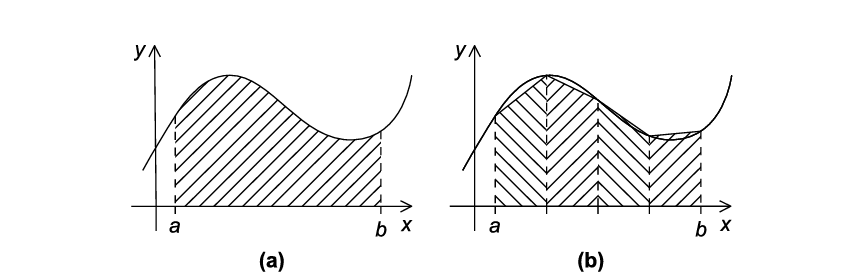
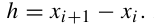
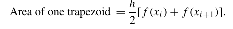
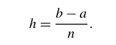
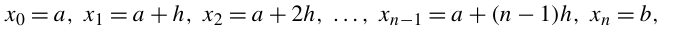
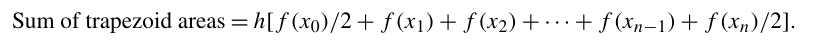
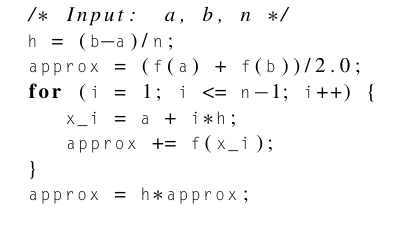
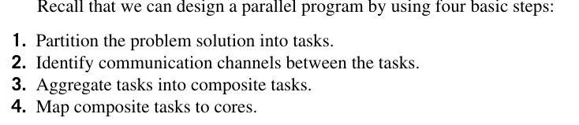
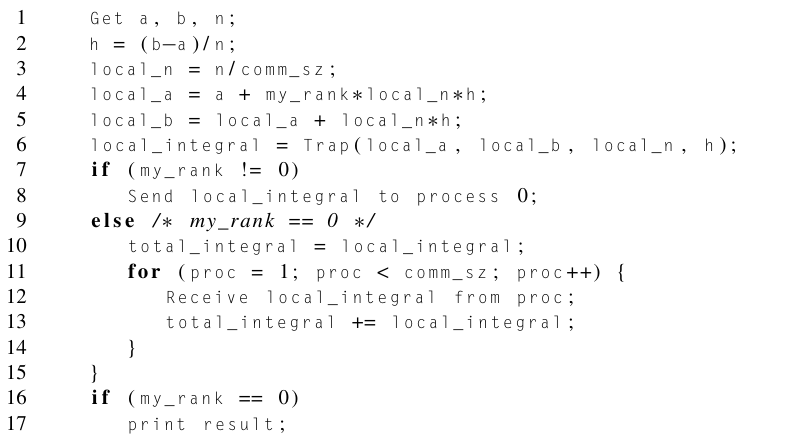
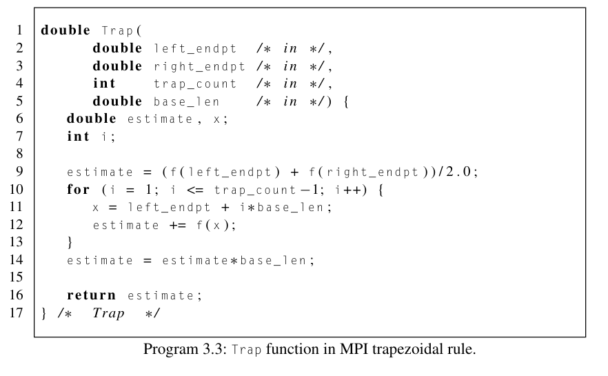

# The trapezoidal rule in MPI

Created: 2024-03-16 13:58:12 -0400

Modified: 2024-03-18 03:46:12 -0400

---

{width="5.1875in" height="1.6666666666666667in"}

-   Each subinterval is a trapizoid, whose base is the subinterval, whose vertical sides are the vertical lines through the end points of the subinterval, and whose fourth side is the secant line joining the points where the vertical lines cross the graph.

    -   If the endpoints of the subinterval are xi and xi+1, then the length of the subinterval is

> {width="1.59375in" height="0.2708333333333333in"}

-   Also, if the lengths of the two vertical segments are f(xi) and f(xi+1), then the area of the trapezoid is

> {width="4.833333333333333in" height="0.6041666666666666in"}

-   Since we chose the length of n subintervals they will all have the same length thus we derive that

    -   x is a endpoint where x =a and x= b, where a and b are the leftmost endpoint and rightmost endpoint

        -   Thus we can say that the length of each subinterval can be

> {width="1.8125in" height="0.7083333333333334in"}

-   We can also see that from x~0~ to x~n~ where x is an endpoint, we have that

> {width="6.5625in" height="0.3333333333333333in"}
>
> Where x~0~ will be the first endpoint then the next one will be found by taking the last endpoint and adding h to it and so on

-   Then we can also say that the sum of each area of trapezoids will be the approx total area under the curve by

> {width="7.145833333333333in" height="0.3541666666666667in"}

-   f(x~0~)/2 and f(x~n~)/2 have the division by 2 to make it even

 

-   Pseudocode for a serial program of trapezoidal rule would look like:

> {width="4.25in" height="2.34375in"}

 

**Parallelizing the trapezoidal rule**

{width="4.666666666666667in" height="1.0104166666666667in"}

1.  Partition the problem solution into tasks:

    a.  We identify two tasks: finding the area of a single trapezoid and computing the sum of those trapezoids

2.  Identify the communication channels between tasks:

    a.  We see that the communication channels will join each of the tasks of finding the area of a single trap. To the second task which is computing the sum of the traps.

3.   

4.  Tasks 3 and 4: aggregate the tasks and map them to cores.

    a.  The more traps we use the more accurate thus we can see that we will have more traps to compute than we have cores, so we will have to compute the area of traps into groups.

        i.  One way to do this is to split the intervals [a,b] of the curve we want to compute into comm_sz subintervals.

            1.  For example if we have 20 subintervals and 8 cores we could do 20/8 so that each core has that many traps to compute evenly divided

            2.  We can then have say process 0 add the estimates

> {width="5.552083333333333in" height="1.8125in"}

-   The pseudocode for this in MPI would look like:

> {width="5.145833333333333in" height="2.8541666666666665in"}

-   The first take implementation of the trapizoidal rule will look like:

> {width="4.885416666666667in" height="5.666666666666667in"}

 

-   Trap function

> {width="5.864583333333333in" height="3.625in"}
>
>  

Note:

-   Finding the area under the curve can be done by creating trapizoids from a to b where each trapizoid is a subsection of the curve.

    -   The idea is the more subsections (traps) the more accurate area under the curve

 

Note:

-   Find length of each interval first

-   Then approx the first and last subinterval

-   Then sum up in approx all the other subintervals

-   I don't know what the last line does

 

We will apply these rules to parallelize the trapizoidal rule

 

Note:

-   We take a moment to talk a bit about local and global variables as it pertains to MPI

-   [Local variable]{.underline}: variables are variables whose contents are significant only on the process that's using them.

-   [global variables]{.underline}: Variables whose contents are significant to all the processes

