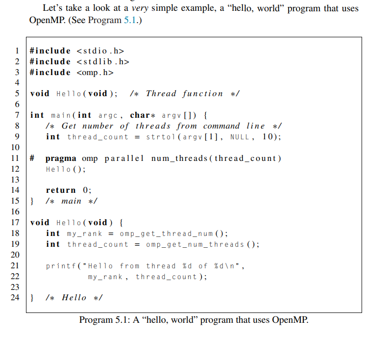
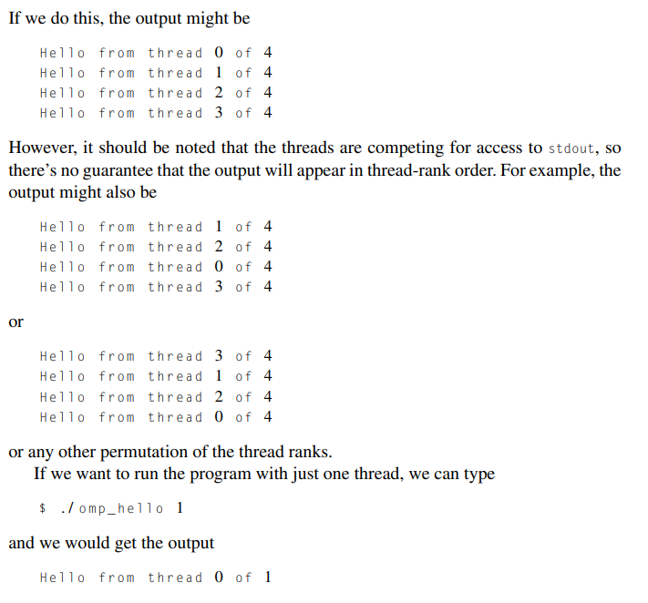
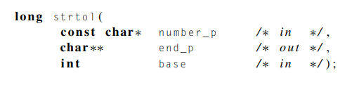
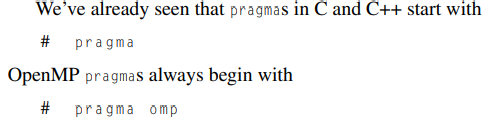
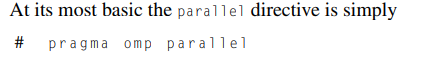
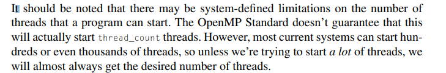
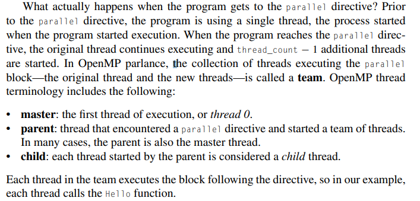
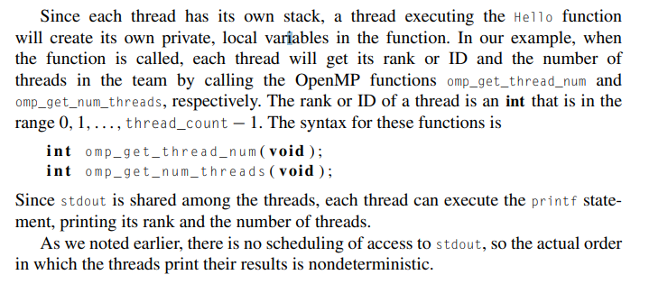
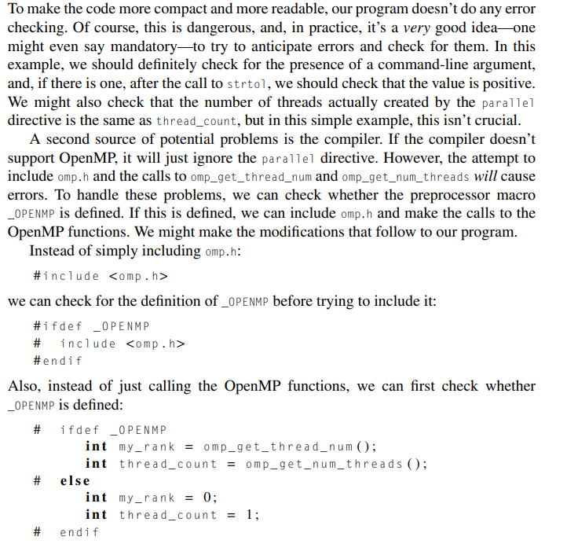
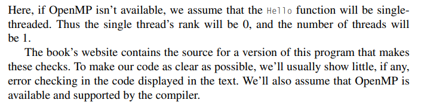

# Getting started

Created: 2024-04-25 15:28:12 -0400

Modified: 2024-04-25 17:34:06 -0400

---

-   Compilers that don't support the pragmas are free to ignore them.

-   This allows a program that uses the pragmas to run on platforms that don't support them.

    -   So, in principle, if you have a carefully written OpenMP program, it can be compiled and run on any system with a C compiler, regardless of whether the compiler supports OpenMP.

-   Essentially not all compilers support pragmas but those that do can utilize them to be more flexible and do things it wouldn't normally od

-   If OpenMP is not supported, then the directives are simply ignored and the code will execute sequentially.

-   Pragmas in C and C++ start with ..

    -   # pragma

-   Pragmas (like all preprocessor directives) are, by default, one line in length, so if a pragma won't fit on a single line, the newline needs to be "escaped"---that is, preceded by a backslash 

-   The details of what follows the #pragma depend entirely on which extensions are being used.

 

Example of simple openMP program

{width="5.104166666666667in" height="4.416666666666667in"}

 

 

How to compile and execute using the example above:

-   To compile:

> {width="6.125in" height="0.6666666666666666in"}

-   To execute:

> {width="2.625in" height="0.4375in"}

-   Notice how the 4 is inputted here because of the way our program is written which requires this input

-   Line 9 in example above

-   {width="3.8125in" height="3.5416666666666665in"}

 

 

The program

-   Let's take a look at the source code. In addition to a collection of directives, OpenMP consists of a library of functions and macros, so we usually need to include a header file with prototypes and macro definitions.

    -   The openMP header file is omp.h

-   In our Pthreads programs, we specified the number of threads on the command line. We'll also usually do this with our OpenMP programs.

    -   we therefore use the strtol function from stdlib.h to get the number of threads.

    -   {width="4.1875in" height="0.9895833333333334in"}

        -   The first argument is a string---in our example, it's the command-line argument, a string---and the last argument is the numeric base in which the string is represented--- in our example, it's base 10. We won't make use of the second argument, so we'll just pass in a NULL pointer. The return value is the command-line argument converted to a C long int

-   When we start the program from the command line, the operating system starts a single-threaded process, and the process executes the code in the main function.

-   However, things get interesting in Line 11. This is our first OpenMP [directive]{.underline}, and we're using it to specify that the program should start some threads. Each thread should execute the Hello function, and when the threads return from the call to Hello, they should be terminated, and the process should then terminate when it executes the return statement

>  

-   That's a lot of bang for the buck (or code). If you studied the Pthreads chapter, you'll recall that we had to write a lot of code to achieve something similar: we needed to allocate storage for a special struct for each thread, we used a for loop to start all the threads, and we used another for loop to terminate the threads

    -   Thus it's immediately evident that OpenMP provides a higher-level abstraction than Pthreads provides

-   {width="3.6354166666666665in" height="0.875in"}

    -   Our first directive is a parallel directive, and, as you might have guessed, it specifies that the [structured block]{.underline} of code that follows should be executed by multiple threads.

        -   A structured block is a C statement or a compound C statement with one point of entry and one point of exit, although calls to the function exit are allowed.

        -   This definition simply prohibits code that branches into or out of the middle of the structured block.

        -   {width="3.7604166666666665in" height="0.5416666666666666in"}

    -   As we noted earlier, we'll usually specify the number of threads on the command line, so we'll modify our parallel directives with the num_threads [clause]{.underline}

        -   A clause in OpenMP is just some text that modifies a directive.

        -   The num_threads clause can be added to a parallel directive. It allows the programmer to specify the number of threads that should execute the following block:

> {width="6.020833333333333in" height="0.3333333333333333in"}
>
>  

-   {width="5.59375in" height="0.9166666666666666in"}

>  

-   {width="5.604166666666667in" height="2.6875in"}

-   When the block of code is completed---in our example, when the threads return from the call to Hello---there's an [implicit barrier]{.underline}.

    -   This means that a thread that has completed the block of code will wait for all the other threads in the team to complete the block---in our example, a thread that has completed the call to Hello will wait for all the other threads in the team to return.

    -   When all the threads have completed the block, the child threads will terminate and the parent thread will continue executing the code that follows the block.

<!-- -->

-   {width="7.708333333333333in" height="3.28125in"}

    -   Omp_get_thread_num is used for knowing what rank a thread is

    -   Omp_get_num_threads is used for knowing how many total threads there are in the team

        -   Used in the print statement "_ out of [# of threads] threads"

 

Error checking

{width="5.083333333333333in" height="4.96875in"}

{width="4.916666666666667in" height="1.2083333333333333in"}

 

Note: notice how the pragma is used and how syntactically it works and how it is formatted

