# Producers and consumers

Created: 2024-04-26 17:50:19 -0400

Modified: 2024-04-26 19:19:41 -0400

---

We will be using the example of a queue:

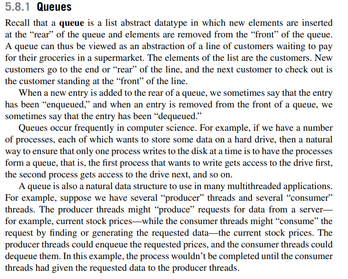{width="5.552083333333333in" height="4.46875in"}

 

Lets look into message passing using openMP and the queue data structure:

-   Another natural application would be implementing message-passing on a shared memory system. Each thread could have a shared-message queue, and when one thread wanted to "send a message" to another thread, it could enqueue the message in the destination thread's queue. A thread could receive a message by dequeuing the message at the head of its message queue.

-   Let's implement a relatively simple message-passing program, in which each thread generates random integer "messages" and random destinations for the messages.

-   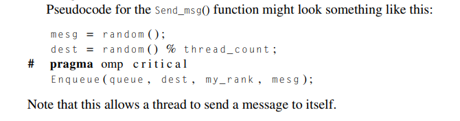{width="6.270833333333333in" height="1.65625in"}

    -   After creating the message, the thread enqueues the message in the appropriate

> message queue. After sending a message, a thread checks its queue to see if it has received a message. If it has, it dequeues the first message in its queue and prints it out. Each thread alternates between sending and trying to receive messages.

-   When a thread is done sending messages, it receives messages until all the threads are done, at which point all the threads quit.

<!-- -->

-   Receiving messages

    -   The synchronization issues for receiving a message are a little different. Only the owner of the queue (that is, the destination thread) will dequeue from a given message queue.

    -   As long as we dequeue one message at a time, if there are at least two messages in the queue, a call to Dequeue can't possibly conflict with any calls to Enqueue.

        -   So if we keep track of the size of the queue, we can avoid any synchronization (for example, critical directives), as long as there are at least two messages.

    -   Now you may be thinking, "What about the variable storing the size of the queue?" This would be a problem if we simply store the size of the queue. How-ever, if we store two variables, enqueued and dequeued, then the number of messages in the queue is:

> {width="3.96875in" height="0.28125in"}

-   the only thread that will update dequeued is the owner of the queue

-   Note that a thread will send their message to another threads queue in which case they (destination thread) will be able to dequeue

-   Also note that

> 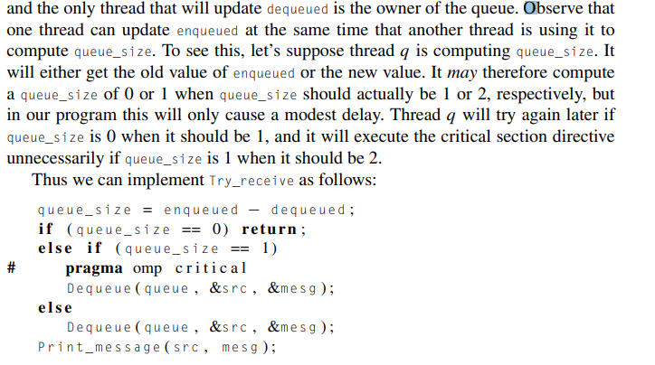{width="4.791666666666667in" height="2.6666666666666665in"}

-   How do we know when to terminate?

> 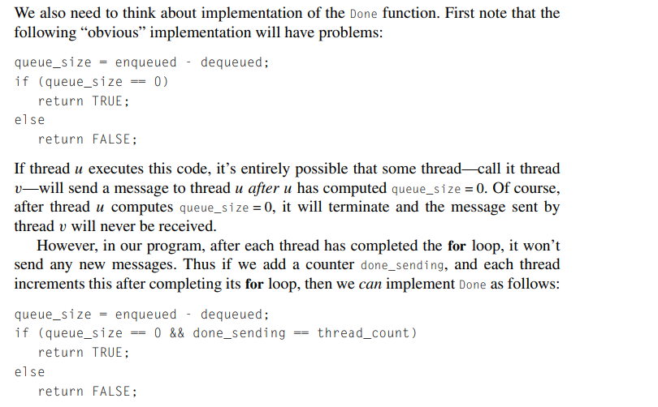{width="5.59375in" height="3.4583333333333335in"}

-   Startup; How the program should be initiated.

> 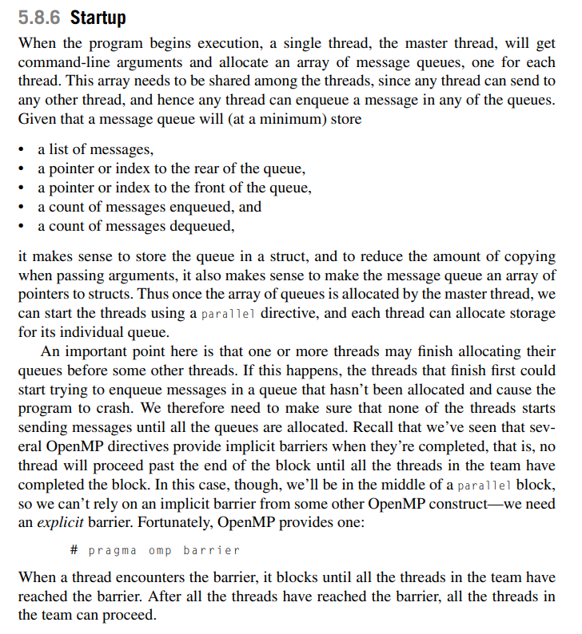{width="5.229166666666667in" height="5.708333333333333in"}

-   The takeaway here is that we can add expliicit barrier using an openMP construct called barrier where needed instead of relying on the implicit one at the end of each thread function

<!-- -->

-   The atomic directive:

    -   This is a directive which rivals the critical directive for securing code, it is more efficient but can only be used in certain scenarios

    -   Example:

> 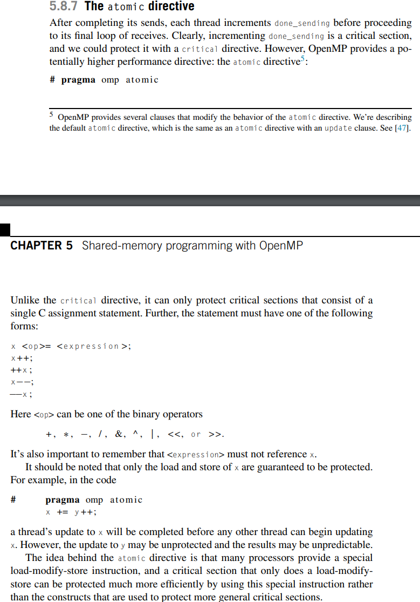{width="4.854166666666667in" height="6.9375in"}
>
>  

Critical sections and locks

-   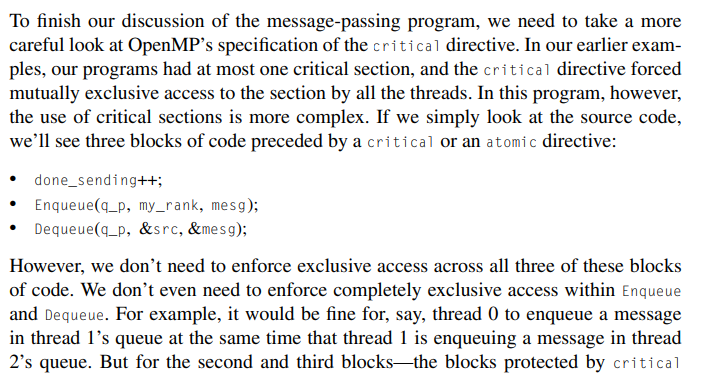{width="6.135416666666667in" height="3.2395833333333335in"}

    -   Essentially we don't need to be completely preventing each thread from performing certain things like enqueuing b/w two threads and enqueuing b/w other two threads that have nothing to do with each other

        -   For example, it would be fine for, say, thread 0 to enqueue a message in thread 1's queue at the same time that thread 1 is enqueuing a message in thread 2's queue.

-   To solve this problem we could do this:

> 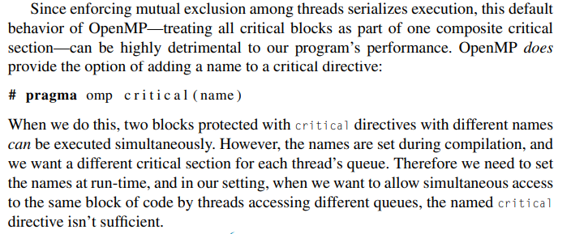{width="5.458333333333333in" height="2.2395833333333335in"}

-   But that would still be too inefficient compared to using locks

    -   A lock consists of a data structure and functions that allow the programmer to explicitly enforce mutual exclusion in a critical section.

    -   Pseudocode:

> 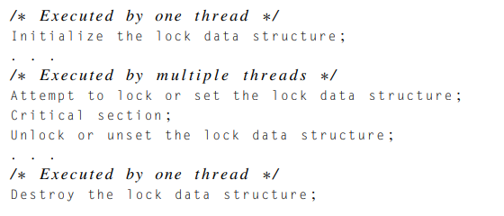{width="4.9375in" height="2.1145833333333335in"}

-   The lock data structure is shared among the threads that will execute the critical section. One of the threads (e.g., the master thread) will initialize the lock, and when all the threads are done using the lock, one of the threads should destroy it

-   How it works..

    -   Before a thread enters the critical section, it attempts to set the lock by calling the lock function. If no other thread is executing code in the critical section, it acquires the lock and proceeds into the critical section past the call to the lock function. When the thread finishes the code in the critical section, it calls an unlock function, which releases or unsets the lock and allows another thread to acquire the lock.

    -   While a thread owns the lock, no other thread can enter the critical section. If another thread attempts to enter the critical section, it will block when it calls the lock function. If multiple threads are blocked in a call to the lock function, then when the thread in the critical section releases the lock, one of the blocked threads returns from the call to the lock, and the others remain blocked.

-   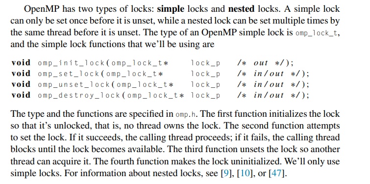{width="5.5625in" height="2.7604166666666665in"}

-   Using locks in our message passing prg

> 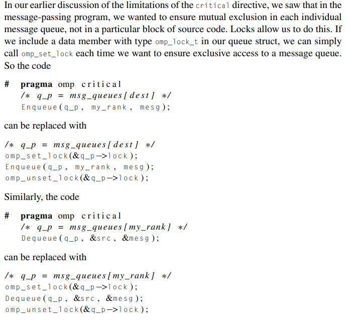{width="5.25in" height="4.75in"}

-   Now when a thread tries to send or receive a message, it can only be blocked by a thread attempting to access the same message queue, since different message queues have different locks. In our original implementation, only one thread could send at a time, regardless of the destination.

<!-- -->

-   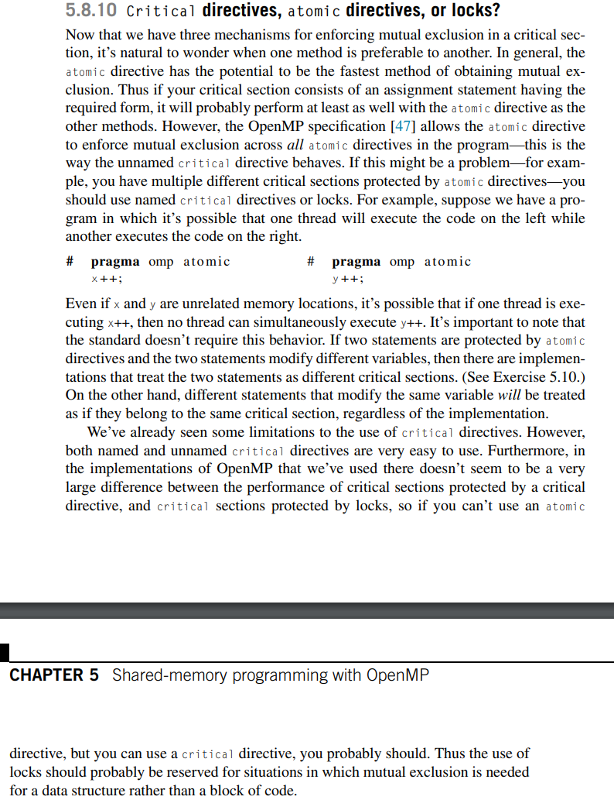{width="6.21875in" height="8.083333333333334in"}

 

You should exercise caution when using the mutual exclusion techniques (crit sections) we've discussed.

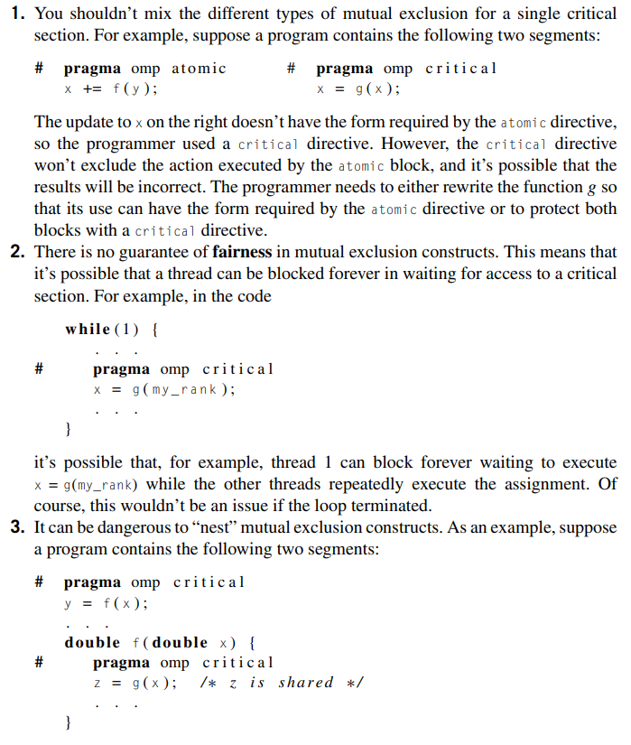{width="5.020833333333333in" height="5.927083333333333in"}

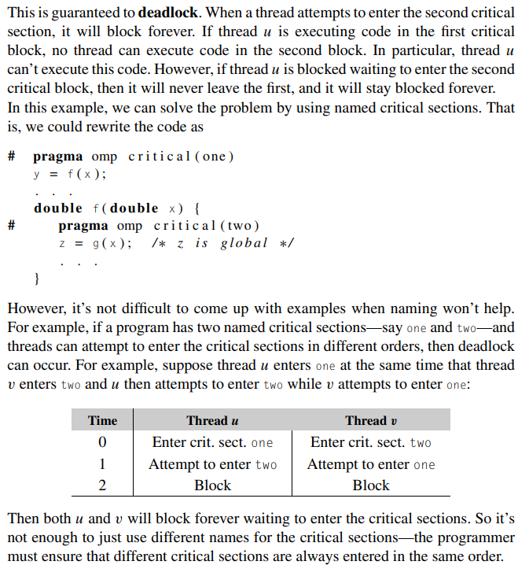{width="5.020833333333333in" height="5.458333333333333in"}

 

