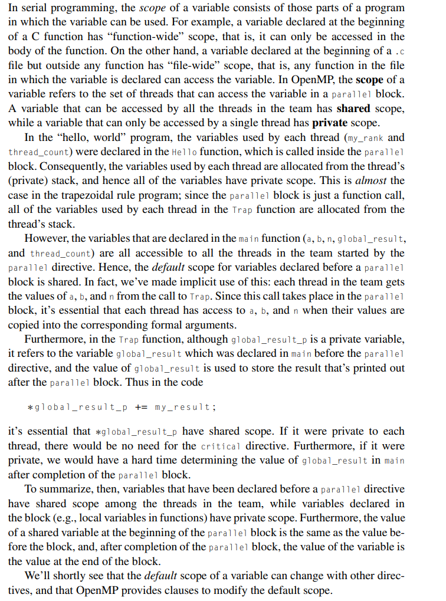

# Scope of variables

Created: 2024-04-25 18:24:51 -0400

Modified: 2024-04-25 19:32:31 -0400

---

-   One of the important things to note is that a variable that is shared will be affected in the parallel function if it is changed.

>  

Full section if I want to read it:

-   It goes over it with examples from the trapizoidal program

-   {width="5.083333333333333in" height="6.854166666666667in"}

