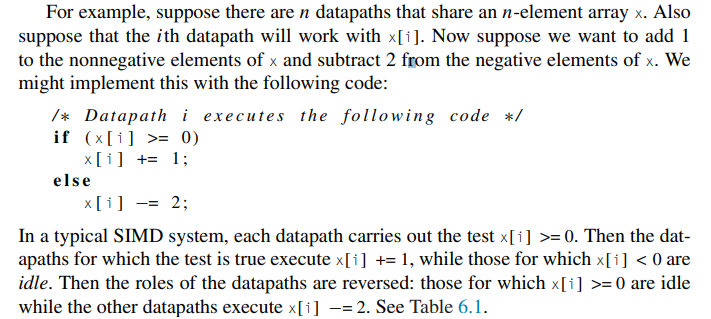
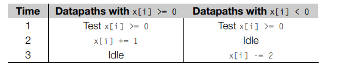
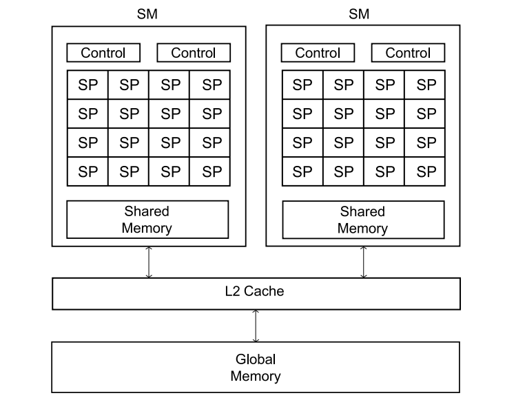
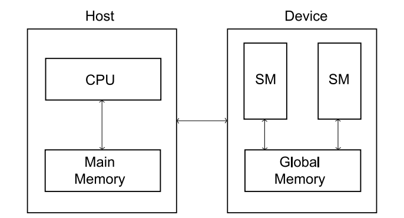

# INTRO

Created: 2024-05-07 18:12:52 -0400

Modified: 2024-05-07 22:19:45 -0400

---

-   Are designed to improve performance of programs that render many detailed images

-   People soon started to look into using the power of GPU's to solve general purpose computing problems

    -   Things such as searching and sorting, rather than graphics.

    -   This became known as GPGPU

        -   General purpose graphics processing unit

-   Several API's were created for the purpose of GPGPU's

    -   The most used are CUDA and OpenCL

        -   CUDA was developed for NVIDIA GPU's only

            -   We will be focusing on CUDA since its much easier to implement

        -   OpenCL was developed for all GPU's

            -   To ensure this portability, an OpenCL program must include a good deal of code providing information about which systems it can be run on and information about how it should be run

 

GPU architectures

-   We often think of CPU's as being SISD (Flynns taxonomy):

    -   the processor fetches an instruction from memory and executes the instruction on a small number of data items

-   GPU's are composed of SIMD (Single instruction Multiple data stream) processors

    -   SIMD processor as being composed of a single control unit and multiple datapaths.

    -   The control unit fetches an instruction from memory and broadcasts it to the datapaths.

        -   Each datapath either executes the instruction on its data or is idle.

    -   Example of SIMD

> {width="5.614583333333333in" height="2.5208333333333335in"}
>
>  
>
> {width="5.604166666666667in" height="1.1145833333333333in"}

-   A GPU can be thought of as being composed of many SIMD processors (each processor lives in an SM)

    -   Nvidia GPUs are composed of Streaming Multiprocessors (SMs)

        -   One SM can have several control units and many more datapaths

            -   an SM can be thought of as consisting of one or more SIMD processors

        -   The SMs, however, operate asynchronously: there is no penalty if one branch of an if−else executes on one SM, and the other executes on another SM.

    -   So in our preceding example, if all the threads with x[i] >= 0 were executing on one SM, and all the threads with x[i]

> {width="6.15625in" height="0.8333333333333334in"}

-   Only two stages required here

<!-- -->

-   In Nvidia language, we will refer to cores as SP (streaming processor)

    -   Note, one SM can have 120 SP's

-   Nvidia uses SIMT (single input multiple thread) instead of SIMD.

    -   the term is used because threads on an SM that are executing the same instruction may not execute simultaneously: to hide memory access latency, some threads may block while memory is accessed and other threads, that have already accessed the data, may proceed with execution.

-   Each SM has a relatively small block of memory that is shared among its SPs.

    -   This memory can be accessed quickly by its SP's

-   All of the SM's on a single chip also have access to a much larger memory block that is shared among all the SP's.

    -   Accessing this larger block of memory is slow

-   The CPU and GPU are usually physically seperated alongside its memories.

    -   The CPU and its memory is often called the host

    -   The GPU and its memory is often called the device

    -   Because of this separation an explicit function would be needed to transfer data from the GPU to CPU or vice versa

        -   This isnt often the case anymore

-   What a GPU might look like

-   {width="4.947916666666667in" height="3.84375in"}

 

Heterogeneous computing

-   Up this point we have assumed that our programs are running on processors which have similar architectures.

-   This is not the case now, program that runs on a GPU is an example of heterogeneous computing.

    -   The reason is that the program makes use of both the host (CPU) and device (GPU), both have different architectures

-   We will still write a single program but we will write functions for the CPU and functions we write for the GPU

    -   In a way we are writing two programs

-   CPU and GPU

> {width="6.072916666666667in" height="3.2708333333333335in"}
>
>  
>
>  
>
>  

