# Vector addition

Created: 2024-05-08 15:19:30 -0400

Modified: 2024-05-08 20:22:56 -0400

---

So let's write a very simple, data-parallel CUDA program that's embarrassingly parallel: a program that adds two vectors or arrays.

-   We will initialize three arrays: x, y, z (will be the array with the computation of adding x[i] + y[i]).

    -   x and y will be initialized on the host

    -   Since GPU's tend to have more 32 bit than 64 bit floating points we will use float arrays instead of doubles

    -   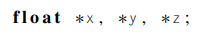{width="2.1354166666666665in" height="0.34375in"}

-   The kernel will then start n threads and each thread will take care of one iteration of appending to z.

-   After allocating and initializing the arrays, we'll call the kernel, and after the kernel completes execution, the program checks the result, frees memory, and quits.

-   The program (complete with all of the helper functions except for Two_norm_diff function, serial_vec_add and Init_vectors):

> 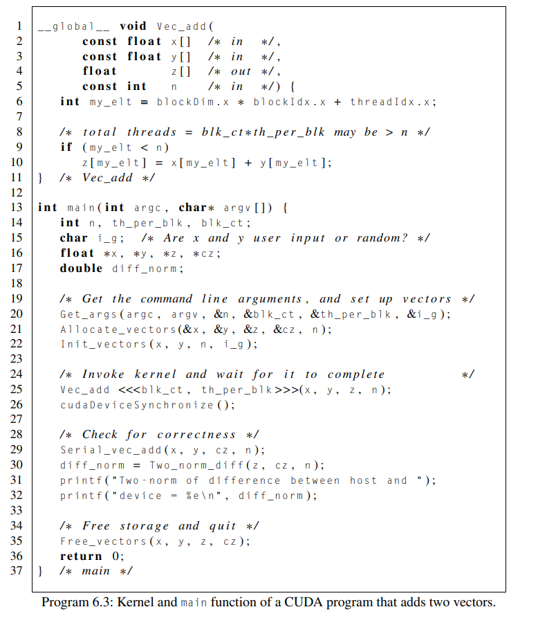{width="5.21875in" height="5.864583333333333in"}

 

 

 

 

 

 

 

 

 

 

 

 

The Kernel

-   In lines 1-11 of the kernel (function that is running the parallel code on the GPU) we first determine which element of z (the array we want to append to) the thread should take care of

    -   Essentially which iteration the thread should take care of

        -   As a side not, we can do gridDim.x * blockDim.x which will equal the total number of threads we have.

            -   In this program we expect the have more threads than iterations

    -   We want to assign a unique "global" (meaning a rank number which takes into account all of the other threads) to each thread by using the formula

        -   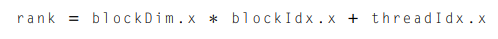{width="5.072916666666667in" height="0.3958333333333333in"}

            -   BlockDim.x is the amount of total blocks we have

            -   blockInd.x is the current "rank" of the block we are in

            -   threadIdx.x is the current thread we are in, respective of the block we are in too

        -   For example,

> 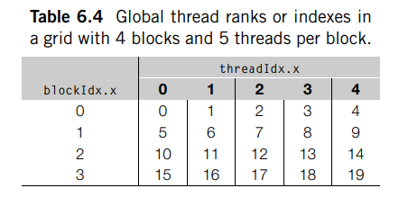{width="4.59375in" height="2.28125in"}

-   Before running the code on line 10 which computes and appends to the z array we want to run an if statement that checks to see if the current global rank for the thread we are in doesn't exceed the z array size (n)

    -   We could have more threads than size of array and in that case we would simply not do anything in those threads

    -   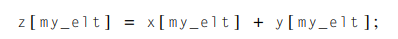{width="4.145833333333333in" height="0.40625in"}

 

The Get_args() function

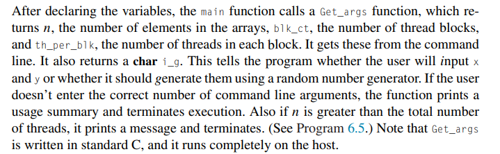{width="7.489583333333333in" height="2.3125in"}

-   The get_args function handles asking the user through the command line for things needed by the program

-   The i_g variable is obtained by asking the user whether they want a randomely generated x and y or if they want to input it

-   We also handle the error here where there are not enough threads to handle the size of the array

 

The Allocate_vectors and managed memory

-   In the Allocate_vectors function we allocate memory to the arrays x, y, z, cz ( of type float)

    -   x, y, and z are all used on both the host and device

        -   For this reason, we allocate them memory using a CUDA function

> 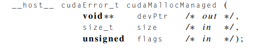{width="5.125in" height="0.9791666666666666in"}

-   The host qualifier (__host__) is a CUDA addition to C and it indicates that the function should be called and ran on the host

    -   The __host__ qualifier is by default in every CUDA function

-   FYI, most CUDA functions have a return type of cudaError_t to tell you if there was an error, but for not we will ignore these return statements

-   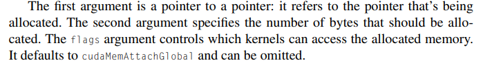{width="7.28125in" height="0.9479166666666666in"}

-   The function cudaMallocManaged is one of several CUDA memory allocation functions. It allocates memory that will be automatically managed by the "unified memory system."

    -   This is a relatively recent addition to CUDA and it allows a programmer to write CUDA programs as if the host and device shared a single memory: pointers referring to memory allocated with cudaMallocManaged can be used on both the device and the host, even when the host and the device have separate physical memories.

        -   It simplifies programming but it can have some drawbacks:

> 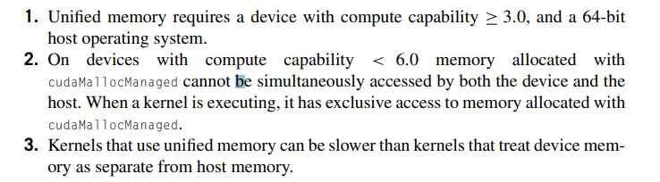{width="6.416666666666667in" height="1.7708333333333333in"}

-   For number 3, it has to do with data transfer b/w cpu and gpu and when we use this function it becomes up to the system to decide when to transfer data which can be slow.

-   A programmer could choose not to use this function and explicitly write their own which could make the program more efficient if they know how write code to reduce the cost of transferring data.

<!-- -->

-   The cz array is only used on the host and its purpose it to compute the sum of z using only one core from the CPU

    -   In this case we simply use the C function malloc

 

Other functions called from main

-   Except for the Free_vectors function, the other host functions that we call from main are just standard C.

-   Other functions that are standard C functions:

    -   The function Init_vectors either reads x and y from stdin using scanf or generates them using the C library function random. It uses the last command line argument i_g to decide which it should do.

    -   The Serial_vec_add function (Program 6.4) just adds x and y on the host using a for loop. It stores the result in the host array cz.

    -   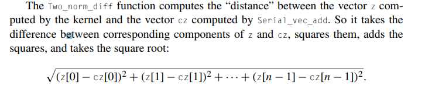{width="7.864583333333333in" height="1.65625in"}

-   Free_vectors function (CUDA involved function)

    -   This function just frees the arrays allocated by the Allocate_vectors function

    -   The array cz is simply freed using the C library free() since it is a regularly initialized array using malloc

    -   The other arrays x, y, z that were allocated using cudaMallocManaged must be freed using cudaFree function:

        -   {width="6.71875in" height="0.34375in"}

            -   The __device__ qualifier is a CUDA addition to C, and it indicates that the function can be called from the device

            -   So cudaFree can be called by both the host and device since its using both qualifiers

            -   One thing to note: if a pointer is allocated on the device, it cannot be freed on the host, and vice versa.

                -   This means if you allocated things on the device you must deallocate it there and if you allocated things in the host you must deallocate there

                -   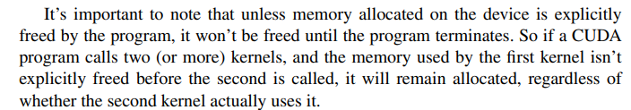{width="7.333333333333333in" height="1.28125in"}

Explicit memory transfers

-   In our program for adding vectors we used the CUDA function cudaMallocManaged() to initialize the arrays that were going to be used by both the host and device.

    -   Remember, we used this function because it takes care of data transfer b/w CPU and GPU for us and makes for less coding to write

    -   It has its drawbacks

-   Here we will rewrite our program without using cudaMallocManaged and explicitly define the transfer of data

-   Here is the new program:

> 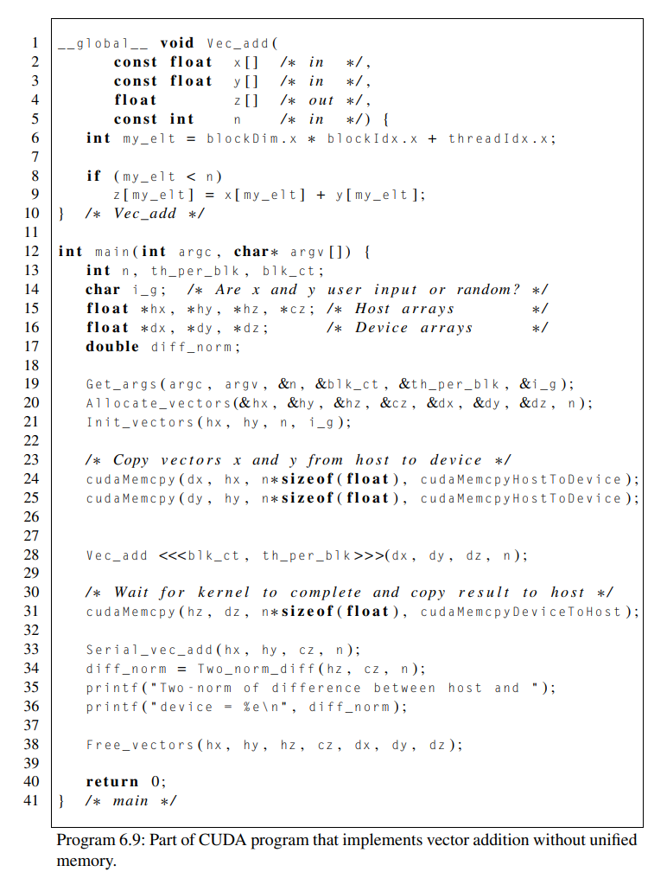{width="5.114583333333333in" height="6.822916666666667in"}

-   This is a program that does not provide unified memory (which came from cudaMallocManaged)

-   The first things to note is that much of the code is similar

    -   The kernel arguments are unchanged: x,y,z and n. And it still does the same thing.

-   The main function is pretty similar but we do have some differences due to no unified memory

    -   Since unified memory isnt assumed, the pointers we had on the host arent valid on the device and so we must handle that by making arrays for both host and device

        -   an address on the host may be illegal on the device, or, even worse, it might refer to memory that the device is using for some other purpose.

        -   Similar problems occur if we try to use a device address on the host.

        -   We must combat this by declaring three arrays that are valid on the host and three arrays that are valid on the device: hx,hy,hz for the host and dx,dy,dz for the device

            -   The arrays will be used as the arrays that both sides will use when talking to each other

    -   We declared these arrays but now we allocate space for these arrays in the Allocate_vectors() function passing in all of the arrays and other args

        -   Since we arent using unified memory by way of cudaMallocManaged we will use ordinary C malloc calls for the host arrays and the CUDA function cudaMalloc() (which is different of course from cudaMallocManaged) for the device arrays

            -   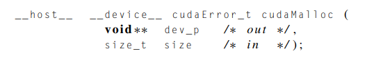{width="5.739583333333333in" height="1.1458333333333333in"}

                -   The first argument is a reference to a pointer that will be used on the device.

                -   The second argument specifies the number of bytes to allocate on the device.

    -   Now that all the arrays have been allocated, we then initialize the host arrays with data using the helper function Init_vectors() to give the host arrays their data

    -   We will not copy over the data that exists in the host arrays to the device arrays using a CUDA function

        -   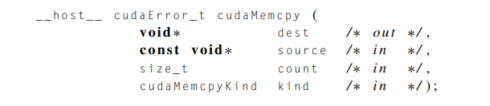{width="6.34375in" height="1.375in"}

            -   This copies count bytes from the memory referred to by source into the memory referred to by dest. The type of the kind argument, cudaMemcpyKind, is an enumerated type defined by CUDA that specifies where the source and dest pointers are located. For our purposes the two values of interest are cudaMemcpyHostToDevice and cudaMemcpyDeviceToHost. The first indicates that we're copying from the host to the device, and the second indicates that we're copying from the device to the host.

    -   The call to the kernel in Line 28 uses the pointers dx, dy, and dz, because these are addresses that are valid on the device.

    -   After the call to the kernel, we copy the result of the vector addition from the device to the host in Line 31 using cudaMemcpy again.

        -   The z variable is now filled with data from the kernel and we tranfer it back into the variable hz which the device can work with

    -   Note:

        -   A call to cudaMemcpy is synchronous, so it waits for the kernel to finish executing before carrying out the transfer. So in this version of vector addition we do not need to use cudaDeviceSynchronize to ensure that the kernel has completed before proceeding.

    -   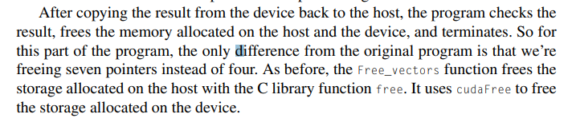{width="7.46875in" height="1.59375in"}

>  

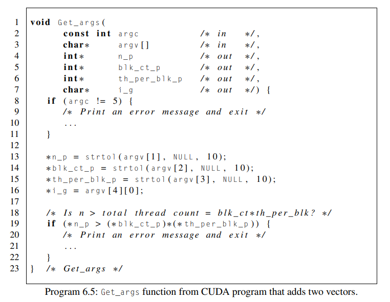{width="4.229166666666667in" height="3.28125in"}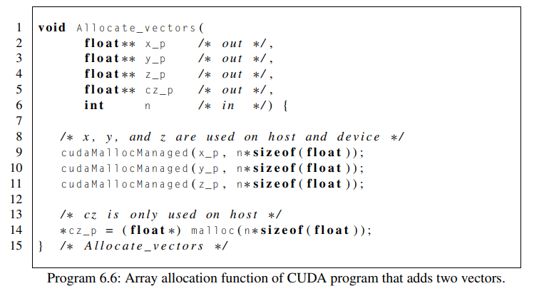{width="4.260416666666667in" height="2.3541666666666665in"}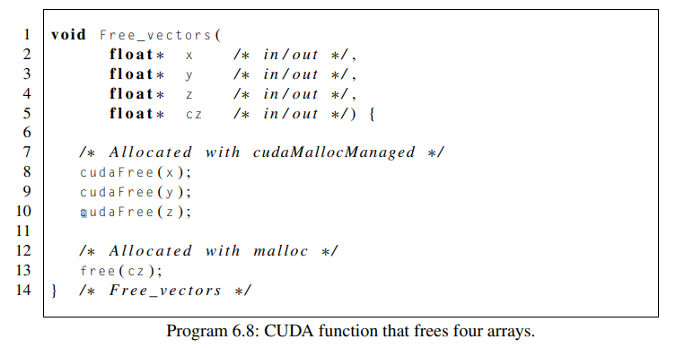{width="4.28125in" height="2.1770833333333335in"}

 

My_rank can also be my_elt

 

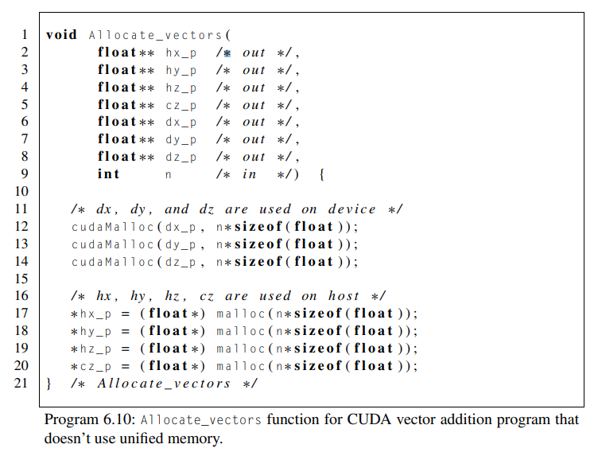{width="4.989583333333333in" height="3.8020833333333335in"}

